# EMS Simulate - Energy Management System Simulator

[简体中文](README.md) | [English](README.en.md)

EMS Simulate models the behavior of key devices in an energy management system (EMS) for testing and development. It supports Modbus TCP/RTU, IEC 60870-5-101/104, DL/T 645-2007, IEC 61850, and DNP3, and simulates data exchange with devices such as PCS converters, BMS controllers, meters, and circuit breakers.

> 📖 **[Online documentation](https://600888.github.io/ems_simulate/)**

---

## 🏪 Microsoft Store

EMS Simulate is available from the Microsoft Store for Windows 10/11.

[](https://apps.microsoft.com/detail/9N3MMM0CH93F?hl=zh-cn&gl=CN&ocid=pdpshare)

> Click the image above or [open the Microsoft Store listing](https://apps.microsoft.com/detail/9N3MMM0CH93F?hl=zh-cn&gl=CN&ocid=pdpshare).

---

## Features

| Feature | Description |
|---------|-------------|
| **Multi-protocol integration** | Modbus TCP/RTU, IEC 60870-5-101/104, DL/T 645-2007, IEC 61850, and DNP3, with device simulation and client-side acquisition |
| **Device management** | Device groups and subgroups, channels and outstations, start/stop controls, and connection monitoring; batch copying with name, IP, and port offsets |
| **Point management** | YC/YX/YK/YT categories, point editing, Excel point-list import/export, protocol attributes, and runtime updates |
| **Data simulation** | Fixed values, random values, increments, decrements, sine waves, ramps, and pulses; per-point and batch configuration with live monitoring |
| **Reading and control** | Single-point, batch, and automatic background reads, plus remote control and setpoint operations supported by each protocol |
| **Point relationships** | Multiplication/addition coefficients, custom formulas, and cross-device point mapping |
| **Change tracking** | Timestamps, previous and new values, and change sources, including manual edits, simulation, mapping, protocol writes, and client reads |
| **Message analysis** | Sent and received messages, raw bytes, and decoded fields for troubleshooting communications |
| **IEC 61850 tools** | Data models and DataSets, MMS, GOOSE, Reports, Files, Setting Groups, Logs, SCL file management, and visual modeling |
| **Interface and runtime** | Vue 3 web interface, Tauri desktop app, Chinese/English UI, zoom controls, storage directory settings, and application logs |

## Architecture


### Technology stack

| Layer | Technology |
|-------|------------|
| **Frontend** | Vue 3, TypeScript, Vite, Element Plus |
| **Backend** | Python 3.11+, FastAPI, SQLAlchemy |
| **Protocols** | pymodbus 3.12, c104, dlt645, pyiec61850-ng, pydnp3-pure, and an IEC 101 FT1.2 implementation |
| **Database** | SQLite (default) / MySQL |
| **Desktop shell** | Tauri v2 + Rust |

---

## Screenshots

Available screenshots are shown below. Screenshots still to be added are marked with a camera icon and a suggested filename. To replace a placeholder, put the image in `resources/img/` and remove the HTML comment around its image markup, if present.

### General features

#### Device and point management

1. **Main screen** — device group tree and device details

   

2. **Add a device group**

   

3. **Add a subgroup**

   

4. **Add a device** — select its device type and protocol

   

5. **Expand a row to edit a point value**

   

6. **Choose a simulation mode** — random, step, or fixed value

   

7. **Edit point details** — address, coefficients, decode code, and more

   

#### Batch copying, outstations, and connections

Copy one or more devices with configurable name prefixes/suffixes and IP and port offsets. Use outstation management and connection monitoring to check communication status.

> 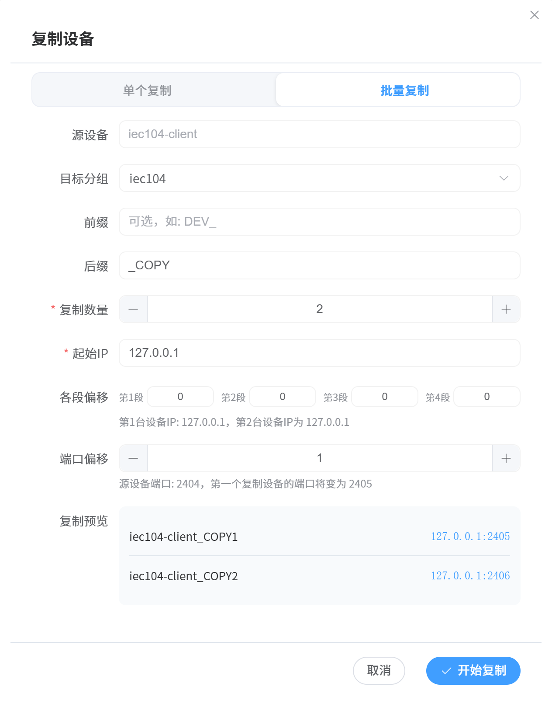

> 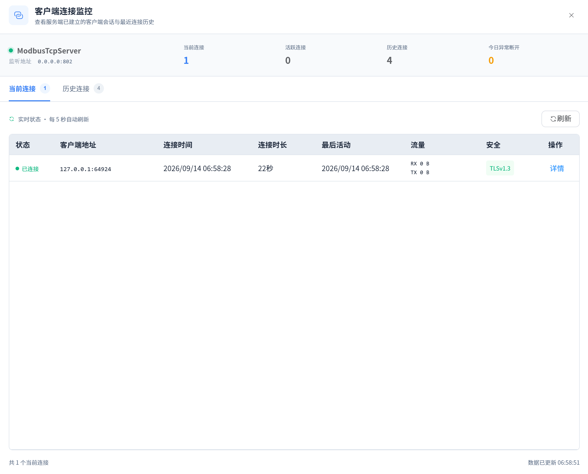

#### Point-list import and export

Configure points in bulk with an Excel template and export point lists. Sample spreadsheets are provided for [Modbus](data/point_csv/point_sample_modbus.xlsx), [IEC 104](data/point_csv/point_sample_iec104.xlsx), [DL/T 645](data/point_csv/point_sample_dlt645.xlsx), and [DNP3](data/point_csv/point_sample_dnp3.xlsx).

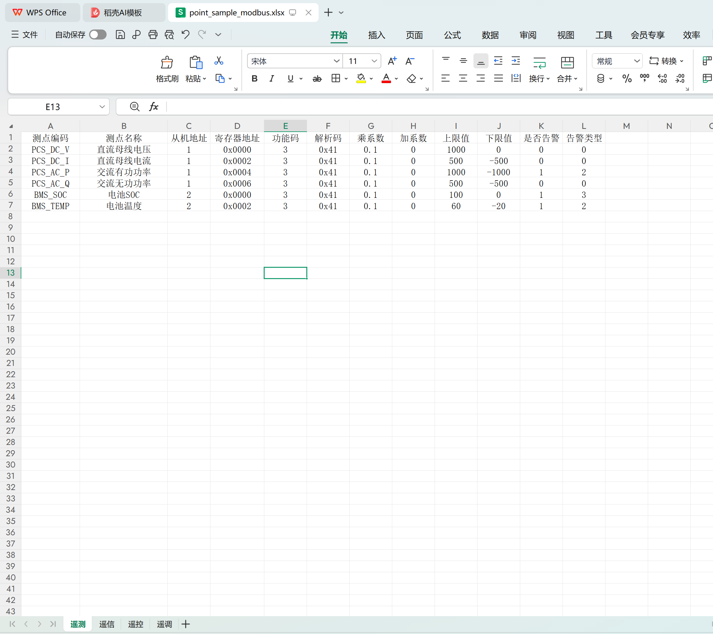

#### Simulation configuration and live monitoring

Choose fixed, random, incrementing, decrementing, sine-wave, ramp, or pulse values. Configure parameters per point and select points for simulation in bulk.

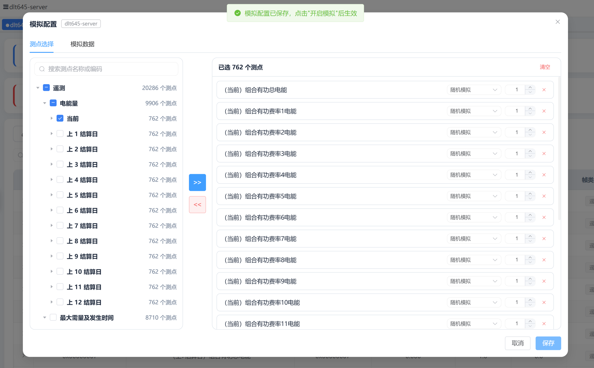


The client supports single-point, batch, and automatic background reads. Automatic reads continue when you switch pages; their status reappears when you return to the device page. Stopping a device ends its associated tasks.

> 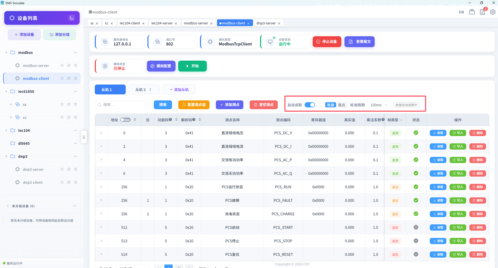

#### Point mapping, formulas, and change tracking

Build formulas from multiple source points and map their results to target points, including across devices and protocols. Change history records timestamps, previous and new values, and sources to help trace simulation results and communication writes.

> 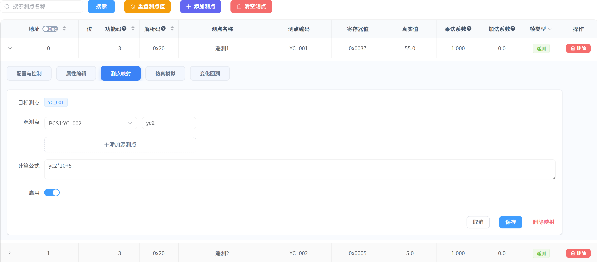

> 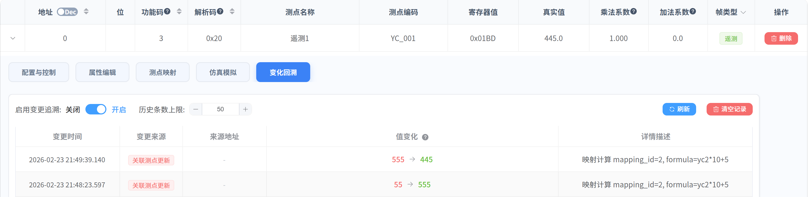

#### Application settings and logs

Switch between Chinese and English, adjust interface zoom, choose a storage directory, and inspect application logs.

> **Application settings** — interface, language, and storage options.
>
> 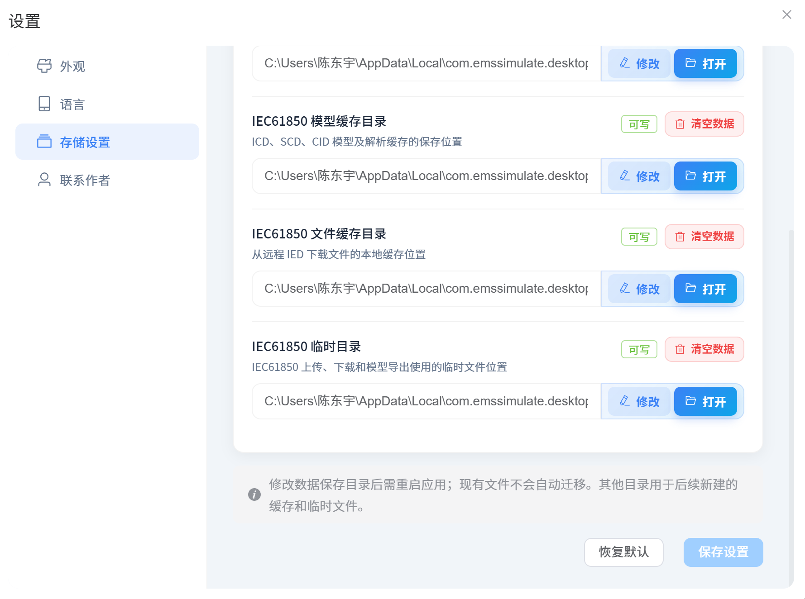

> **Application logs** — log filters and details.
> 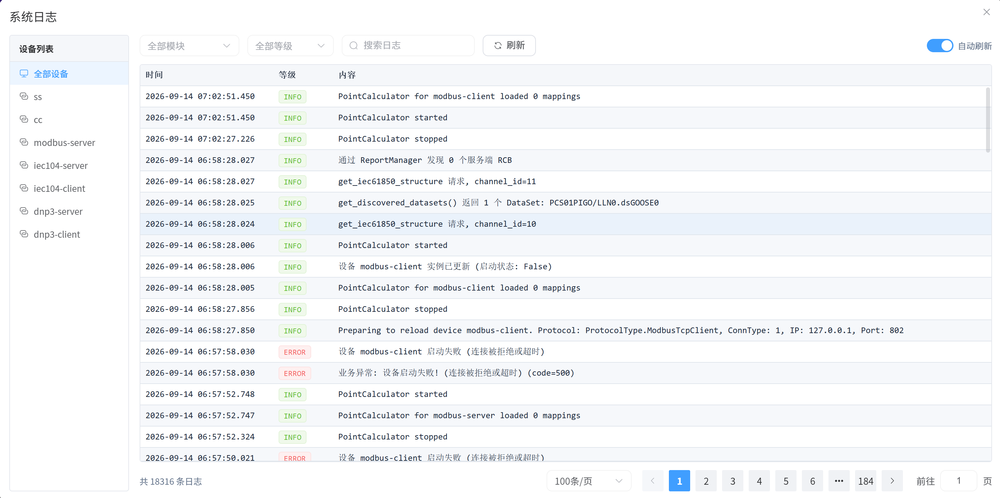

---

### Protocol modules

The sections below cover configuration, data operations, and message inspection for each protocol. Protocols support **server/outstation** roles (simulated devices) and **client/master** roles (acquisition or control), with specific capabilities described under each module.

#### Modbus TCP / RTU

Modbus is widely used in industrial automation. This application supports both TCP network connections and RTU serial connections.

| Property | TCP | RTU |
|----------|-----|-----|
| Default port | 502 | — (serial) |
| Data operations | Read coils, discrete inputs, holding registers, and input registers; write to writable areas | Same as TCP |
| Decode codes | 8/16/32/64-bit values, byte order, and word swapping | Same as TCP |

##### Device configuration and data operations


> Supports all four Modbus data areas, with a decode-code system for different device layouts.

##### Message inspection


---

#### IEC 60870-5-104

A telecontrol protocol used for data exchange between substations and dispatch centers.

| Property | Description |
|----------|-------------|
| Default port | 2404 |
| Point categories | YC (measurements), YX (indications), YK (controls), YT (setpoints) |
| Quality descriptors | Standard quality bits such as IV/NT/SB/BL/OV |
| Causes of transmission | Periodic, spontaneous, general interrogation, and more |

##### Parameter configuration and four-category operations


> Supports YC/YX/YK/YT, ASDU type configuration and filtering, general interrogation, clock synchronization, and quality descriptors.

##### Message inspection


---

#### IEC 60870-5-101

The serial telecontrol counterpart to IEC 104. It shares ASDU handling, YC/YX/YK/YT point lists, quality descriptors, causes of transmission, and value conversion with IEC 104.

| Property | Description |
|----------|-------------|
| Transport | Serial port (master / outstation) |
| Link layer | FT1.2 fixed and variable frames, single-character acknowledgments, checksums, FCB/FCV |
| Address lengths | 1/2-byte link address, 1/2-byte COT, 1/2-byte common address, 1–3-byte IOA |
| Application functions | Class 1/2 polling, general interrogation, read commands, controls/setpoints, clock synchronization, spontaneous transmission |

> Unbalanced transmission is the default. Protocol runtime settings control address widths, response timeout, and polling interval.

##### Parameter configuration and data operations

> 📷 **IEC 101 configuration and operations** — serial port, link address, ASDU address widths, and YC/YX/YK/YT points.
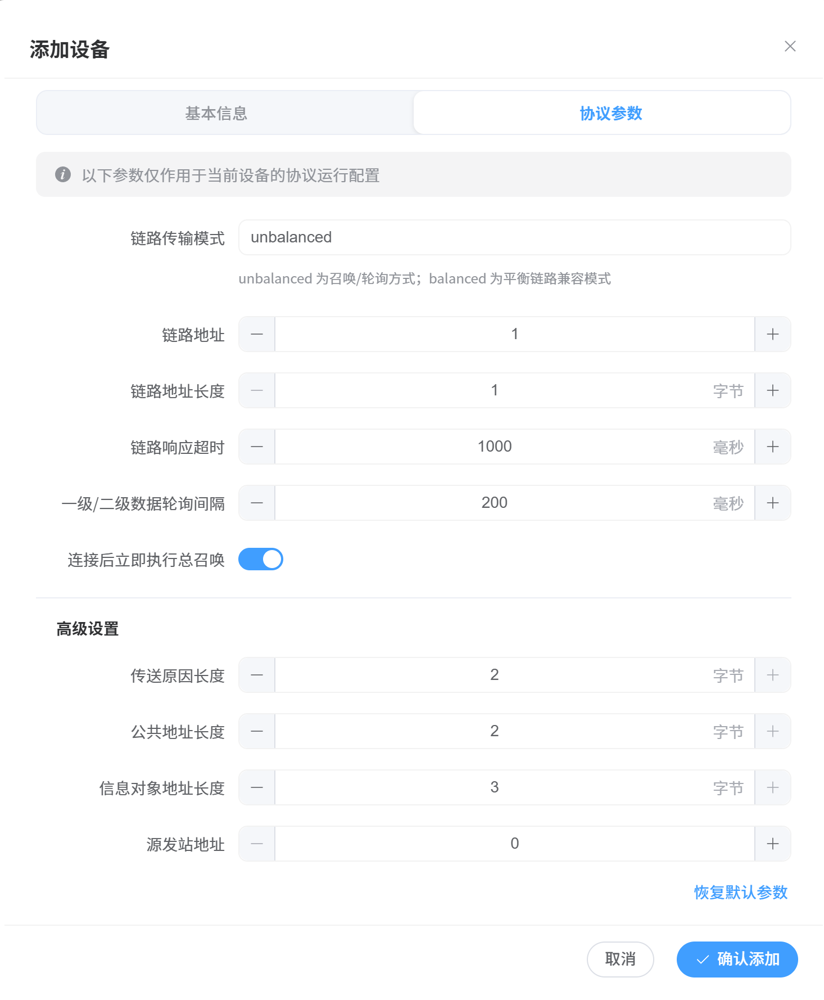

##### Message inspection

> 📷 **IEC 101 messages** — FT1.2 sent/received frames and decoded link-layer and ASDU fields.
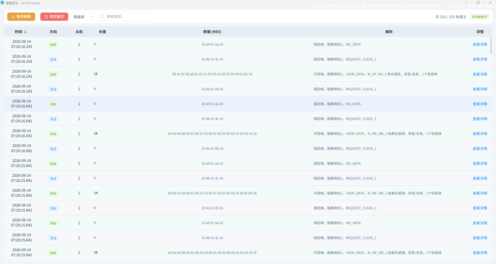

---

#### DL/T 645-2007

A Chinese power-industry communication standard for multifunction electricity meters and meter data acquisition.

| Property | Description |
|----------|-------------|
| Default port | 8899 |
| Data identifiers | Configure energy, power, voltage, current, and other values by DI |
| Coefficient conversion | Multiplication coefficient + addition coefficient → engineering value |

##### Meter configuration and read/write verification


**DL/T 645 protocol test** — verify reads and coefficient conversion.


> Resolves meter data identifiers, applies multiplication/addition coefficients to obtain engineering values, and provides client-side read verification.

##### Message inspection


---

#### IEC 61850

Device simulation and integration testing for digital substations, including MMS data access, GOOSE publishing/subscription, report control, file browsing, setting groups, and logs, along with SCL management and visual modeling.

| Module | Capabilities |
|--------|--------------|
| **MMS / Data Models** | Server-side modeling, client-side model discovery, tree browsing, data reads/writes, and model export |
| **Data Sets** | Browse members and read them in bulk |
| **GOOSE** | Publish, subscribe, inspect receive history, and capture/decode packets |
| **Reports** | Configure BRCB/URCB control blocks, enable/disable, trigger GI, and receive reports |
| **Files** | Browse remote directories and download files from a client |
| **Setting Groups** | Discover, read, select edit groups, write, confirm, and activate setting groups |
| **Logs** | Discover and enable/disable log control blocks; query logs by time range |
| **SCL file management** | Upload, preview, validate, import, and compare ICD/CID/SCD files |
| **Visual modeling** | Model projects; LD/LN/DO/DA editing; CDC templates; DataSet and control-block configuration; validation, versions, and publishing |

##### MMS, data models, and DataSets


The client can discover and export models. DataSets organize points for batch reading.

📷 **DataSet and model export** — shows model export formats.

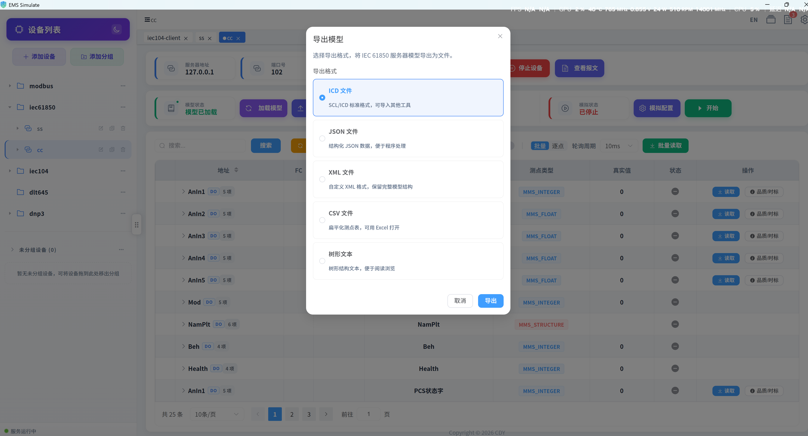

##### GOOSE publishing, subscription, and capture


##### Report control


##### File service


##### Setting Groups

Inspect setting-group control blocks, select an edit group, change and confirm settings, then activate the target group.

> 📷 **IEC 61850 Setting Groups** — active group, edit group, settings, and operation results.
>
> 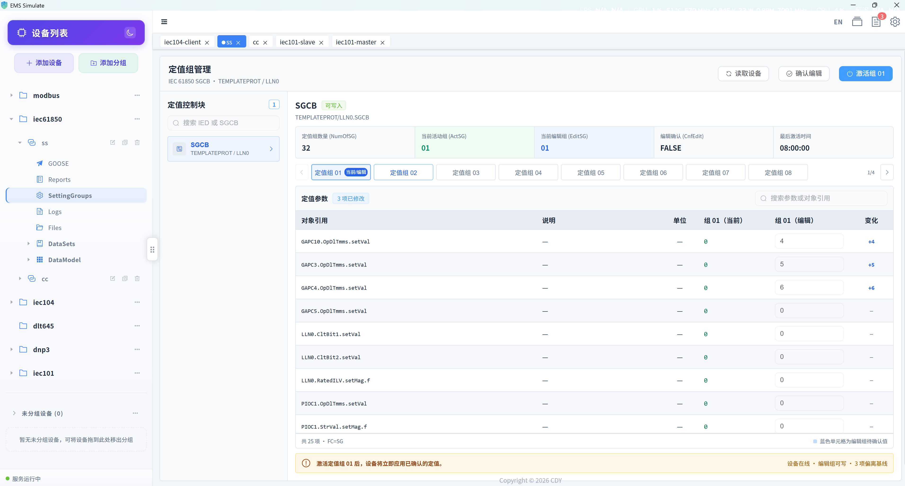

##### Logs

Manage log control blocks.

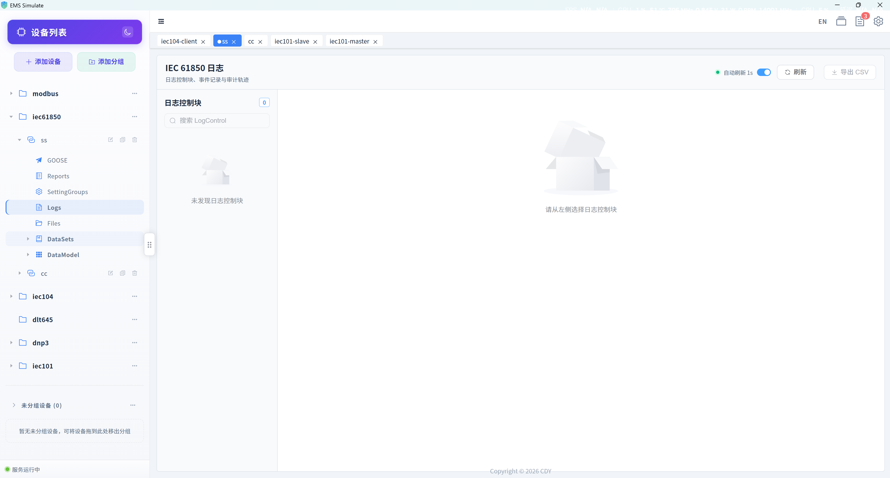

##### SCL file management and visual modeling

Preview, import, and compare SCL files. In the visual modeling workspace, create or import model projects; edit logical devices, logical nodes, and data objects; configure datasets and control blocks; validate models; save versions; and publish models.


##### Message inspection

**MMS messages**


**GOOSE messages**


**Report messages**


---

#### DNP3

Supports **Master (client)** and **Outstation (server)** roles for DNP3 acquisition, event transmission, and control testing.

| Property | Description |
|----------|-------------|
| Transport and port | TCP, default port `20000`; TLS configuration is supported |
| Station settings | Local and remote station addresses, request timeout, retries, and reconnection |
| Point-list settings | Point index, static/event Variation, event Class, deadband, quality bits, and timestamps |
| Data acquisition | Class 0 integrity polling, Class 1/2/3 event reads, and single-point/batch reads |
| Event transmission | Configurable unsolicited responses, with received values and runtime metadata synchronized to points |
| Control | CROB binary controls and analog outputs, with Select/Operate and Direct Operate |
| Other operations | Time synchronization, counter freeze, and Excel point-list import |

##### Master/outstation configuration and data operations

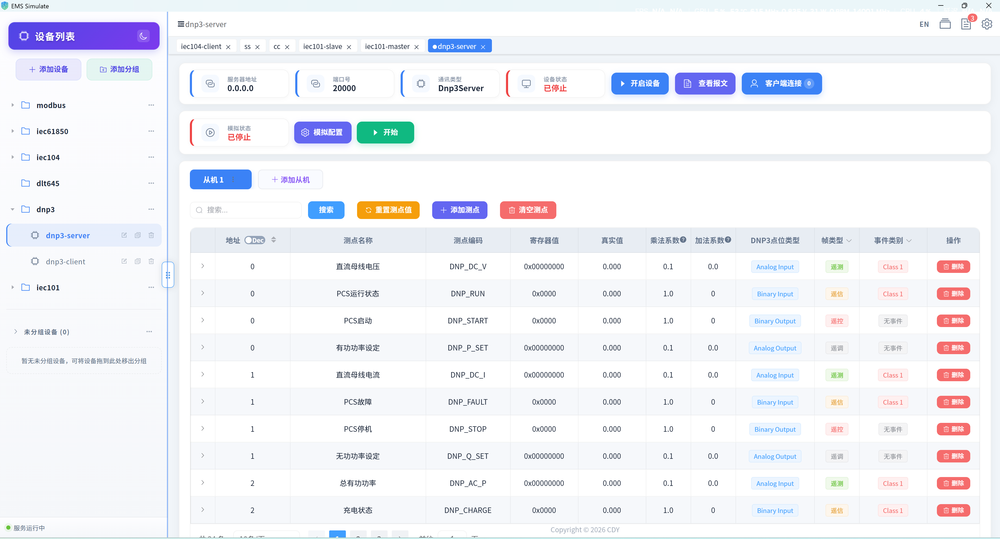

##### Point attributes and event configuration

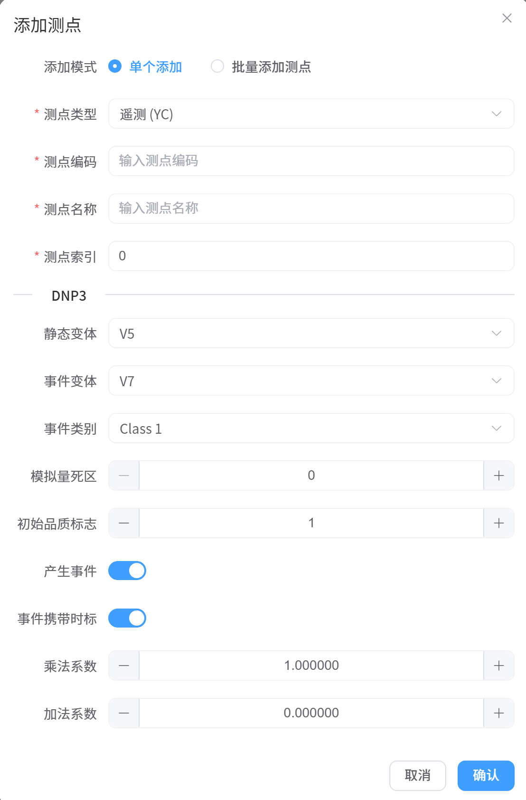

##### Message inspection

> 📷 **DNP3 messages** — direction, link addresses, application function codes, object groups/variations, and raw bytes.
>
> 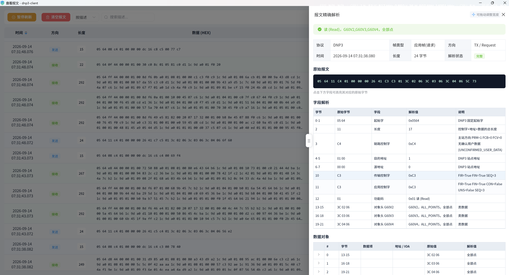

---

## Quick start

### Requirements

- Python >= 3.11
- Node.js >= 18
- uv, npm, and Git (some Python protocol dependencies are installed from Git repositories)

### Install dependencies

From the repository root, install Python dependencies and start the backend:

```bash
# If uv is not installed yet: pip install uv
uv sync --extra dev
uv run python start_back_end.py
```

In another terminal, start the frontend from the repository root:

```bash
cd front
npm install
npm run dev
```

Open the local address printed by Vite in a browser. See the [configuration guide](docs/guide/install/configuration.md) for backend settings.

### Build the Tauri desktop app

Windows builds require Rust, MSVC build tools, and the Tauri CLI. The repository script builds the frontend, Python backend, and desktop client:

```powershell
# Run from the repository root
uv sync --extra dev --extra build
npm install -g @tauri-apps/cli

# Build the Windows installer
.\scripts\build_tauri_windows.ps1
```

The script creates an MSI installer by default. See the [Windows build script](scripts/build_tauri_windows.ps1) for the MSIX entry point and additional tool requirements. For Linux, see the [Debian packaging and deployment guide](docs/guide/install/packaging_deb.md).

---

## Documentation

- 📚 **[Project documentation](docs/index.md)**: full usage guide and API reference
- **[Batch device copying](docs/guide/device/device-copy.md)**, **[point mapping](docs/guide/point/mapping.md)**, **[formulas](docs/guide/point/formula.md)**, and **[change tracking](docs/guide/point/change-tracking.md)**
- **[Simulation settings](docs/guide/simulation/point-config.md)** and **[data monitoring and automatic reads](docs/guide/simulation/data-monitor.md)**
- 📦 **[Debian packaging and deployment guide](docs/guide/install/packaging_deb.md)**: build a deb package and deploy on Linux

---

## Core concepts

### Point types

The system supports four point types:

| Type | Code | Description | Typical use |
|------|------|-------------|-------------|
| **YC (measurement)** | frame_type=0 | Analog measurement | Voltage, current, power, temperature |
| **YX (indication)** | frame_type=1 | Binary status | Running state, fault flag |
| **YK (control)** | frame_type=2 | Binary command | Start/stop, open/close breaker |
| **YT (setpoint)** | frame_type=3 | Analog command | Power or temperature setpoint |

### Protocol types

| Protocol | Server | Client | Default port |
|----------|--------|--------|--------------|
| Modbus TCP | ✅ | ✅ | 502 |
| Modbus RTU | ✅ | ✅ | Serial |
| IEC 60870-5-104 | ✅ | ✅ | 2404 |
| IEC 60870-5-101 | ✅ | ✅ | Serial |
| DL/T 645-2007 | ✅ | ✅ | 8899 |
| DNP3 | ✅ (Outstation) | ✅ (Master) | 20000 |
| IEC 61850 MMS | ✅ | ✅ | 102 |
| IEC 61850 GOOSE | ✅ (publish) | ✅ (subscribe) | — (Ethernet layer 2) |
| IEC 61850 Reports | ✅ | ✅ | Reuses the MMS connection |
| IEC 61850 Files | ✅ | ✅ | — |
| IEC 61850 Setting Groups | ✅ | ✅ | Reuses the MMS connection |
| IEC 61850 Logs | ✅ | ✅ | Reuses the MMS connection |

---

## Decode-code system

Decode codes specify how Modbus register data is interpreted, including data type, byte order, and bit width.

### Decode-code reference

#### 16-bit integers (1 register)

| Code | Name | Description | Byte order |
|------|------|-------------|------------|
| `0x20` | UINT16_BE | 16-bit unsigned integer | Big-endian (AB) |
| `0x21` | INT16_BE | 16-bit signed integer | Big-endian (AB) |
| `0xC0` | UINT16_LE | 16-bit unsigned integer | Little-endian (BA) |
| `0xC1` | INT16_LE | 16-bit signed integer | Little-endian (BA) |
| `0xB0` | UINT16_BE_SWAP | 16-bit unsigned integer | Big-endian, word swap |
| `0xB1` | INT16_BE_SWAP | 16-bit signed integer | Big-endian, word swap |

#### 32-bit integers and floats (2 registers)

| Code | Name | Description | Byte order |
|------|------|-------------|------------|
| `0x40` | UINT32_BE | 32-bit unsigned integer | Big-endian (ABCD) |
| `0x41` | INT32_BE | 32-bit signed integer | Big-endian (ABCD) |
| `0x42` | FLOAT_BE | 32-bit float | Big-endian (ABCD) |
| `0xD0` | UINT32_LE | 32-bit unsigned integer | Little-endian (DCBA) |
| `0xD1` | INT32_LE | 32-bit signed integer | Little-endian (DCBA) |
| `0xD2` | FLOAT_LE | 32-bit float | Little-endian (DCBA) |
| `0x43` | UINT32_BE_SWAP | 32-bit unsigned integer | Big-endian, word swap (CDAB) |
| `0x44` | INT32_BE_SWAP | 32-bit signed integer | Big-endian, word swap (CDAB) |
| `0x45` | FLOAT_BE_SWAP | 32-bit float | Big-endian, word swap (CDAB) |
| `0xD4` | UINT32_LE_SWAP | 32-bit unsigned integer | Little-endian, word swap (BADC) |
| `0xD5` | INT32_LE_SWAP | 32-bit signed integer | Little-endian, word swap (BADC) |
| `0xD3` | FLOAT_LE_SWAP | 32-bit float | Little-endian, word swap (BADC) |

#### 64-bit integers and floats (4 registers)

| Code | Name | Description | Byte order |
|------|------|-------------|------------|
| `0x60` | UINT64_BE | 64-bit unsigned integer | Big-endian |
| `0x61` | INT64_BE | 64-bit signed integer | Big-endian |
| `0x62` | DOUBLE_BE | 64-bit double | Big-endian |
| `0xE0` | UINT64_LE | 64-bit unsigned integer | Little-endian |
| `0xE1` | INT64_LE | 64-bit signed integer | Little-endian |
| `0xE2` | DOUBLE_LE | 64-bit double | Little-endian |

#### 8-bit characters (1 register)

| Code | Name | Description |
|------|------|-------------|
| `0x10` | CHAR_8_BE | 8-bit unsigned character |
| `0x11` | CHAR_8_BE_SIGNED | 8-bit signed character |

### Byte order

For example, the 32-bit float `1234.5` has the hexadecimal representation `449A5000`:

| Order | Stored bytes | Description |
|-------|--------------|-------------|
| **Big-endian (BE)** | `44 9A 50 00` | Most significant byte first; standard network byte order |
| **Little-endian (LE)** | `00 50 9A 44` | Least significant byte first; common on x86 |
| **Big-endian word swap (BE_SWAP)** | `50 00 44 9A` | Big-endian within registers, registers swapped |
| **Little-endian word swap (LE_SWAP)** | `9A 44 00 50` | Little-endian within registers, registers swapped |

### Code example

```python
from src.enums.modbus_register import Decode, DecodeCode

# Option 1: use a decode-code string
info = Decode.get_info("0x41")
print(f"Register count: {info.register_cnt}")  # 2
print(f"Signed: {info.is_signed}")             # True
print(f"Byte order: {info.endian}")            # >

# Option 2: use the enum (recommended)
info = DecodeCode.FLOAT_BE.value
print(f"Decode code: {info.code}")             # 0x42
print(f"Description: {info.description}")

# Pack/unpack data
packed = Decode.pack_value(info.pack_format, 1234.5)
value = Decode.unpack_value(info.pack_format, packed)

# List all decode codes for a frontend dropdown
all_codes = Decode.get_all_codes()
```

### Engineering-value conversion

YC and YT points support coefficient conversion:

```
engineering value = register value × multiplication coefficient + addition coefficient
register value = (engineering value - addition coefficient) ÷ multiplication coefficient
```

| Property | Description | Default |
|----------|-------------|---------|
| `mul_coe` | Multiplication coefficient | 1.0 |
| `add_coe` | Addition coefficient | 0.0 |

---

## Project structure

```
ems_simulate/
├── src/                        # Backend source
│   ├── config/                 # Configuration
│   │   ├── config.py          # Global settings
│   │   └── log/               # Logging settings
│   ├── data/                   # Data layer
│   │   ├── dao/               # Data access objects
│   │   └── service/           # Business services
│   ├── device/                 # Device simulators
│   │   ├── core/              # Core classes
│   │   │   ├── device.py      # Main Device class
│   │   │   ├── point/        # Point management and calculations
│   │   │   └── data/         # Data reading and export
│   │   ├── protocol/          # Protocol handlers
│   │   │   ├── base_handler.py      # Base classes
│   │   │   ├── modbus_handler.py    # Modbus
│   │   │   ├── iec104_handler.py    # IEC 104
│   │   │   ├── iec101_handler.py    # IEC 101
│   │   │   ├── dlt645_handler.py    # DL/T 645
│   │   │   ├── dnp3_handler.py      # DNP3 Master/Outstation
│   │   │   └── iec61850_handler.py  # IEC 61850
│   │   ├── simulator/         # Simulation controls
│   │   ├── factory/           # Device factory
│   │   └── types/             # Device types
│   ├── enums/                  # Enums and data structures
│   │   ├── modbus_register.py # Decode-code definitions
│   │   └── points/            # Point types
│   ├── proto/                  # Low-level protocol implementations
│   │   ├── pyModbus/          # Modbus server/client
│   │   ├── iec104/            # IEC 104 server/client
│   │   ├── iec101/            # IEC 101 FT1.2 master/outstation
│   │   ├── iec60870/           # Shared IEC 101/104 ASDU layer
│   │   ├── dlt645/            # DL/T 645 protocol library
│   │   ├── dnp3/              # DNP3 master/outstation, events, controls, TLS
│   │   └── iec61850/          # IEC 61850 MMS/GOOSE/Reports/Files/SV
│   ├── modeling/               # IEC 61850 model projects, validation, versions
│   └── web/                    # Web API
│       └── api/
│           ├── device/        # Device control endpoints
│           ├── channel/       # Channel and protocol management
│           ├── point/         # Points and mapping endpoints
│           ├── modeling/      # IEC 61850 visual modeling endpoints
│           └── scl/           # SCL/ICD file management
├── front/                      # Vue 3 frontend source
│   ├── src/
│   │   ├── components/        # Components
│   │   ├── views/             # Pages
│   │   └── api/               # API wrappers
│   └── package.json
├── src-tauri/                  # Tauri desktop shell (Rust)
│   ├── src/
│   │   ├── lib.rs             # Tauri Builder
│   │   └── backend.rs         # Backend process management
│   └── tauri.conf.json
├── data/                       # SQLite database
├── start_back_end.py          # Backend entry point
├── pyproject.toml             # Python dependencies and settings
└── uv.lock                    # Python lockfile
```

---

## Development guide

### Add a device type

1. Create a device class under `src/device/types/`.
2. Inherit from the `Device` base class.
3. Optionally implement `setSpecialDataPointValues()`.

```python
from src.device.core.device import Device, DeviceType

class MyDevice(Device):
    def __init__(self):
        super().__init__()
        self.device_type = DeviceType.Other

    def setSpecialDataPointValues(self):
        # Define custom point relationships
        pass
```

### Add a protocol

1. Create a handler under `src/device/protocol/`.
2. Inherit from `ServerHandler` or `ClientHandler`.
3. Implement the abstract methods.

```python
from src.device.protocol.base_handler import ServerHandler

class MyProtocolHandler(ServerHandler):
    def initialize(self, config):
        pass

    async def start(self) -> bool:
        self._is_running = True
        return True

    async def stop(self) -> bool:
        self._is_running = False
        return True

    def read_value(self, point):
        pass

    def write_value(self, point, value):
        pass

    def add_points(self, points):
        pass
```

---

## License

This project is licensed under the **GNU General Public License v3.0 (GPL-3.0)**. See [LICENSE](LICENSE).

## Contributing

Issues and pull requests are welcome!
