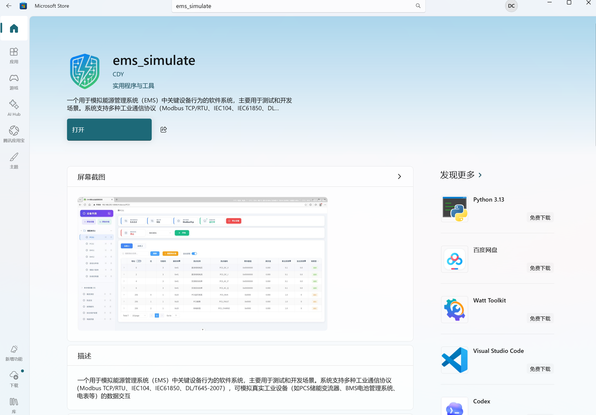
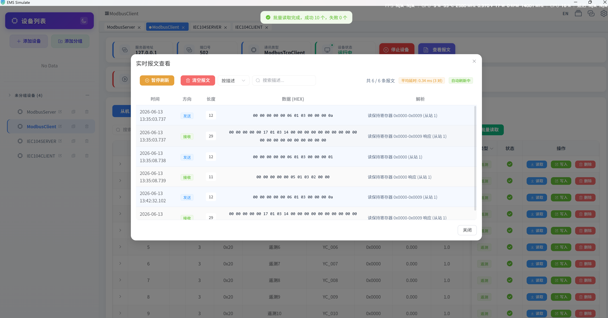
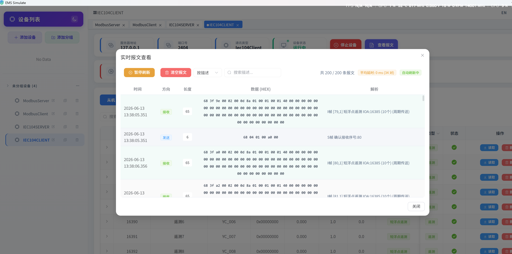
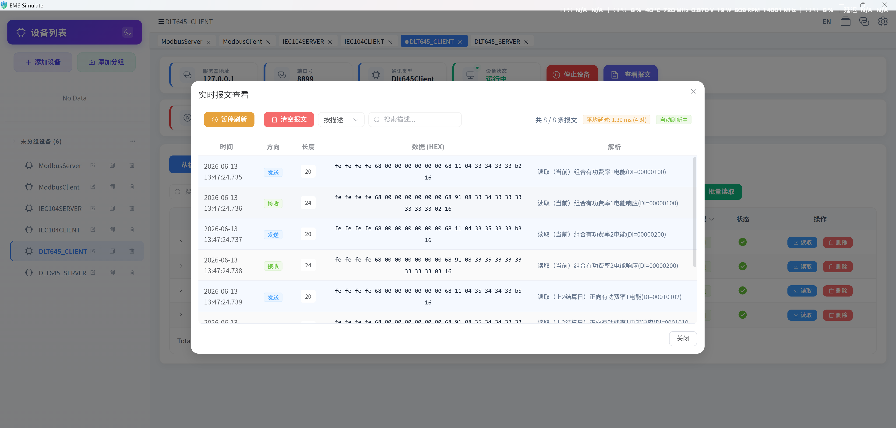
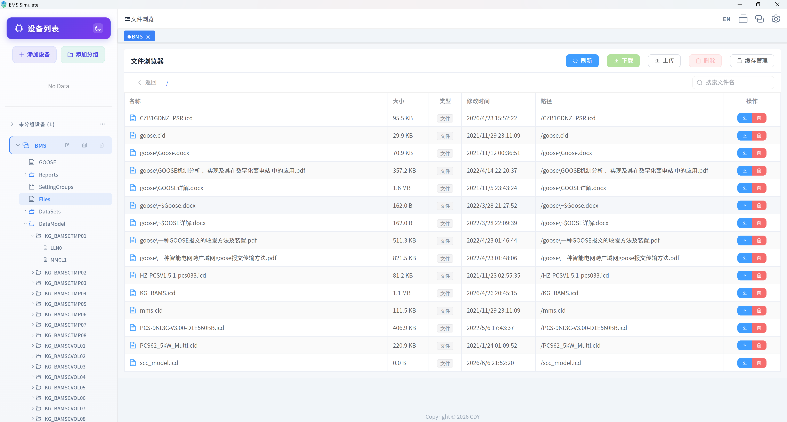

# EMS Simulate - 能源管理系统模拟器

一个用于模拟能源管理系统（EMS）中关键设备行为的软件系统，主要用于测试和开发场景。系统支持多种工业通信协议（Modbus TCP/RTU、IEC 60870-5-104、DL/T 645-2007、IEC 61850），可模拟真实工业设备（如PCS储能变流器、BMS电池管理系统、电表、断路器等）的数据交互。

> 📖 **[查看在线文档 / Online Documentation](https://600888.github.io/ems_simulate/)**

---

## 🏪 Microsoft Store

EMS Simulate 已上架微软应用商店，可直接在 Windows 10/11 上安装使用。

https://apps.microsoft.com/detail/9N3MMM0CH93F?hl=zh-cn&gl=CN&ocid=pdpshare


> 点击上方图片链接跳转至 Microsoft Store 下载页面，或 [直接访问商店页面](#)

---

## 功能特性

- 🔌 **多协议支持**：Modbus TCP/RTU、IEC 60870-5-104、DL/T 645-2007、IEC 61850 (MMS/GOOSE/Reports)
- ⚡ **设备模拟**：PCS储能变流器、BMS电池管理系统、电表、断路器等
- 🎯 **数据模拟**：支持随机模拟、步进模拟等多种方式
- ⚙️ **灵活配置**：支持数据库配置和CSV文件导入
- 📊 **Web界面**：Vue3 + TypeScript 构建的现代化前端界面
- 🔄 **热重载**：支持运行时修改测点属性
- 🖥️ **桌面应用**：基于 Tauri 打包为原生 Windows 桌面客户端

## 技术架构


### 技术栈

| 层次 | 技术 |
|------|------|
| **前端** | Vue 3, TypeScript, Vite, Element Plus |
| **后端** | Python 3.11+, FastAPI, SQLAlchemy |
| **协议** | pymodbus 3.12, c104, dlt645, pyiec61850 |
| **数据库** | SQLite (默认) / MySQL |
| **桌面壳** | Tauri v2 + Rust |

---

## 界面展示

### 通用功能

1. **主界面** — 设备分组树 + 设备详情面板

   

2. **添加设备分组**

   

3. **添加子设备组**

   

4. **新增设备** — 选择设备类型与协议

   

5. **展开列表行编辑测点值**

   

6. **设置数据模拟方式** — 随机 / 步进 / 固定值

   

7. **编辑测点信息** — 地址、系数、解析码等

   

---

### 协议模块

EMS Simulate 支持 5 种工业通信协议，每种协议均可配置为**服务端**（模拟设备）或**客户端**（读取真实设备），并提供专属的操作界面。

#### Modbus TCP / RTU

工业自动化领域应用最广泛的通信协议，支持 TCP 网络连接和 RTU 串口连接两种模式。

| 属性 | TCP | RTU |
|------|-----|-----|
| 默认端口 | 502 | —（串口） |
| 功能码 | 01~04, 15~16 | 01~04, 15~16 |
| 解析码 | 28 种（8/16/32/64位、大小端、字交换） | 同 TCP |


> 支持线圈、离散输入、保持寄存器、输入寄存器四类数据区，内置完整解析码系统适配不同厂商设备。

#### 报文查看



---

#### IEC 60870-5-104

电力系统远动通信标准协议，广泛用于变电站与调度中心之间的数据传输。

| 属性 | 说明 |
|------|------|
| 默认端口 | 2404 |
| 帧类型 | YC(遥测)、YX(遥信)、YK(遥控)、YT(遥调) |
| 品质描述 | IV/NT/SB/BL/OV 等标准品质位 |
| 传输原因 | 周期、自发、总召等 |


> 完整实现四遥（YC/YX/YK/YT）体系，支持总召、时钟同步、品质描述符等高级特性。

#### 报文查看



---

#### DL/T 645-2007

中国电力行业多功能电能表通信协议标准，用于电表数据采集。

| 属性 | 说明 |
|------|------|
| 默认端口 | 8899 |
| 数据标识 | D13~D133 等多个数据项 |
| 系数转换 | 乘法系数 + 加法系数 → 真实值 |


**DL/T645 协议测试** — 验证读取值与系数转换的正确性


> 支持电表数据项标识解析，自动应用乘法/加法系数转换真实值，提供客户端读取验证。

#### 报文查看



---

#### IEC 61850 (MMS / GOOSE / Reports / Files)

新一代智能变电站通信标准，提供完整的 MMS 服务端/客户端、GOOSE 发布/订阅、报告控制和文件浏览功能。

| 子模块 | 服务端 | 客户端 | 说明 |
|--------|:------:|:------:|------|
| **MMS** | ✅ | ✅ | 制造报文规范，数据读写与浏览 |
| **GOOSE** | ✅ | ✅ | 通用面向对象变电站事件，发布/订阅/抓包 |
| **Reports** | ✅ | ✅ | BRCB/URCB 报告控制块 |
| **Files** | — | ✅ | 文件目录浏览与传输 |
| **SCL** | ✅ | — | ICD/CID/SCD 文件解析与导入 |
| **SV** | — | — | 采样值发布 |

#### MMS


#### Reports


#### Files


> 支持 SCL 文件导入自动建模、GOOSE 报文实时抓包与解析、报告控制块配置等完整 IEC 61850 功能链。

---

## 快速开始

### 环境要求

- Python >= 3.11
- Node.js >= 18
- pip, npm

### 安装依赖

```bash
# 1. 安装 Python 依赖
pip install -r requirements.txt -i https://pypi.tuna.tsinghua.edu.cn/simple

# 2. 前端开发环境
cd front
npm install
npm run dev

# 3. 启动后端服务
python start_back_end.py
```

### Tauri 桌面应用构建

```bash
# 安装 Tauri CLI
npm install -g @tauri-apps/cli

# 构建 Windows 安装包
cd src-tauri
cargo tauri build
```

构建产物：
- `.msi` — Windows 安装包（用于微软商店分发）
- `.exe` — 独立可执行文件
- `.appx` / `.msix` — 微软商店打包格式

---

## 文档资源

-   📚 **[项目文档](docs/index.md)**: 完整的项目使用说明和 API 参考
-   📦 **[Debian 打包与部署指南](docs/packaging_deb.md)**: 详细介绍了如何在 Linux 环境下构建 deb 安装包

---

## 核心概念

### 测点类型

系统支持四种测点类型：

| 类型 | 代码 | 说明 | 典型用途 |
|------|------|------|----------|
| **遥测 (YC)** | frame_type=0 | 模拟量测量 | 电压、电流、功率、温度 |
| **遥信 (YX)** | frame_type=1 | 开关量状态 | 运行状态、故障标志 |
| **遥控 (YK)** | frame_type=2 | 开关量命令 | 启停命令、合分闸 |
| **遥调 (YT)** | frame_type=3 | 模拟量命令 | 功率设定、温度设定 |

### 协议类型

| 协议 | 服务端 | 客户端 | 默认端口 |
|------|--------|--------|----------|
| Modbus TCP | ✅ | ✅ | 502 |
| Modbus RTU | ✅ | ✅ | 串口 |
| IEC 60870-5-104 | ✅ | ✅ | 2404 |
| DLT/T 645-2007 | ✅ | ✅ | 8899 |
| IEC 61850 MMS | ✅ | ✅ | 102 |
| IEC 61850 GOOSE | ✅ | ✅ | — (VLAN) |
| IEC 61850 Reports | ✅ | ✅ | — |
| IEC 61850 Files | — | ✅ | — |

---

## 解析码系统 (Decode)

解析码定义了 Modbus 寄存器数据的解析方式，包括数据类型、字节序和位数。

### 解析码一览表

#### 16位整数 (1个寄存器)

| 解析码 | 名称 | 说明 | 字节序 |
|--------|------|------|--------|
| `0x20` | UINT16_BE | 16位无符号整数 | 大端 (AB) |
| `0x21` | INT16_BE | 16位有符号整数 | 大端 (AB) |
| `0xC0` | UINT16_LE | 16位无符号整数 | 小端 (BA) |
| `0xC1` | INT16_LE | 16位有符号整数 | 小端 (BA) |
| `0xB0` | UINT16_BE_SWAP | 16位无符号整数 | 大端字交换 |
| `0xB1` | INT16_BE_SWAP | 16位有符号整数 | 大端字交换 |

#### 32位整数/浮点 (2个寄存器)

| 解析码 | 名称 | 说明 | 字节序 |
|--------|------|------|--------|
| `0x40` | UINT32_BE | 32位无符号整数 | 大端 (ABCD) |
| `0x41` | INT32_BE | 32位有符号整数 | 大端 (ABCD) |
| `0x42` | FLOAT_BE | 32位浮点数 | 大端 (ABCD) |
| `0xD0` | UINT32_LE | 32位无符号整数 | 小端 (DCBA) |
| `0xD1` | INT32_LE | 32位有符号整数 | 小端 (DCBA) |
| `0xD2` | FLOAT_LE | 32位浮点数 | 小端 (DCBA) |
| `0x43` | UINT32_BE_SWAP | 32位无符号整数 | 大端字交换 (CDAB) |
| `0x44` | INT32_BE_SWAP | 32位有符号整数 | 大端字交换 (CDAB) |
| `0x45` | FLOAT_BE_SWAP | 32位浮点数 | 大端字交换 (CDAB) |
| `0xD4` | UINT32_LE_SWAP | 32位无符号整数 | 小端字交换 (BADC) |
| `0xD5` | INT32_LE_SWAP | 32位有符号整数 | 小端字交换 (BADC) |
| `0xD3` | FLOAT_LE_SWAP | 32位浮点数 | 小端字交换 (BADC) |

#### 64位整数/浮点 (4个寄存器)

| 解析码 | 名称 | 说明 | 字节序 |
|--------|------|------|--------|
| `0x60` | UINT64_BE | 64位无符号整数 | 大端 |
| `0x61` | INT64_BE | 64位有符号整数 | 大端 |
| `0x62` | DOUBLE_BE | 64位双精度浮点 | 大端 |
| `0xE0` | UINT64_LE | 64位无符号整数 | 小端 |
| `0xE1` | INT64_LE | 64位有符号整数 | 小端 |
| `0xE2` | DOUBLE_LE | 64位双精度浮点 | 小端 |

#### 8位字符 (1个寄存器)

| 解析码 | 名称 | 说明 |
|--------|------|------|
| `0x10` | CHAR_8_BE | 8位无符号字符 |
| `0x11` | CHAR_8_BE_SIGNED | 8位有符号字符 |

### 字节序说明

以32位浮点数 `1234.5` 为例，其十六进制表示为 `449A5000`：

| 字节序类型 | 存储顺序 | 说明 |
|------------|----------|------|
| **大端 (BE)** | `44 9A 50 00` | 高字节在前，标准网络字节序 |
| **小端 (LE)** | `00 50 9A 44` | 低字节在前，x86架构常用 |
| **大端字交换 (BE_SWAP)** | `50 00 44 9A` | 寄存器内大端，寄存器间交换 |
| **小端字交换 (LE_SWAP)** | `9A 44 00 50` | 寄存器内小端，寄存器间交换 |

### 代码使用示例

```python
from src.enums.modbus_register import Decode, DecodeCode

# 方式一：使用解析码字符串
info = Decode.get_info("0x41")
print(f"寄存器数量: {info.register_cnt}")  # 2
print(f"是否有符号: {info.is_signed}")      # True
print(f"字节序: {info.endian}")             # >

# 方式二：使用枚举（推荐）
info = DecodeCode.FLOAT_BE.value
print(f"解析码: {info.code}")              # 0x42
print(f"描述: {info.description}")         # 32位浮点数(大端)

# 数据打包/解包
packed = Decode.pack_value(info.pack_format, 1234.5)
value = Decode.unpack_value(info.pack_format, packed)

# 获取所有解析码（供前端下拉菜单使用）
all_codes = Decode.get_all_codes()
```

### 真实值转换

遥测和遥调类型支持系数转换：

```
真实值 = 寄存器值 × 乘法系数 + 加法系数
寄存器值 = (真实值 - 加法系数) ÷ 乘法系数
```

| 属性 | 说明 | 默认值 |
|------|------|--------|
| `mul_coe` | 乘法系数 | 1.0 |
| `add_coe` | 加法系数 | 0.0 |

---

## 项目结构

```
ems_simulate/
├── src/                        # 后端源码
│   ├── config/                 # 配置管理
│   │   ├── config.py          # 全局配置
│   │   └── log/               # 日志配置
│   ├── data/                   # 数据层
│   │   ├── dao/               # 数据访问对象
│   │   └── service/           # 业务服务
│   ├── device/                 # 设备模拟器 ⭐
│   │   ├── core/              # 核心类
│   │   │   ├── device.py      # Device 主类
│   │   │   ├── point_manager.py # 测点管理
│   │   │   └── data_exporter.py # 数据导出
│   │   ├── protocol/          # 协议处理器
│   │   │   ├── base_handler.py      # 基类
│   │   │   ├── modbus_handler.py    # Modbus
│   │   │   ├── iec104_handler.py    # IEC104
│   │   │   ├── dlt645_handler.py    # DLT645
│   │   │   └── iec61850_handler.py  # IEC61850
│   │   ├── simulator/         # 模拟控制
│   │   ├── factory/           # 设备工厂
│   │   └── types/             # 设备类型
│   ├── enums/                  # 枚举和数据结构
│   │   ├── modbus_register.py # 解析码定义 ⭐
│   │   └── points/            # 测点类型
│   ├── proto/                  # 底层协议实现
│   │   ├── pyModbus/          # Modbus 服务端/客户端
│   │   ├── iec104/            # IEC104 服务端/客户端
│   │   ├── dlt645/            # DLT645 协议库
│   │   └── iec61850/          # IEC61850 MMS/GOOSE/Reports/Files/SV
│   └── web/                    # Web API
│       ├── device/            # 设备控制接口
│       ├── channel/           # 通道与协议管理 (含 IEC61850/GOOSE/Reports/Files)
│       ├── point/             # 测点与映射接口
│       └── scl/               # SCL/ICD 文件管理
├── front/                      # 前端源码 (Vue3)
│   ├── src/
│   │   ├── components/        # 组件
│   │   ├── views/             # 页面
│   │   └── api/               # API封装
│   └── package.json
├── src-tauri/                  # Tauri 桌面壳 (Rust)
│   ├── src/
│   │   ├── lib.rs             # Tauri Builder
│   │   └── backend.rs         # 后端进程管理
│   └── tauri.conf.json
├── data/                       # SQLite 数据库
├── start_back_end.py          # 后端入口
└── requirements.txt           # Python依赖
```

---

## 开发指南

### 添加新设备类型

1. 在 `src/device/types/` 下创建新设备类
2. 继承 `Device` 基类
3. 实现 `setSpecialDataPointValues()` 方法（可选）

```python
from src.device.core.device import Device, DeviceType

class MyDevice(Device):
    def __init__(self):
        super().__init__()
        self.device_type = DeviceType.Other
    
    def setSpecialDataPointValues(self):
        # 设置特殊测点关联逻辑
        pass
```

### 扩展新协议

1. 在 `src/device/protocol/` 下创建处理器
2. 继承 `ServerHandler` 或 `ClientHandler`
3. 实现抽象方法

```python
from src.device.protocol.base_handler import ServerHandler

class MyProtocolHandler(ServerHandler):
    def initialize(self, config):
        pass
    
    async def start(self) -> bool:
        self._is_running = True
        return True
    
    async def stop(self) -> bool:
        self._is_running = False
        return True
    
    def read_value(self, point):
        pass
    
    def write_value(self, point, value):
        pass
    
    def add_points(self, points):
        pass
```

---

## 许可证

Apache License 2.0

## 贡献

欢迎提交 Issue 和 Pull Request！