# IEC 61850 前端 UI 设计

> 版本: 1.0  
> 日期: 2026-06-02  
> 关联: [iec61850-unified-model-refactoring.md](./09-iec61850-unified-model-refactoring.md)  
> 状态: 初稿

---

## 1. 导航结构

### 1.1 侧边栏菜单结构

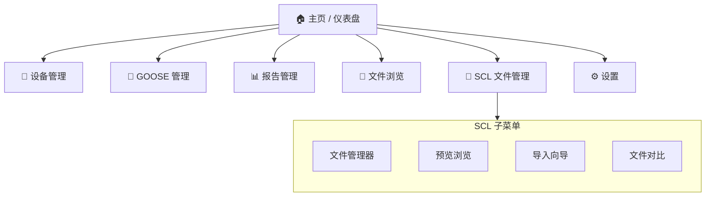

### 1.2 路由设计

| 路径 | 视图组件 | 说明 |
|------|----------|------|
| `/device/:deviceName` | `Device.vue` | 设备详情（含左侧树 + 右侧面板） |
| `/goose` | `GooseView.vue` | GOOSE 发布/订阅管理 |
| `/reports` | `ReportsView.vue` | 报告控制块管理 |
| `/files` | `FilesView.vue` | 远程 IED 文件浏览 |
| `/scl` | `SclView.vue` | SCL 文件管理首页（路由重定向到 `/scl/manager`） |
| `/scl/manager` | `SclFileManager.vue` | SCL 文件管理器 |
| `/scl/preview/:fileName` | `SclPreview.vue` | SCL 文件预览/浏览 |
| `/scl/import` | `SclImportWizard.vue` | SCL 导入向导（含选项卡步骤） |
| `/scl/diff` | `SclDiffViewer.vue` | SCL 文件对比 |
| `/scl/viewer/:fileName` | `SclXmlViewer.vue` | SCL 原始 XML 查看 |

---

## 2. 页面布局

### 2.1 整体布局

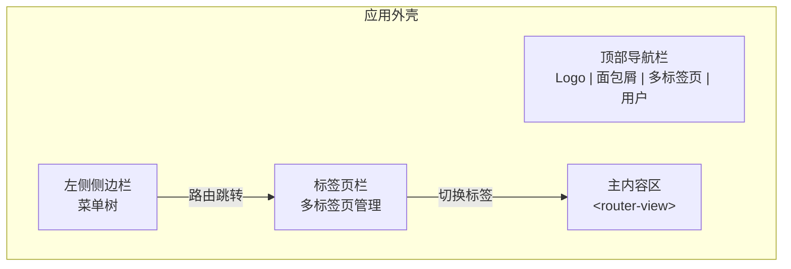

### 2.2 SCL 文件管理器布局

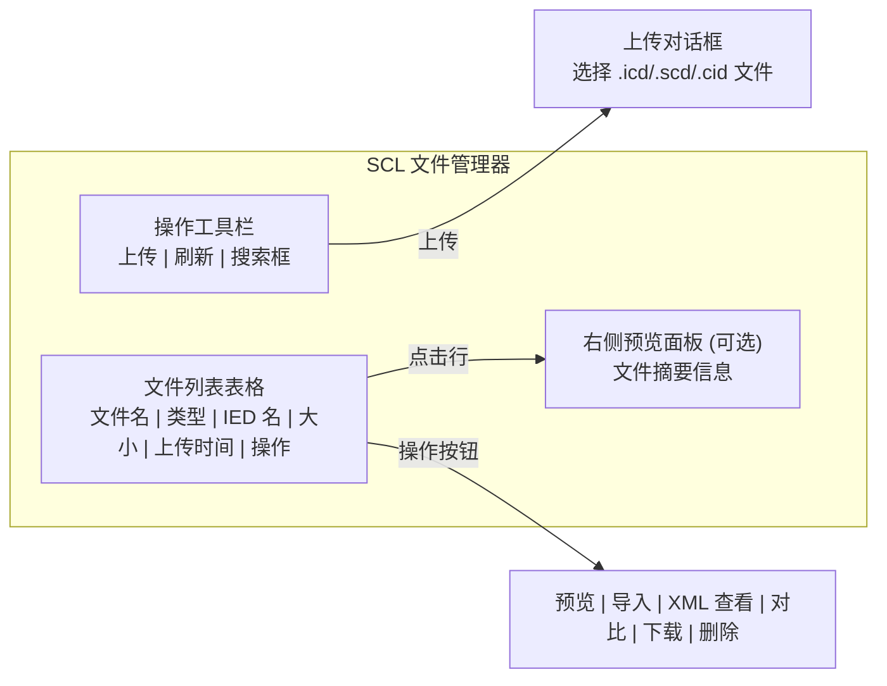

### 2.3 SCL 预览浏览布局

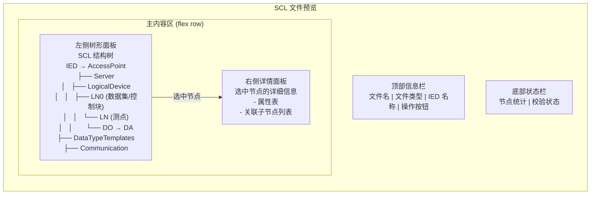

### 2.4 SCL 导入向导布局

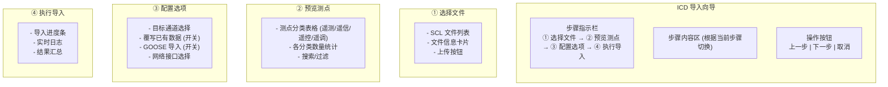

---

## 3. 组件树

### 3.1 新建 SCL 相关组件

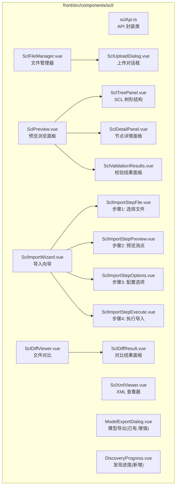

### 3.2 设备页面的增强组件

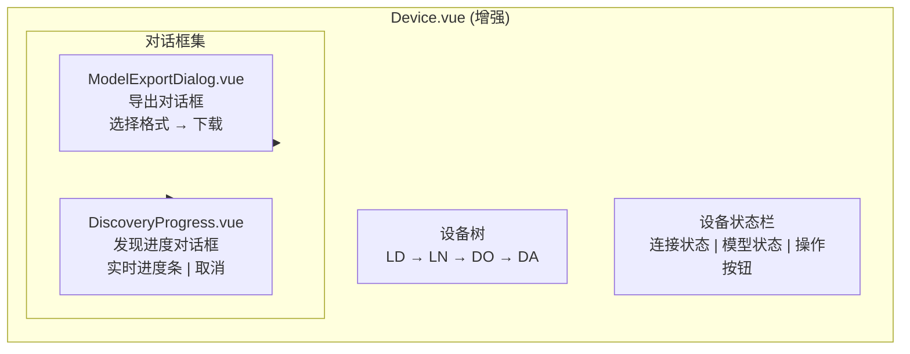

---

## 4. 交互流程

### 4.1 SCL 文件管理流程

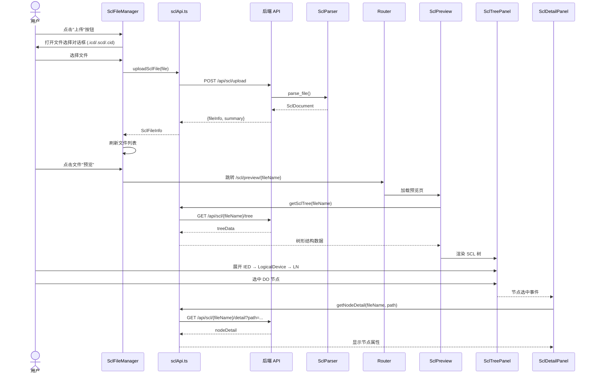

### 4.2 ICD 导入流程

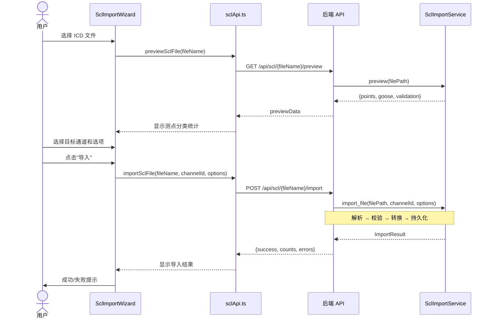

### 4.3 模型发现流程 (增强)

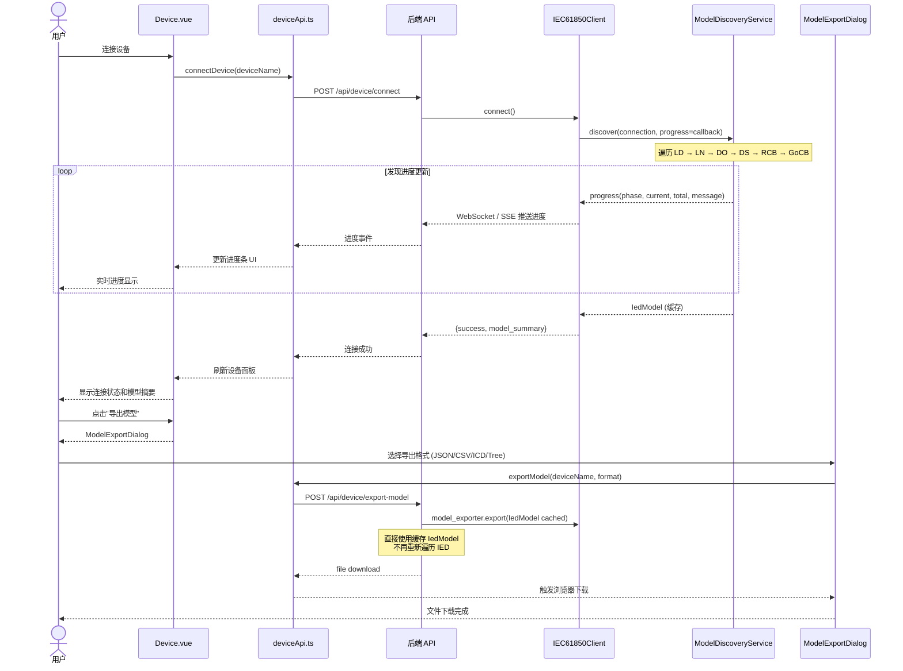

### 4.4 SCL 文件对比流程

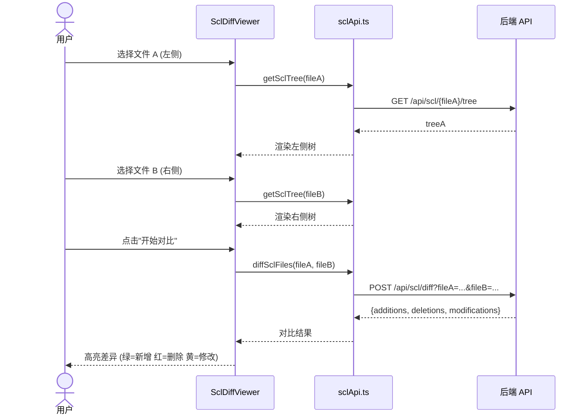

---

## 5. 页面原型图

### 5.1 SCL 文件管理器

```
┌─────────────────────────────────────────────────────────────┐
│ SCL 文件管理                                                │
├─────────────────────────────────────────────────────────────┤
│ [+ 上传] [🔄 刷新]  [🔍 搜索文件名...]                      │
├─────────────────────────────────────────────────────────────┤
│ ┌───┬───────┬──────┬────────┬─────────┬──────────┬────────┐│
│ │ # │ 文件名  │ 类型 │ IED 名 │ 大小    │ 上传时间  │ 操作   ││
│ ├───┼───────┼──────┼────────┼─────────┼──────────┼────────┤│
│ │ 1 │KG_BAMS│ ICD  │KG_BAMS │ 156 KB │ 06-02 14:│ [预览] ││
│ │   │ .icd  │      │        │        │ 30      │ [导入] ││
│ │   │       │      │        │        │         │ [XML]  ││
│ │   │       │      │        │        │         │ [删除] ││
│ ├───┼───────┼──────┼────────┼─────────┼──────────┼────────┤│
│ │ 2 │Station│ SCD  │T1,T2,T3│ 2.1 MB │ 06-01 09:│ [预览] ││
│ │   │ .scd  │      │        │        │ 15      │ [导入] ││
│ │   │       │      │        │        │         │ [对比] ││
│ ├───┼───────┼──────┼────────┼─────────┼──────────┼────────┤│
│ │ 3 │...    │ ...  │ ...    │ ...    │ ...      │ ...    ││
│ └───┴───────┴──────┴────────┴─────────┴──────────┴────────┘│
├─────────────────────────────────────────────────────────────┤
│ 共 3 个文件                           [上一页] [1] [2] [下一页]│
└─────────────────────────────────────────────────────────────┘
```

### 5.2 SCL 预览浏览

```
┌─────────────────────────────────────────────────────────────┐
│ SCL 文件预览: KG_BAMS.icd  [ICD]  [📤 导出XML] [🔄 重新解析]│
├────────────────────────────────┬────────────────────────────┤
│ 🔍 搜索节点...                 │ 📋 节点详情                │
│                                │                            │
│ 📁 KG_BAMS                     │ 属性             值        │
│  ├── AccessPoint S1            │ ─────────────────────────   │
│  │   ├── Server                │ 名称         TotW          │
│  │   │   ├── LD LD0            │ 引用         LD0/MMXU1     │
│  │   │   │   ├── LLN0          │                       .TotW│
│  │   │   │   │   ├── 📊 DataSets│ CDC           MV           │
│  │   │   │   │   │   ├── dsGOOSE│ 帧类型       0 (遥测)      │
│  │   │   │   │   │   └── dsReport                          │
│  │   │   │   │   ├── 🎛️ GoCB   │ 📋 子节点                  │
│  │   │   │   │   │   └── gcb1  │ ┌────────┬──────┬────────┐ │
│  │   │   │   │   └── 📋 RCBs   │ │ DA名   │ FC   │ 类型   │ │
│  │   │   │   ├── MMXU1         │ ├────────┼──────┼────────┤ │
│  │   │   │   │   ├── TotW      │ │ mag.f  │ MX   │ Float  │ │
│  │   │   │   │   ├── TotV      │ │ q      │ MX   │ Qualit │ │
│  │   │   │   │   └── TotA      │ │ t      │ MX   │ Timest │ │
│  │   │   │   └── ...           │ └────────┴──────┴────────┘ │
│  │   │   └── LD1               │                            │
│  │   └── ...                   │ ⚠️ 校验结果                │
│  ├── 📘 DataTypeTemplates      │ ✓ IED 存在性检查: 通过    │
│  └── 📡 Communication          │ ⚠ 类型引用完整: 2 个警告  │
│                                │   - DO 'TotQ' 类型缺失    │
├────────────────────────────────┴────────────────────────────┤
│ 节点数: 125 | DO: 48 | DA: 156 | DS: 2 | GoCB: 1 | 校验: ⚠️ │
└─────────────────────────────────────────────────────────────┘
```

### 5.3 导入向导

```
┌─────────────────────────────────────────────────────────────┐
│ ICD 导入向导                                                │
├─────────────────────────────────────────────────────────────┤
│ ① 选择文件 ───── ② 预览测点 ───── ③ 配置选项 ────→ ④ 执行导入│
├─────────────────────────────────────────────────────────────┤
│                                                             │
│ 请选择要导入的 ICD 文件:                                     │
│                                                             │
│ ┌─────────────────────────────────────────────────────────┐ │
│ │ ○ KG_BAMS.icd               LD0     156 KB  06-02      │ │
│ │   ├─ IED: KG_BAMS                                        │ │
│ │   └─ 测点: YC=24 YX=32 YK=8 YT=4  DS=2 GoCB=1         │ │
│ │                                                         │ │
│ │ ○ T1_Protection.icd         LD0     89 KB   06-01      │ │
│ │   ├─ IED: T1                                             │ │
│ │   └─ 测点: YC=12 YX=48 YK=16 YT=0  DS=1 GoCB=2        │ │
│ │                                                         │ │
│ │ ○ [+ 上传新文件]                                         │ │
│ └─────────────────────────────────────────────────────────┘ │
│                                                             │
├─────────────────────────────────────────────────────────────┤
│                    [取消]          [下一步 →]                │
└─────────────────────────────────────────────────────────────┘
```

```
┌─────────────────────────────────────────────────────────────┐
│ ICD 导入向导                                                │
├─────────────────────────────────────────────────────────────┤
│ ① 选择文件 ──→ ② 预览测点 ──→ ③ 配置选项 ──→ ④ 执行导入   │
├─────────────────────────────────────────────────────────────┤
│ 文件: KG_BAMS.icd              IED: KG_BAMS                 │
│                                                             │
│ ┌──────────────┬──────────────────────────────────────────┐ │
│ │ 遥测 (YC)   22 │ TotalWatts, TotalVars, CurrentPhaseA...│ │
│ │ 遥信 (YX)   30 │ BreakerStatus, IsolatorPosition, ...   │ │
│ │ 遥控 (YK)    8 │ SwitchControl, BreakerControl, ...     │ │
│ │ 遥调 (YT)    4 │ VoltageSetpoint, PowerFactorSet, ...   │ │
│ ├──────────────┴──────────────────────────────────────────┤ │
│ │ [🔍 搜索测点...]                                         │ │
│ │ ┌────────┬────────────┬──────────┬──────┬──────┬──────┐ │ │
│ │ │ 编码    │ 名称        │ 寄存器地址 │ 分类 │ FC   │ 类型 │ │ │
│ │ ├────────┼────────────┼──────────┼──────┼──────┼──────┤ │ │
│ │ │ TotW   │ TotalWatts │ LD0/MMXU1│ YC   │ MX   │Float │ │ │
│ │ │        │            │ .TotW.   │      │      │      │ │ │
│ │ │        │            │ mag.f    │      │      │      │ │ │
│ │ │ Breaker│ 断路器状态   │ LD0/XCBR1│ YX   │ ST   │Bool  │ │ │
│ │ │...     │ ...         │ ...      │ ...  │ ...  │ ...  │ │ │
│ │ └────────┴────────────┴──────────┴──────┴──────┴──────┘ │ │
│ └──────────────────────────────────────────────────────────┘ │
├─────────────────────────────────────────────────────────────┤
│                    [← 上一步]          [下一步 →]           │
└─────────────────────────────────────────────────────────────┘
```

```
┌─────────────────────────────────────────────────────────────┐
│ ICD 导入向导                                                │
├─────────────────────────────────────────────────────────────┤
│ ① 选择文件 ──→ ② 预览测点 ──→ ③ 配置选项 ──→ ④ 执行导入   │
├─────────────────────────────────────────────────────────────┤
│ 导入配置:                                                   │
│                                                             │
│ 目标通道: [通道 1 - 变电站 A ▼]                              │
│                                                             │
│ □ 覆写已有数据 (选中将清除通道 1 下的所有现有测点)            │
│                                                             │
│ ■ 导入 GOOSE 配置                                           │
│   网络接口: [eth0 ▼]                                        │
│                                                             │
│ □ 导入报告配置                                              │
│                                                             │
├─────────────────────────────────────────────────────────────┤
│                    [← 上一步]          [开始导入 →]         │
└─────────────────────────────────────────────────────────────┘
```

```
┌─────────────────────────────────────────────────────────────┐
│ ICD 导入向导                                                │
├─────────────────────────────────────────────────────────────┤
│ ① 选择文件 ──→ ② 预览测点 ──→ ③ 配置选项 ──→ ④ 执行导入   │
├─────────────────────────────────────────────────────────────┤
│                                                             │
│  ⏳ 正在导入...                                             │
│                                                             │
│  ███████████████████████░░░░░░░░░░  65%                     │
│                                                             │
│  📋 导入日志:                                               │
│  [14:30:01] 解析 ICD 文件成功                                │
│  [14:30:01] 校验完成: 2 个警告                               │
│  [14:30:01] 清除通道 1 现有数据...                           │
│  [14:30:02] 导入遥测: 22/22 ✓                               │
│  [14:30:02] 导入遥信: 30/30 ✓                               │
│  [14:30:02] 导入遥控: 8/8 ✓                                 │
│  [14:30:02] 导入遥调: 4/4 ✓                                 │
│  [14:30:03] 正在导入 GOOSE 配置...                           │
│  [14:30:03] GOOSE 发布者: 2/2 ✓                             │
│  [14:30:03] ✓ 导入完成                                       │
│                                                             │
│  📊 导入结果:                                               │
│  遥测: 22  遥信: 30  遥控: 8  遥调: 4  GOOSE: 2             │
│                                                             │
├─────────────────────────────────────────────────────────────┤
│                                   [完成]                    │
└─────────────────────────────────────────────────────────────┘
```

### 5.4 模型发现进度对话框

```
┌──────────────────────────────────────┐
│ 🔄 正在发现模型...                    │
│                                      │
│  设备: IED_Protection_01             │
│  地址: 192.168.1.100:102             │
│                                      │
│  ████████████████░░░░░░░░░░  55%     │
│                                      │
│  当前: 发现 LD: LD0                   │
│  进度: LD 3/5 | LN 42/128            │
│                                      │
│  📋 发现的节点:                       │
│  ✓ LD0/LLN0 (DoCB:2 DS:3 RCB:1)     │
│  ✓ LD0/MMXU1 (DO:12 DA:48)          │
│  ✓ LD0/MMTR1 (DO:8 DA:24)           │
│  ⏳ LD0/XCBR1...                     │
│  ⏳ LD0/CSWI1...                     │
│                                      │
│                    [取消发现]         │
└──────────────────────────────────────┘
```

### 5.5 SCL 文件对比

```
┌─────────────────────────────────────────────────────────────┐
│ SCL 文件对比                                                │
├─────────────────────────────────────────────────────────────┤
│ 文件 A: [KG_BAMS_v1.icd ▼]   [⇄ 交换]   文件 B: [KG_BAMS_v2.icd ▼]│
│                    [🔍 开始对比]                             │
├──────────────────────────────────┬──────────────────────────┤
│ KG_BAMS_v1.icd                   │ KG_BAMS_v2.icd           │
├──────────────────────────────────┼──────────────────────────┤
│ 📁 KG_BAMS                       │ 📁 KG_BAMS               │
│  ├── AccessPoint S1              │  ├── AccessPoint S1      │
│  │   ├── Server                  │  │   ├── Server          │
│  │   │   ├── LD LD0              │  │   │   ├── LD LD0      │
│  │   │   │   ├── LLN0            │  │   │   │   ├── LLN0    │
│  │   │   │   │   ├── dsGOOSE     │  │   │   │   │   ├── dsGOOSE      │
│  │   │   │   │   │   └── FCDA(3)│  │   │   │   │   │   ├── dsGOOSE2   │← 🟢新增
│  │   │   │   │   └── gcb1       │  │   │   │   │   │   └── FCDA(1)   │← 🟢新增
│  │   │   │   ├── MMXU1          │  │   │   │   │   └── gcb1          │
│  │   │   │   │   ├── TotW       │  │   │   │   ├── MMXU1             │
│  │   │   │   │   ├── TotV       │  │   │   │   │   ├── TotW          │
│  │   │   │   │   │   ├── mag.f  │  │   │   │   │   ├── TotV          │
│  │   │   │   │   │   ├── q      │  │   │   │   │   │   ├── mag.f     │
│  │   │   │   │   │   └── t      │  │   │   │   │   │   ├── q          │
│  │   │   │   │   ├── TotA       │  │   │   │   │   │   └── t          │
│  │   │   │   │   └── TotPF      │← 🟡修改 │   │   │   ├── TotA       │
│  │   │   │   └── XCBR1          │  │   │   │   │   ├── TotPF         │← 🟡修改
│  │   │   │       ├── Pos        │  │   │   │   │   │   └── cVal.mag.f│← 🟡修改
│  │   │   │       ├── BlkOpn     │  │   │   │   │   └── TotPF_Q       │← 🔴删除
│  │   │   │       └── BlkCls     │  │   │   │   └── XCBR1             │
│  │   │   └── LD1 (已移除)       │← 🔴删除│   │       ├── Pos        │
│  └── ...                        │  │   │       ├── BlkOpn     │
│                                 │  │   │       └── BlkCls     │
│                                 │  │   └── LD2               │← 🟢新增
│                                 │  └── ...                   │
├──────────────────────────────────┴──────────────────────────┤
│ 📊 差异统计: +3 节点 | -4 节点 | ±2 修改                    │
└─────────────────────────────────────────────────────────────┘
```

### 5.6 SCL XML 查看器

```
┌─────────────────────────────────────────────────────────────┐
│ KG_BAMS.icd - 原始 XML                        [📋 复制] [💾 下载]│
├─────────────────────────────────────────────────────────────┤
│ 行号 │ XML 内容                                              │
│ ─────┼─────────────────────────────────────────────────────── │
│    1 │ <?xml version="1.0" encoding="UTF-8"?>               │
│    2 │ <SCL xmlns="http://www.iec.ch/61850/2003/SCL"        │
│    3 │     revision="B"                                      │
│    4 │     release="4"                                       │
│    5 │     version="2007">                                   │
│    6 │     <Header id="KG_BAMS"                              │
│    7 │             version="1" revision="0">                 │
│    8 │     </Header>                                         │
│    9 │     <IED name="KG_BAMS" manufacturer="...">           │
│   10 │         <AccessPoint name="S1">                       │
│   11 │             <Server>                                  │
│   12 │                 <LDevice inst="LD0">                  │
│   13 │                     <LN0 lnClass="LLN0"               │
│   14 │                          lnType="LN0_TYPE">           │
│   15 │                         <DataSet name="dsGOOSE">      │
│   16 │                             <FCDA ldInst="LD0"        │
│   17 │                                   .../>               │
│   18 │                         </DataSet>                    │
│   19 │                     </LN0>                            │
│   20 │                     <LN lnClass="MMXU"                │
│   21 │                        inst="1"                       │
│   22 │                        lnType="MMXU_TYPE">            │
│   23 │                         <DOI name="TotW">...</DOI>    │
│   24 │                     </LN>                             │
│   25 │                 </LDevice>                            │
│   26 │             </Server>                                 │
│   27 │         </AccessPoint>                                │
│   28 │     </IED>                                            │
│   29 │     <DataTypeTemplates>                               │
│   30 │         <LNodeType id="MMXU_TYPE" cdc="MV">           │
│   31 │             <DO name="TotW" type="MV_DO"/>            │
│   32 │         </LNodeType>                                  │
│   33 │     </DataTypeTemplates>                              │
│   34 │ </SCL>                                                │
├─────────────────────────────────────────────────────────────┤
│ 行 1-34 / 共 2,456 行                              [1-999] ▶│
└─────────────────────────────────────────────────────────────┘
```

---

## 6. API 接口清单

### 6.1 SCL 文件管理 API

| 方法 | 路径 | 说明 | 对应组件 |
|------|------|------|----------|
| `GET` | `/api/scl/files` | 获取 SCL 文件列表 | `SclFileManager` |
| `POST` | `/api/scl/upload` | 上传 SCL 文件 | `SclUploadDialog` |
| `GET` | `/api/scl/{fileName}` | 获取文件元信息 | `SclFileManager` |
| `GET` | `/api/scl/{fileName}/content` | 获取原始 XML 内容 | `SclXmlViewer` |
| `GET` | `/api/scl/{fileName}/tree` | 获取 SCL 解析树结构 | `SclTreePanel` |
| `GET` | `/api/scl/{fileName}/detail` | 获取节点详情 | `SclDetailPanel` |
| `GET` | `/api/scl/{fileName}/preview` | 预览导入内容(测点统计) | `SclImportStep2` |
| `GET` | `/api/scl/{fileName}/validation` | 获取校验结果 | `SclValidationResults` |
| `POST` | `/api/scl/{fileName}/import` | 导入到通道 | `SclImportStep4` |
| `DELETE` | `/api/scl/{fileName}` | 删除文件 | `SclFileManager` |
| `POST` | `/api/scl/diff` | 对比两个 SCL 文件 | `SclDiffResult` |

### 6.2 模型发现/导出 API (增强)

| 方法 | 路径 | 说明 | 对应组件 |
|------|------|------|----------|
| `POST` | `/api/devices/{name}/connect` | 连接设备(含发现进度推送) | `Device.vue` |
| `GET` | `/api/devices/{name}/discovery-progress` | 发现进度轮询 | `DiscoveryProgress` |
| `POST` | `/api/devices/{name}/export-model` | 导出模型(流式大文件) | `ModelExportDialog` |
| `POST` | `/api/devices/{name}/export-model-progress` | 异步导出进度查询 | `ModelExportDialog` |

---

## 7. 数据流

### 7.1 数据流总览

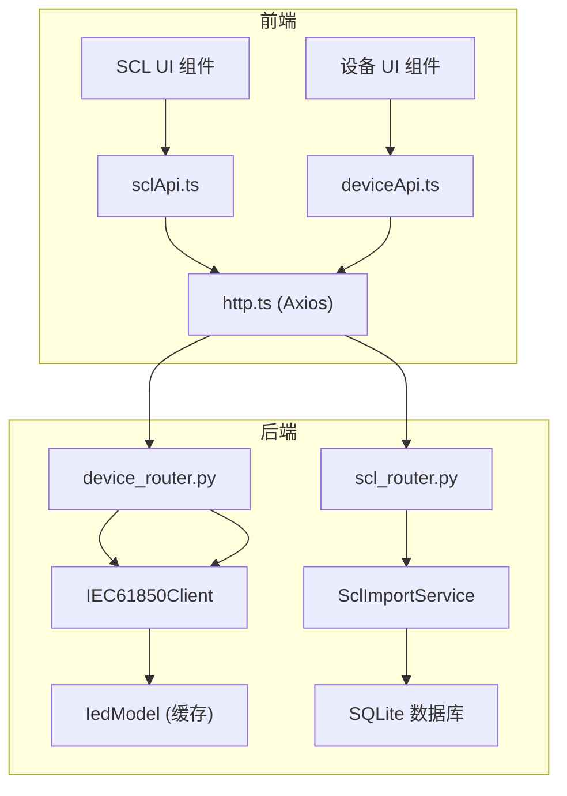

### 7.2 文件 → 测点数据流

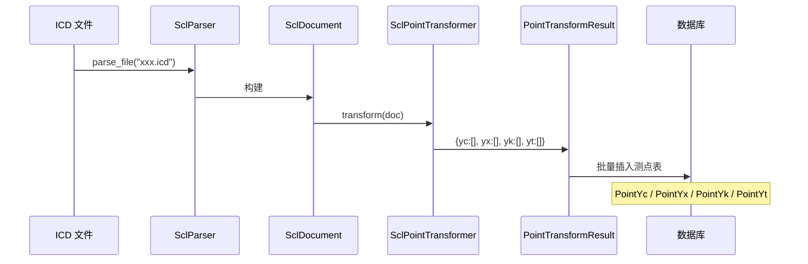

---

## 8. 组件属性与事件

### 8.1 关键组件接口

```typescript
// SclTreePanel.vue
interface SclTreePanelProps {
  treeData: SclTreeNode[]          // SCL 树节点数据
  selectedPath: string             // 当前选中节点路径
  diffMode?: boolean               // 是否处于对比模式
  highlightNodes?: string[]        // 高亮节点路径列表
}

interface SclTreePanelEmits {
  (e: 'node-select', path: string, node: SclTreeNode): void
  (e: 'node-expand', path: string): void
}

// SclTreeNode 类型
interface SclTreeNode {
  id: string                       // 唯一标识
  label: string                    // 显示名称
  type: 'IED' | 'AP' | 'Server' | 'LDevice' | 'LN' | 'DO' | 'DA'
       | 'DataSet' | 'FCDA' | 'GoCB' | 'RCB' | 'DataType' | 'Communication'
  children?: SclTreeNode[]
  icon?: string                    // 图标名称
  badge?: string                   // 徽标 (如 "DS:3")
  meta?: Record<string, any>       // 节点元数据
}
```

```typescript
// SclImportWizard.vue
interface ImportOptions {
  fileName: string                 // 源文件名
  channelId: number                // 目标通道 ID
  overwrite: boolean               // 是否覆写
  importGoose: boolean             // 是否导入 GOOSE
  gooseInterface: string           // GOOSE 网口
  importReports: boolean           // 是否导入报告
}

interface ImportResult {
  success: boolean
  totalPoints: number              // 测点总数
  yc: number
  yx: number
  yk: number
  yt: number
  gooseCount: number
  reportCount: number
  errors: string[]                 // 错误列表
  warnings: string[]               // 警告列表
}
```

```typescript
// DiscoveryProgress.vue
interface DiscoveryProgressProps {
  visible: boolean
  deviceName: string
  host: string
  port: number
}

interface DiscoveryProgressData {
  phase: 'browse-ld' | 'discovering' | 'building' | 'done' | 'error'
  current: number                  // 当前进度
  total: number                    // 总量
  message: string                  // 进度消息
  discoveredLds: number
  discoveredLns: number
  discoveredDos: number
  discoveredDas: number
  elapsed: number                  // 已耗时(秒)
}
```

---

## 9. 主题与样式

### 9.1 颜色语义

| 用途 | 颜色 | CSS 变量 | 说明 |
|------|------|----------|------|
| 遥测 (YC) | <span style="color:#1890ff">蓝色</span> | `--color-yc` | 测量值 |
| 遥信 (YX) | <span style="color:#52c41a">绿色</span> | `--color-yx` | 状态量 |
| 遥控 (YK) | <span style="color:#faad14">橙色</span> | `--color-yk` | 控制量 |
| 遥调 (YT) | <span style="color:#722ed1">紫色</span> | `--color-yt` | 设定值 |
| 差异新增 | <span style="color:#389e0d">深绿</span> | `--color-diff-add` | 文件对比中的新增节点 |
| 差异删除 | <span style="color:#cf1322">红色</span> | `--color-diff-del` | 文件对比中的删除节点 |
| 差异修改 | <span style="color:#d4b106">黄色</span> | `--color-diff-mod` | 文件对比中的修改节点 |
| 校验错误 | <span style="color:#f5222d">红色</span> | `--color-validation-error` | 校验错误 |
| 校验警告 | <span style="color:#faad14">橙色</span> | `--color-validation-warning` | 校验警告 |

### 9.2 图标

| 图标 | 含义 | 使用场景 |
|------|------|----------|
| `📁` | 文件夹/容器 | IED, LogicalDevice, DataTypeTemplates |
| `📄` | 文件 | ICD/SCD/CID 文件 |
| `📊` | 数据集 | DataSet 节点 |
| `🎛️` | 控制块 | GoCB, RCB 节点 |
| `📡` | 通信 | Communication, SubNetwork |
| `🔍` | 搜索 | 搜索框 |
| `✅` `⚠️` `❌` | 校验状态 | 校验结果面板 |

---

## 10. 实施要点

### 10.1 分步实施建议

```
阶段 A (核心): SclFileManager + SclPreview + SclXmlViewer
  - 实现文件上传/列表/删除/预览
  - 提供树形浏览和 XML 查看

阶段 B (导入): SclImportWizard
  - 实现导入向导四步骤
  - 与后端 SclImportService 对接

阶段 C (增强): SclDiffViewer + DiscoveryProgress
  - 实现文件对比功能
  - 实现模型发现实时进度

阶段 D (优化): ModelExportDialog 增强
  - 利用缓存 IedModel 优化导出体验
  - 不再需要等发现完成才能导出
```

### 10.2 性能注意事项

1. **大数据集虚拟滚动**: SCL 树超过 1000 节点时启用虚拟滚动
2. **标签页缓存**: SCL 预览页使用 `<keep-alive>` 缓存树形数据
3. **文件下载**: 模型导出使用 `fetch` + `Blob` 绕过 Vue 响应式深拷贝，避免循环引用
4. **上传进度**: 大文件上传显示上传进度百分比
5. **节流**: 树节点展开时，对后端详情 API 使用 300ms 防抖
6. **SSE 替代轮询**: 发现进度优先使用 Server-Sent Events，降级为 2s 间隔轮询

### 10.3 现有组件改造

| 已有组件 | 变更 | 说明 |
|----------|------|------|
| `ModelExportDialog.vue` | 增强 | 利用缓存 IedModel 即时导出，不再需要等待重新发现 |
| `Device.vue` | 增强 | 连接时显示发现进度对话框 |
| `Slave.vue` | 无变更 | 设备列表显示不变 |
| `deviceApi.ts` | 增强 | 新增 SSE 进度监听方法 |
