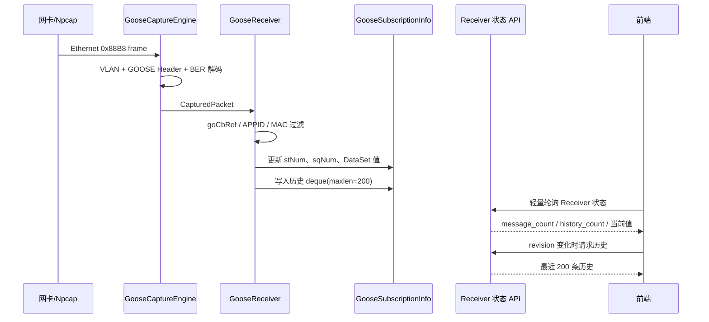

# GOOSE 接收、DataSet 历史与抓包链路重构

> 日期：2026-07-12  
> 状态：已实现  
> 范围：Windows GOOSE 接收、ASN.1 BER 解析、DataSet 元数据映射、历史缓存、抓包 WebSocket、前端交互与日志分级

## 1. 背景与问题边界

测试服务端已经使能 GOOSE，Wireshark 能稳定捕获 EtherType `0x88B8` 报文，但应用出现以下症状：

- Receiver 显示“启动成功”，当前 GOOSE 数据和历史数据仍为空。
- 抓包页面无法收到数据，停止按钮状态也不可靠。
- DataSet 表格只能显示 `Entry[0]`、`Entry[1]`，无法显示真实 FCDA 引用。
- GOOSE 高频重传后，“前值”迅速被覆盖成“当前值”。
- 历史页签每次轮询都重新加载整批数据，选中行会丢失。
- Windows 首次加载 Scapy/Npcap 时可能被 0.5 秒启动超时误判为失败。

这些问题横跨二层收包、BER 解码、模型关联、缓存语义和前端状态机，不能通过单独修改页面文案解决。

## 2. 现场证据与根因

### 2.1 报文确实到达目标网卡

在 WLAN 上直接捕获到的关键字段为：

```text
EtherType  = 0x88B8
APPID      = 0x0001
goCbRef    = PCS01PIGO/LLN0$GO$gocb0
datSet     = PCS01PIGO/LLN0$dsGOOSE0
confRev    = 1
numEntries = 10
```

数据库中的启用订阅具有相同 `goCbRef` 和 APPID。因此问题不在服务端发送，也不在订阅过滤条件。

### 2.2 Windows libiec61850 Receiver 未触发回调

原实现直接调用：

```text
GooseReceiver_create
GooseReceiver_setInterfaceId
GooseReceiver_addSubscriber
GooseReceiver_start
```

底层返回运行状态，但在 Windows/Npcap 环境没有触发 Python 回调。将友好网卡名替换为 `\Device\NPF_{GUID}` 后仍无回调，因此不能简单归因于网卡名称转换。

最终策略是：

- Windows Receiver 使用已验证可靠的 Scapy/Npcap 捕获路径。
- Linux/macOS 保留 libiec61850/原始套接字路径。
- 两条路径最终写入同一 `GooseSubscriptionInfo` 状态模型。

### 2.3 GOOSE BER 标签定义错误

旧抓包解析器使用了错误或整体偏移的标签。现场报文显示实际标签如下：

| 字段 | 正确标签 |
|---|---:|
| GOOSE PDU | `0x61` |
| goCbRef | `0x80` |
| timeAllowedToLive | `0x81` |
| datSet | `0x82` |
| goID | `0x83` |
| timestamp | `0x84` |
| stNum | `0x85` |
| sqNum | `0x86` |
| test/simulation | `0x87` |
| confRev | `0x88` |
| ndsCom | `0x89` |
| numDatSetEntries | `0x8A` |
| allData | `0xAB` |

旧实现期待 PDU `0xA1`、allData `0x8A`，导致报文虽被抓到，却无法进入 DataSet 解码。

### 2.4 MMS Data 标签与浮点编码处理错误

GOOSE `allData` 中使用 MMS 上下文标签：

| 类型 | 标签 | 解码 |
|---|---:|---|
| boolean | `0x83` | 非零为 `true` |
| bit-string | `0x84` | 跳过 unused-bits 字节后合并 |
| integer | `0x85` | BER 整数 |
| unsigned | `0x86` | BER 无符号整数 |
| floating-point | `0x87` | 指数宽度前缀 + IEEE-754 数据 |
| octet-string | `0x89` | 十六进制字符串 |
| visible-string | `0x8A` | UTF-8/可见字符串 |
| utc-time | `0x91` | UTC 时间字节 |

浮点值通常编码为：

```text
87 05 08 XX XX XX XX
```

其中 `08` 是指数宽度描述，后 4 字节才是 float32。旧实现从 `08` 开始直接解包，得到错误结果。

## 3. 接收架构调整

### 3.1 统一数据流



### 3.2 Windows Npcap 启动

Windows 分支创建 `GooseCaptureEngine`，注册 `_on_captured_packet` 回调，并在捕获线程真正就绪后才把 Receiver 标记为运行。

首次导入 Scapy 和枚举 Npcap 适配器可能明显超过 0.5 秒，因此启动等待策略调整为：

| 平台 | 启动等待 |
|---|---:|
| Windows | 5 秒 |
| Linux/macOS | 0.5 秒 |

这个等待是“最大就绪等待”，线程提前就绪会立即返回，不会固定阻塞 5 秒。

### 3.3 生命周期

停止 Receiver 时必须按以下顺序清理：

1. 设置 Receiver 非运行状态。
2. 停止超时监控线程。
3. 从捕获引擎移除回调，避免停止阶段继续写状态。
4. 停止 Npcap 捕获线程。
5. 释放 libiec61850 Subscriber/Handler（非 Windows 路径）。
6. 将订阅状态恢复为 `init`。

## 4. DataSet 值与引用映射

### 4.1 为什么报文里只有 `Entry[i]`

GOOSE 报文的 `allData` 只携带有序值，不携带每个值对应的 FCDA 引用。正确解释必须依赖同一个 DataSet 的成员目录：

```text
allData[0] <-> DataSet.members[0]
allData[1] <-> DataSet.members[1]
...
```

因此 `Entry[0]` 不是协议返回的名称，而是元数据缺失时的保底显示。

### 4.2 三层元数据来源

DataSet 成员按以下优先级解析：

1. **订阅已持久化的 `dataset_entries`**：避免重复查询。
2. **MMS DataSet Directory 在线读取**：复用 Reports 的目录读取能力。
3. **IEC 61850 模型缓存**：在线读取返回 `object-non-existent` 时回退。

### 4.3 `$` 与 `.` 引用规范化

现场存在两种等价引用：

```text
报文/GOOSE 配置：PCS01PIGO/LLN0$dsGOOSE0
模型缓存：       PCS01PIGO/LLN0.dsGOOSE0
```

匹配时统一规范为点号形式，再比较完整引用。模型缓存命中后得到 10 个成员，例如：

```text
0 -> PCS01PIGO/GGIO1.AnIn1.mag.i  FC=MX  integer
1 -> PCS01PIGO/GGIO1.AnIn2.mag.f  FC=MX  float
...
9 -> PCS01PIGO/GGIO2.AnIn5.mag.f  FC=MX  float
```

解析到的成员会写回 Subscription 并持久化。当前值和已存在的历史条目也会重新应用元数据，不必等待下一次值变化才看到真实引用。

## 5. 前值、当前值与重传语义

### 5.1 错误实现

旧逻辑把“上一帧的值”作为前值：

```text
0 -> 45 -> 45 -> 45
```

第一次变化时显示 `0 / 45`，但下一次重传后就变成 `45 / 45`。这不符合用户对变化历史的理解。

### 5.2 正确实现

现在定义为：

- **当前值**：最新报文值。
- **前值**：最近一次与当前值不同的历史值。
- **changed**：本次报文是否使值发生变化。
- **changed_at**：本次变化时间；重复报文不产生新的变化时间。

状态转换示例：

| 输入序列 | 前值 | 当前值 | changed |
|---|---:|---:|---|
| 首次 `0` | 空 | 0 | false |
| 重传 `0` | 空 | 0 | false |
| 变化 `45` | 0 | 45 | true |
| 重传 `45` | 0 | 45 | false |
| 变化 `12` | 45 | 12 | true |

Windows Npcap 和 libiec61850 两条接收路径使用相同语义。

## 6. 历史环形队列与性能

### 6.1 有界历史

每个 `goCbRef` 对应一个：

```python
deque(maxlen=200)
```

达到 200 条后，新增记录自动淘汰最旧记录，不会因 GOOSE 高频重传导致内存无限增长。

历史项保存：

- `received_at`
- GOOSE timestamp
- `st_num` / `sq_num`
- `conf_rev`
- `data_set_ref`
- `value_count` / `changed_count`
- 当次 DataSet 值快照

### 6.2 页签计数与正文解耦

后端状态增加：

- `message_count`：累计接收 revision，持续增长。
- `history_count`：当前环形队列内条数，最大 200。

前端页签数字使用 `history_count`，因此停留在“属性配置”或“最近 GOOSE 数据”时仍会变化。

历史正文不再每 2 秒无条件拉取：

1. 状态轮询取得 `message_count`。
2. 与 `historyKnownRevision` 比较。
3. revision 未变化则跳过历史请求。
4. revision 变化且历史页可见时，最多请求 200 条。

### 6.3 过期响应与选中行稳定性

前端使用单调递增 `historyRequestId` 丢弃过期请求，避免快速切换控制块时旧响应覆盖新选择。

历史表使用 `received_at` 作为稳定 `row-key`，并通过 `current-row-key` 恢复当前行。替换轮询数据时 Element Plus 可能短暂发出 `null` 选中事件，该事件被忽略，因此用户查看的行和详情不会被定时刷新清除。

## 7. 抓包 WebSocket 修复

### 7.1 根因

HTTP API 使用：

```text
VUE_APP_API_BASE=http://127.0.0.1:8991
```

旧 WebSocket 实现尝试读取未注册的 `window.__axios_instance`，失败后回退到页面 origin。在开发环境中，这会连接前端端口而不是后端端口。

同时前端在发送 start 命令前就把 `captureRunning` 设置为 `true`，即使 WebSocket 未连接，也会显示正在运行，造成“抓不到且停不掉”的假状态。

### 7.2 修复

- WebSocket 和 HTTP 统一使用 `VUE_APP_API_BASE`。
- 相对地址通过 `new URL(..., window.location.origin)` 解析。
- 只有收到后端 start 成功响应后才设置 `captureRunning=true`。
- stop 可取消启动中状态。
- 后端 stop 先移除回调，再发送非阻塞停止信号，避免 join 阻塞事件循环和响应发送。

### 7.3 抓包与 Receiver 的关系

Receiver 和抓包页都可以监听同一网卡，但用途不同：

| 能力 | Receiver | 抓包页 |
|---|---|---|
| 数据过滤 | 按订阅 goCbRef/APPID/MAC | 可选 APPID，默认全部 |
| 输出 | 当前值、状态、历史 | 原始帧、统计、十六进制 |
| 生命周期 | 随订阅启停 | 用户显式启停 |
| 数据语义 | DataSet 业务数据 | 协议诊断数据 |

## 8. 前端交互整理

### 8.1 页面语义

- “最近 GOOSE 数据”展示当前 DataSet 值，不把业务值误称为原始报文。
- “GOOSE 数据历史”展示环形队列中的 DataSet 快照。
- 独立“GOOSE 抓包”页面才展示 Ethernet/GOOSE 原始报文。

### 8.2 DataSet 表格

保留扁平 DataSet 明细表，字段为：

- 数据引用
- 描述
- FC
- 类型
- 前值
- 当前值

表头、行高、边框、背景色、悬停色和字体与 Reports 数据表保持一致。

### 8.3 抓包工具栏

- 网卡下拉展示显示名称和 MAC。
- 缓存默认 100。
- APPID 默认 1。
- 缓存与 APPID 使用左减右加的数字控件。
- 控件具有一致高度和响应式换行，不在窄窗口中裁切。

## 9. 日志和错误等级

远端 GoEna 写入失败属于服务端操作失败：

```text
设置远端 GoCB GoEna 失败: MMS 连接不可用
业务异常: 远端 GOOSE 控制块 GoEna 使能失败 (code=500)
```

两类日志均使用 `ERROR`：

- `client_control.py` 的底层失败为 `ERROR`。
- Web 层 `BizError.http_status >= 500` 为 `ERROR`。
- 400、404、409 等用户输入或资源状态问题继续使用 `WARNING`。

## 10. API 与状态字段

### Receiver/Subscription 状态新增字段

| 字段 | 类型 | 含义 |
|---|---|---|
| `message_count` | integer | 累计接收报文数/revision |
| `history_count` | integer | 当前环形队列条数，最大 200 |

### 历史查询

```text
POST /api/channels/goose/receivers/subscriptions/history
```

请求上限调整为 200，与环形队列容量一致。

### 抓包 WebSocket

```text
WS /api/channels/goose/capture/ws
```

支持命令：

- `start`
- `stop`
- `clear`
- `list`
- `status`

## 11. 验证结果

本次实现采用三层验证：

### 11.1 现场协议验证

- WLAN 直接捕获到持续发送的 GOOSE 报文。
- APPID 和 goCbRef 与订阅完全一致。
- 修复 BER 标签后，3 秒内连续收到 6 条更新。
- 每条成功解析 10 个 DataSet 值。
- 独立 HTTP 抓包会话可以启动、列出报文并停止。

### 11.2 自动测试

- GOOSE 捕获与订阅测试通过。
- MAC 规范化测试通过。
- 设备作用域与持久化测试通过。
- 新增重传测试验证：相同值重传不覆盖最近一次不同前值。

### 11.3 静态检查

- Ruff lint 通过。
- Ruff format 检查通过。
- Vue/TypeScript 类型检查通过。
- `git diff --check` 通过。

## 12. 运维排障手册

### 12.1 Wireshark 有报文，Receiver 没数据

依次检查：

1. Wireshark 是否使用和 Receiver 相同的网卡。
2. EtherType 是否为 `0x88B8`。
3. Receiver 是否显示 Npcap 启动成功。
4. Subscription 是否启用。
5. `goCbRef` 是否完整一致，包括大小写和 `$GO$`。
6. APPID 是否一致。
7. 配置目标 MAC 时是否与报文一致。

Windows 关键日志：

```text
GOOSE 报文捕获已启动: interface=...
GOOSE Receiver 已启动 (Npcap): interface=..., 订阅数=...
```

### 12.2 显示 Entry[n]

检查：

1. Subscription 的 `dataset_entries` 是否为空。
2. `data_set_ref` 是否为报文中的完整引用。
3. 在线 DataSet Directory 是否返回 `object-non-existent`。
4. 模型缓存是否包含等价点号引用。
5. 日志是否出现：

```text
从模型缓存关联 GOOSE DataSet 成员: ref=..., count=...
```

### 12.3 抓包无法停止

检查浏览器 WebSocket 是否连接：

```text
ws://<backend>/api/channels/goose/capture/ws
```

不要以按钮视觉状态判断后端状态，应调用 status 或查看 start/stop 响应。

### 12.4 GoEna 失败

GoEna 是 MMS 控制操作。即使 GOOSE 二层报文仍在发送，MMS 连接不可用时也会失败。检查设备连接状态、远端 GoCB 引用候选格式和 IED 返回错误码。

## 13. 后续建议

1. 抽取 libiec61850 与 Npcap 两条接收路径共用的 DataSet 状态合并函数，继续减少重复逻辑。
2. 为 BER 解析增加更多结构体、quality、timestamp 和嵌套 array 测试向量。
3. 在 Receiver 状态中增加最近源 MAC、目标 MAC、VLAN 和 parse error，提升诊断能力。
4. 将模型缓存 DataSet 查找下沉为统一服务，供 Reports、GOOSE 和 DataSet 页面共同调用。
5. 为 WebSocket 增加命令 request id，使多个页面同时控制抓包时响应归属更明确。

