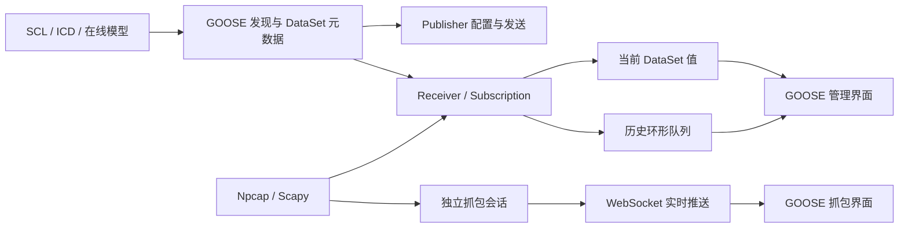

# IEC 61850 GOOSE 专题

本专题汇总 EMS Simulate 中 GOOSE（Generic Object Oriented Substation Event）的设计、演进、实现约束与排障方法。文档按能力演进组织，而不是简单按文件修改时间堆叠。

## 阅读路线

| 阶段 | 文档 | 适合读者 |
|---|---|---|
| 1 | [GOOSE 功能支持](../01-goose-support.md) | 首次了解 Publisher、Receiver、Subscription 和抓包能力 |
| 2 | [GOOSE 模块插件化重构](../06-goose-plugin-refactoring.md) | 了解协议层模块边界和资源管理器 |
| 3 | [GOOSE 按设备作用域全栈重构](../25-goose-device-scoped-refactoring.md) | 了解 `channel_id` 隔离、持久化、真实网卡和导入流程 |
| 4 | [GOOSE 接收、数据历史与抓包链路重构](./04-receive-history-capture-refactoring.md) | 了解 2026-07-12 的接收修复、DataSet 映射、环形队列和前端性能优化 |

## 当前能力地图

### Publisher

- 按设备、控制块引用和网卡管理发布实例。
- 支持 APPID、目标 MAC、VLAN、ConfRev、TAL、Simulation 和 DataSet 条目。
- 支持持久化、恢复、立即发布和运行状态查询。

### Receiver / Subscription

- Receiver 按设备和网卡隔离，Subscription 按 `goCbRef` 匹配。
- 支持 APPID、目标 MAC、ConfRev 和启用状态过滤。
- Windows 使用 Npcap/Scapy 可靠接收 EtherType `0x88B8`。
- 接收到的 `allData` 按 DataSet 成员顺序映射为真实 FCDA 引用。

### 当前值与历史

- 当前值表示最新收到的 DataSet 值。
- 前值表示最近一次不同的历史值；GOOSE 重传不会覆盖前值。
- 每个订阅使用 `deque(maxlen=200)` 保存历史，内存有界。
- 页签计数通过轻量状态轮询更新，历史正文仅在 revision 变化时加载。

### 抓包

- 抓包会话与 Receiver 接收链路相互独立。
- Windows 使用 Scapy/Npcap，Linux/macOS 使用原始二层套接字。
- WebSocket 地址与 HTTP API 使用同一后端基地址。
- 支持启动、停止、清空、状态查询、APPID 过滤和实时推送。

## 核心不变量

维护 GOOSE 功能时应保持以下约束：

1. **二层通信不等于 MMS 连接。** GOOSE 报文可以正常到达，但远端 GoEna 的读写仍可能因 MMS 连接不可用而失败。
2. **报文不携带 FCDA 引用。** `allData[i]` 必须通过 DataSet Directory 或模型缓存中的 `members[i]` 解释。
3. **重传不是值变化。** `sqNum` 增长不代表 DataSet 值变化，前值不能随每个重传报文滚动。
4. **抓包状态以后端为准。** 前端只有收到 start 成功响应后才能进入运行状态。
5. **资源必须按设备隔离。** Publisher、Receiver、Subscription、抓包实例和 WebSocket 广播都必须携带 `channel_id` 作用域。
6. **Windows 首次启动允许冷加载。** Scapy/Npcap 首次枚举网卡可能超过 0.5 秒，不能用过短超时误判失败。

## 代码入口

| 层次 | 入口 |
|---|---|
| 协议类型 | `src/proto/iec61850/plugins/goose/types.py` |
| 发布 | `src/proto/iec61850/plugins/goose/publisher.py` |
| 订阅接收 | `src/proto/iec61850/plugins/goose/subscriber.py` |
| 抓包与 BER 解析 | `src/proto/iec61850/plugins/goose/capture.py` |
| 资源编排 | `src/proto/iec61850/plugins/goose/manager.py` |
| 远端 GoEna | `src/proto/iec61850/plugins/goose/client_control.py` |
| 持久化 | `src/data/dao/goose_publisher_dao.py`、`src/data/dao/goose_receiver_dao.py` |
| HTTP API | `src/web/api/channel/goose.py` |
| WebSocket | `src/web/api/channel/goose_websocket.py` |
| 前端管理 | `front/src/components/goose/GooseSubscriberManager.vue` |
| 前端抓包 | `front/src/components/goose/GooseCapture.vue` |

## 快速排障

| 现象 | 首要检查 |
|---|---|
| Wireshark 有报文，当前 GOOSE 数据为空 | Receiver 网卡、订阅启用、`goCbRef`、APPID、Npcap 启动日志 |
| 显示 `Entry[0]` | DataSet 成员是否为空、`$`/`.` 引用是否规范化、模型缓存是否命中 |
| 前值很快等于当前值 | 是否把重传报文错误当成值变化 |
| 抓包点开始后无数据且停不掉 | WebSocket 是否连接后端 API 端口、前端是否提前设置运行状态 |
| Receiver 启动偶发失败 | Scapy/Npcap 冷启动是否超过等待时间、网卡是否启用 |
| GoEna 失败但报文仍在发送 | MMS 控制连接与 GOOSE 二层发送是两条独立链路 |

