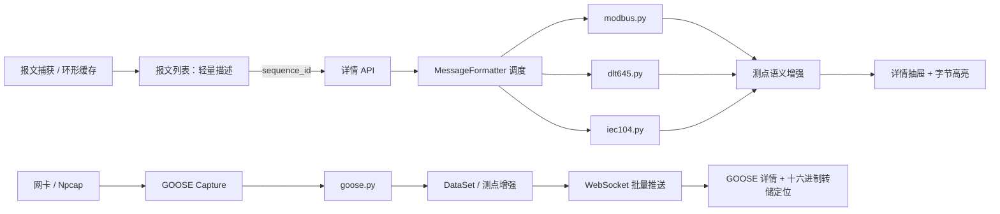
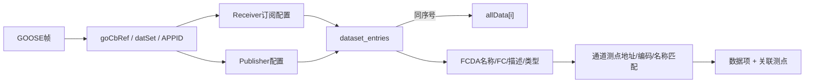

# 报文详情精确解析与原始字节定位

> 日期：2026-07-13  
> 状态：已实现  
> 分类：协议解析 / 报文诊断  
> 协议：DL/T 645-2007、Modbus RTU、Modbus TCP、IEC 60870-5-104、IEC 61850 GOOSE  
> 前端环境：Web、Tauri 独立报文窗口

## 1. 变更摘要

本次变更把原有的“单行粗略描述”升级为可交互的字段级报文诊断能力。用户可以在报文列表中打开某一帧的详情，查看该帧的用途、协议字段、数据对象、校验结果、测点关联和完整原始报文；点击任意字段或数据对象后，界面会高亮其在原始报文中的准确字节范围。

GOOSE 抓包页面采用同一套字节坐标语义，但保留独立的解析和展示链路：点击协议字段或 DataSet 数据项后，直接定位到页面下方唯一的十六进制转储，不重复展示第二份原始十六进制文本。

### 1.1 已实现能力

| 能力 | DL/T 645 | Modbus RTU | Modbus TCP | IEC104 | GOOSE |
|---|:---:|:---:|:---:|:---:|:---:|
| 完整原始报文 | ✓ | ✓ | ✓ | ✓ | ✓ |
| 字段级偏移和长度 | ✓ | ✓ | ✓ | ✓ | ✓ |
| 数据对象反向定位 | ✓ | ✓ | ✓ | ✓ | ✓ |
| 完整性校验 | CS/结束符 | CRC16 | MBAP | APDU长度 | EtherType/长度/BER |
| 请求响应关联 | — | 从站+功能码+时序 | Transaction ID | 序号语义 | stNum/sqNum |
| 测点关联 | DI/地址 | 地址+功能码 | 地址+功能码 | 公共地址+IOA | DataSet成员+测点引用 |
| 工程值 | BCD/系数 | 解析码/系数 | 解析码/系数 | 协议值 | MMS类型值 |

### 1.2 设计目标

1. **协议隔离**：每种协议单独一个解析器文件，避免大型条件分支文件持续膨胀。
2. **原始报文可追溯**：任何解析值都能回到实际线上的原始字节。
3. **解析与业务解耦**：线协议解析器只解释字节；设备测点、倍率和 DataSet 元数据由上层增强。
4. **按需解析**：列表仍使用轻量描述，只有打开详情时才执行完整解析。
5. **容错优先**：不完整或未知报文返回部分结果、告警和错误，不因单帧异常影响报文列表。

## 2. 总体架构



### 2.1 代码分类

```text
src/device/core/message/
├── message_capture.py             # 捕获帧与 sequence_id
├── message_formatter.py           # 协议调度、请求关联、测点增强
└── parsers/
    ├── __init__.py                # 解析器公共导出
    ├── common.py                  # 统一结果、字段和校验构造器
    ├── modbus.py                  # Modbus RTU/TCP
    ├── dlt645.py                  # DL/T 645-2007
    ├── iec104.py                  # IEC 60870-5-104
    └── goose.py                   # IEC 61850 GOOSE Ethernet/BER

src/proto/iec61850/plugins/goose/
├── capture.py                     # 原始二层帧捕获，调用独立 GOOSE 解析器
└── detail.py                      # DataSet 与配置测点语义增强

src/web/api/
├── device/router.py               # /api/devices/message-detail
├── schemas/device.py              # MessageDetailRequest
└── channel/goose_websocket.py     # GOOSE 实时批量推送

front/src/
├── components/device/MessageDetailDrawer.vue
├── components/goose/GooseCapture.vue
├── services/GooseCaptureWebSocket.ts
├── api/deviceApi.ts
└── api/gooseApi.ts
```

这个分类有一个重要约束：`goose.py` 是协议解析器，`detail.py` 是业务元数据增强器。前者不访问数据库，后者不重新解释 BER 字节。

## 3. 统一解析结果契约

所有协议解析器返回相同的顶层结构。公共构造器位于 `parsers/common.py`：

```python
def _result(protocol: str, raw: bytes) -> dict[str, Any]:
    return {
        "protocol": protocol,
        "frame_kind": "未知帧",
        "role": "unknown",
        "summary": "无法识别该报文",
        "purpose": "",
        "valid": True,
        "complete": True,
        "raw_hex": " ".join(f"{byte:02X}" for byte in raw),
        "raw_length": len(raw),
        "fields": [],
        "objects": [],
        "validation": [],
        "correlation": None,
        "warnings": [],
        "errors": [],
    }
```

### 3.1 顶层字段

| 字段 | 类型 | 含义 |
|---|---|---|
| `protocol` | `string` | 规范化协议名称 |
| `frame_kind` | `string` | 请求帧、响应帧、I/S/U格式帧、GOOSE发布报文等 |
| `role` | `string` | 捕获上下文中的请求/响应/发布角色 |
| `summary` | `string` | 可直接阅读的精确摘要 |
| `purpose` | `string` | 该帧执行的业务动作 |
| `valid` | `boolean` | 已执行的校验是否全部通过 |
| `complete` | `boolean` | 当前解析器是否完整解释了该帧 |
| `raw_hex` | `string` | 带空格的完整原始报文，不截断 |
| `raw_length` | `number` | 原始报文字节数 |
| `fields` | `Field[]` | 协议头和数据域字段 |
| `objects` | `DataObject[]` | 寄存器、IOA、DI值、DataSet值等业务对象 |
| `validation` | `Validation[]` | CRC、CS、长度和结束符等校验 |
| `correlation` | `object \| null` | 请求响应关联信息 |
| `warnings/errors` | `string[]` | 部分解析与致命解析错误 |

### 3.2 字段的字节坐标

```python
def _field(key, name, offset, raw, value, description="", level="normal"):
    return {
        "key": key,
        "name": name,
        "offset": offset,
        "length": len(raw),
        "raw_hex": " ".join(f"{byte:02X}" for byte in raw),
        "value": value,
        "display_value": str(value),
        "description": description,
        "level": level,
    }
```

字节坐标统一采用：

```text
起始字节 = offset
结束字节 = offset + length - 1
选中区间 = [offset, offset + length)
```

例如 `offset=12, length=5` 的显示范围是 `12-16`，正好五个字节；`12-17` 表示六个字节。表格中的“数据项、关联测点、原始值、解析值”等是列，不应被误认为额外字节。前端始终以 `length` 为真值计算结束位置，避免人工拼接范围产生差一错误。

### 3.3 数据对象

一个数据对象至少应包含：

```json
{
  "index": 0,
  "offset": 9,
  "length": 2,
  "address": 16385,
  "value": 0,
  "raw_value": "00 00",
  "quality": null,
  "timestamp": null,
  "fields": []
}
```

`offset` 和 `length` 必须覆盖这个对象在**完整原始帧**中的字节，而不是只相对于 PDU、ASDU 或 ALL_DATA 的局部位置。对象包含细分字段时，`fields` 中的坐标也必须是绝对坐标。

## 4. 通用设备报文详情接口

### 4.1 请求模型与路由

```python
class MessageDetailRequest(BaseModel):
    device_name: str
    sequence_id: int = Field(..., ge=1)


@device_router.post("/message-detail", response_model=BaseResponse)
async def get_message_detail(req: MessageDetailRequest, request: Request):
    device = _get_device(req.device_name, request)
    detail = device.get_message_detail(req.sequence_id)
    if detail is None:
        raise NotFoundError("报文不存在、已被缓存淘汰或该协议暂不支持详情解析")
    return BaseResponse(message="获取报文详情成功!", data=detail)
```

请求示例：

```http
POST /api/devices/message-detail
Content-Type: application/json

{
  "device_name": "modbus_tcp_server_1",
  "sequence_id": 128
}
```

前端调用：

```ts
export async function getMessageDetail(
  deviceName: string,
  sequenceId: number,
): Promise<MessageDetail> {
  return await requestApi(DEVICE_API.MESSAGE_DETAIL, "post", {
    device_name: deviceName,
    sequence_id: sequenceId,
  })
}
```

### 4.2 按序号查帧与协议调度

```python
def get_message_detail(self, sequence_id: int) -> dict | None:
    messages = self.get_messages(10_000)
    message = next(
        (item for item in messages if item.get("sequence_id") == sequence_id),
        None,
    )
    if message is None:
        return None

    raw = bytes.fromhex(message.get("raw_hex", ""))
    protocol_type = self._device.protocol_type
    role = message.get("msg_type", "")

    if protocol_type in _MODBUS_ALL_TYPES:
        request_context = self._find_modbus_request_context(
            messages,
            message,
            protocol_type in _MODBUS_TCP_TYPES,
        )
        detail = parse_modbus(
            raw,
            tcp=protocol_type in _MODBUS_TCP_TYPES,
            role=role,
            request_context=request_context,
        )
    elif protocol_type in _DLT645_TYPES:
        detail = parse_dlt645(raw, role=role)
    elif protocol_type in _IEC104_TYPES:
        detail = parse_iec104(raw, role=role)
    else:
        return None

    detail.update(
        sequence_id=sequence_id,
        direction=message.get("direction", ""),
        msg_type=role,
        timestamp=message.get("timestamp", 0),
        formatted_time=message.get("formatted_time", ""),
    )
    self._enrich_with_points(detail, protocol_type)
    return detail
```

这里特意没有在捕获时进行完整解析。报文列表可能持续高速增长，打开某一帧时才解析可以降低 CPU、对象分配和前后端传输压力。

## 5. Modbus RTU/TCP 解析

解析器文件：`src/device/core/message/parsers/modbus.py`。

### 5.1 协议层级

```text
Modbus TCP: MBAP(7字节) + PDU
Modbus RTU: 从站地址(1字节) + PDU + CRC16(2字节，小端)
PDU: 功能码 + 功能数据
```

当前精确支持功能码 `01/02/03/04/05/06/0F/10` 以及异常响应。TCP 校验 Protocol ID 和 MBAP 声明长度；RTU 计算并校验 CRC16。

### 5.2 TCP 与 RTU 公共入口

```python
def parse_modbus(raw: bytes, *, tcp: bool, role: str, request_context=None):
    result = _result("Modbus TCP" if tcp else "Modbus RTU", raw)
    result["role"] = role.lower()

    if tcp:
        transaction = int.from_bytes(raw[0:2], "big")
        protocol_id = int.from_bytes(raw[2:4], "big")
        declared = int.from_bytes(raw[4:6], "big")
        unit = raw[6]
        _validation(
            result,
            "MBAP长度",
            declared == len(raw) - 6,
            f"声明{declared}字节，实际{len(raw) - 6}字节",
        )
        pdu, pdu_offset = raw[7:], 7
    else:
        unit = raw[0]
        received_crc = int.from_bytes(raw[-2:], "little")
        calculated_crc = _crc16_modbus(raw[:-2])
        _validation(
            result,
            "CRC16",
            received_crc == calculated_crc,
            f"报文0x{received_crc:04X}，计算0x{calculated_crc:04X}",
        )
        pdu, pdu_offset = raw[1:-2], 1
```

### 5.3 为什么响应需要关联请求

读寄存器响应只携带字节数和值，不携带起始地址。要把第一个返回值恢复为地址 `16385`，必须找到对应请求：

```python
address = (
    request_context["start_address"] + index // 2
    if request_context
    else None
)
```

关联规则：

- Modbus TCP：`Transaction ID + Unit ID + Function Code`。
- Modbus RTU：`Unit ID + Function Code + 最近的在先请求`。
- 只向前查找，不把后续请求错误关联到当前响应。

关联结果示例：

```json
{
  "request_sequence_id": 127,
  "start_address": 16385,
  "end_address": 16386,
  "quantity": 2,
  "match_method": "transaction_id"
}
```

### 5.4 测点解析码和工程值

寄存器协议值不一定等于业务工程值。上层根据测点的 `decode` 决定组合几个寄存器、字节序和数值类型：

```python
info = Decode.get_info(point.decode)
registers = objects[index : index + info.register_cnt]
buffer = b"".join(
    bytes.fromhex(str(register["raw_value"]))
    for register in registers
)
decoded = Decode.unpack_value(info.pack_format, buffer)
item["decoded_value"] = decoded
item["engineering_value"] = round(
    decoded * point.mul_coe + point.add_coe,
    6,
)
```

多寄存器测点只在首对象展示组合工程值，后续被覆盖的寄存器记录 `covered_by_point`，避免把同一四字节浮点数误显示成两个独立工程量。

## 6. DL/T 645-2007 解析

解析器文件：`src/device/core/message/parsers/dlt645.py`。

### 6.1 帧结构和数据域变换

```text
FE... + 68 + 地址(6) + 68 + 控制码 + 长度 + 数据域 + CS + 16
```

解析器支持前导 `FE`，反转六字节表地址，并对数据域执行 DL/T 645 的逐字节减 `0x33`：

```python
encoded = raw[data_start:data_end]
decoded = bytes((byte - 0x33) & 0xFF for byte in encoded)
di = int.from_bytes(decoded[:4], "little")
```

原始定位仍指向线上编码后的 `encoded` 字节；减 `0x33` 的结果只作为解析值显示。这样用户点击 DI 或数据值时，看到的是抓包中真实存在的字节，而不是一个无法在原始帧中找到的派生数组。

### 6.2 DI、BCD 与测点

解析器通过协议库查询 DI 元数据，包括名称、格式和单位，再按小端压缩 BCD 解码。例如格式 `XXX.X` 会保留一位小数。

```python
value, bcd_valid = _decode_bcd(value_bytes, metadata["format"])
result["objects"].append({
    "offset": data_start + 4,
    "length": len(encoded[4:]),
    "address": f"0x{di:08X}",
    "value": value,
    "raw_value": _hex(encoded[4:]),
    "quality": {"bcd_valid": bcd_valid},
    "name": metadata["name"],
    "unit": metadata["unit"],
})
```

同时校验第一/第二起始符、校验和 CS 和结束符 `0x16`。异常响应会按状态字位解释“无请求数据、密码错误或未授权”等原因。

## 7. IEC 60870-5-104 解析

解析器文件：`src/device/core/message/parsers/iec104.py`。

### 7.1 APCI 帧类型

| 帧类型 | 识别 | 解析内容 |
|---|---|---|
| I格式 | 控制域 bit0 为 0 | `N(S)`、`N(R)`、完整 ASDU |
| S格式 | 控制域 bit0 为 1、低两位非 `11` | 接收序号 `N(R)` |
| U格式 | 控制域低两位为 `11` | STARTDT、STOPDT、TESTFR 的 ACT/CON |

```python
if ctrl[0] & 0x03 == 0x03:
    # U格式
elif ctrl[0] & 0x01:
    nr = int.from_bytes(ctrl[2:4], "little") >> 1
    # S格式
else:
    ns = int.from_bytes(ctrl[:2], "little") >> 1
    nr = int.from_bytes(ctrl[2:4], "little") >> 1
    # I格式 + ASDU
```

### 7.2 ASDU 与信息体

I格式帧继续解析：

- Type ID；
- VSQ 对象数和 SQ 顺序地址位；
- COT、否定确认位、测试位和源发地址；
- 公共地址；
- IOA、值、品质、命令限定词和时标。

当前覆盖遥信、遥测、累计量、遥控、设点、总召唤、电度召唤、读命令、时钟同步、测试、复位进程和延时获得等常用 ASDU，包括 CP16Time2a 与 CP56Time2a 变体。

SQ=1 时只有第一个对象携带 IOA，后续地址由首地址递增。对象定位仍覆盖其实际携带的字节；后续对象中派生的 IOA 字段长度为零，不伪造原始字节：

```python
if not sequential or index == 0:
    ioa = int.from_bytes(payload[cursor:cursor + 3], "little")
    first_ioa = ioa
    cursor += 3
else:
    ioa = int(first_ioa or 0) + index
```

### 7.3 品质与时标

品质描述词统一输出结构化状态：

```json
{
  "raw": "0x80",
  "overflow": false,
  "blocked": false,
  "substituted": false,
  "not_topical": false,
  "invalid": true
}
```

CP56Time2a 除格式化时间外，还保留年月日、星期、时分秒毫秒、无效位和夏令时位，便于诊断设备时钟和品质问题。

## 8. IEC 61850 GOOSE 独立解析链路

GOOSE 不是通用设备请求/响应报文，使用独立二层抓包页面和独立解析器 `parsers/goose.py`。

### 8.1 分层解析

```text
Ethernet II
├── Destination MAC
├── Source MAC
├── EtherType 0x88B8
└── 可选 802.1Q VLAN
    └── VLAN ID / Priority / 内层 EtherType

GOOSE Header
├── APPID
├── Length
├── Reserved 1
└── Reserved 2

ASN.1 BER GOOSE PDU (0x61)
├── goCbRef (0x80)
├── timeAllowedToLive (0x81)
├── datSet (0x82)
├── goID (0x83)
├── timestamp (0x84)
├── stNum / sqNum (0x85 / 0x86)
├── simulation / confRev / ndsCom
└── allData (0xAB)
    └── MMS Data TLV[]
```

BER 长度支持短格式和长格式：

```python
def _read_length(data: bytes, offset: int) -> tuple[int | None, int]:
    first = data[offset]
    offset += 1
    if not first & 0x80:
        return first, offset
    count = first & 0x7F
    if count == 0 or offset + count > len(data):
        return None, offset
    return int.from_bytes(data[offset:offset + count], "big"), offset + count
```

### 8.2 ALL_DATA 数据对象定位

每个 MMS TLV 保存完整 TLV 范围和纯值范围：

```python
objects.append({
    "index": len(objects),
    "offset": object_start,       # Tag 起点
    "length": value_end - object_start,
    "value_offset": value_start,  # Value 起点
    "value_length": length,
    "type": MMS_TYPES.get(tag, f"unknown(0x{tag:02X})"),
    "ber_tag": f"0x{tag:02X}",
    "value": _decode_mms(tag, raw_value),
    "raw_value": _hex(data[object_start:value_end]),
    "value_raw_hex": _hex(raw_value),
})
```

支持 Boolean、Bit String、Integer、Unsigned、Float、Octet String、Visible String 和 UTC Time。浮点值会跳过 MMS 浮点格式中的指数宽度前缀，再按大端 IEEE-754 解码。

### 8.3 DataSet 数据项和关联测点

GOOSE 报文的 `allData` 只有有序值，不携带每项 FCDA 名称。因此 `Entry[0]` 是元数据未命中时的保底文本，而不是协议中的真实数据项名称。

元数据增强流程为：



DataSet 匹配优先级：

1. Receiver 的规范化 `goCbRef` 精确匹配；
2. Publisher 的规范化 `goCbRef` 精确匹配；
3. `data_set_ref` 回退匹配；
4. APPID 回退匹配。

引用规范化会统一 `$` 和 `.`，并移除 `$ST$`、`$MX$`、`$CO$` 等功能约束片段的表示差异。配置查询按 `channel_id` 隔离，并使用 2 秒 TTL 缓存降低高频抓包时的数据库压力。

```python
for index, value in enumerate(enriched["data_values"]):
    value["index"] = index
    if index >= len(entries):
        value.setdefault("name", f"Entry[{index}]")
        continue

    entry = entries[index]
    value["name"] = entry.get("name") or f"Entry[{index}]"
    value["fc"] = entry.get("fc", "")
    value["description"] = entry.get("description", "")
    value["dataset_type"] = entry.get("type") or entry.get("iec_type") or ""

    point = _find_point(points, entry)
    if point:
        value["point"] = {
            "code": point.get("code", ""),
            "name": point.get("name", ""),
            "address": point.get("reg_addr") or point.get("address") or "",
            "frame_type": point.get("frame_type"),
            "fc": point.get("fc", ""),
            "mms_type": point.get("mms_type", ""),
        }
```

如果仍显示 `Entry[n]`，应检查该抓包通道内是否存在匹配的 Receiver/Publisher、配置是否保存 `dataset_entries`、报文 `goCbRef/datSet/APPID` 是否与配置一致。没有 DataSet 成员目录时不能仅凭 `allData` 值可靠推断 FCDA 名称；系统不会伪造关联。

## 9. 前端字节定位与 Tauri 兼容

### 9.1 通用详情抽屉

通用设备报文使用 `MessageDetailDrawer.vue`，关键配置如下：

```vue
<el-drawer
  v-model="visible"
  title="报文精确解析"
  size="min(760px, 100vw)"
  resizable
  append-to-body
  destroy-on-close
>
```

- `append-to-body` 避免抽屉被报文窗口内部的定位容器、层叠上下文或 `overflow` 裁剪。
- `min(760px, 100vw)` 在桌面宽窗口保持信息密度，在小窗口不超出视口。
- Tauri 报文独立窗口最小宽度提高到 820px，为抽屉边框和页面滚动条保留空间。
- `destroy-on-close` 关闭时释放大型详情表格和原始字节 DOM。

### 9.2 字段与数据对象高亮

```ts
function selectField(field: { offset: number; length: number }) {
  if (!field.length) return
  selectedField.value = { offset: field.offset, length: field.length }
}

function selectObject(object: {
  offset?: number
  length?: number
  fields?: Array<{ offset: number; length: number }>
}) {
  if (typeof object.offset === 'number' && object.length) {
    selectField({ offset: object.offset, length: object.length })
    return
  }
  const mapped = object.fields?.filter((field) => field.length > 0) ?? []
  if (!mapped.length) return
  const start = Math.min(...mapped.map((field) => field.offset))
  const end = Math.max(...mapped.map((field) => field.offset + field.length))
  selectField({ offset: start, length: end - start })
}

function isSelectedByte(index: number) {
  const selected = selectedField.value
  return !!selected
    && index >= selected.offset
    && index < selected.offset + selected.length
}
```

对象优先使用自身范围；旧对象没有范围时，再根据子字段求并集。这一兼容策略修复了“点击数据对象不能定位到原始报文”的问题。

### 9.3 GOOSE 只保留一份十六进制转储

GOOSE 详情不再重复显示连续原始十六进制字符串，只保留 16 字节一行、带偏移和 ASCII 的转储。点击字段或 DataSet 行后，高亮并滚动到对应字节：

```ts
function selectRawRange(row: { offset?: number; length?: number }) {
  if (typeof row.offset !== 'number' || !row.length) return
  selectedRawRange.value = { offset: row.offset, length: row.length }
  nextTick(() => {
    const byte = hexDumpRef.value?.querySelector<HTMLElement>(
      `[data-byte-index="${row.offset}"]`,
    )
    byte?.scrollIntoView({
      behavior: 'smooth',
      block: 'center',
      inline: 'nearest',
    })
  })
}
```

## 10. GOOSE 页面性能优化

GOOSE 可能按毫秒级重传，若每帧都触发深层 Vue 响应式转换、WebSocket 消息解析和整表重绘，页面会明显卡顿。本次采用端到端合并策略。

### 10.1 服务端 50ms 批量推送

```python
async def _flush_packet_batch(self, channel_id: int) -> None:
    await asyncio.sleep(0.05)
    with self._lock:
        packets = self._pending_packets.pop(channel_id, [])
        self._packet_batch_scheduled.discard(channel_id)
    if packets:
        await self.broadcast(
            {"type": "packets", "data": packets},
            channel_id,
        )
```

回调线程只入队并调度异步刷新，避免在抓包线程中直接执行 WebSocket I/O。广播仍按 `channel_id` 隔离。

### 10.2 前端 100ms 合并与浅响应式

```ts
const packets = shallowRef<GooseCapturedPacket[]>([])
let pendingPackets: GooseCapturedPacket[] = []

function queuePackets(incoming: GooseCapturedPacket[]) {
  pendingPackets.push(...incoming.map((packet) => markRaw(packet)))
  if (!packetFlushTimer) {
    packetFlushTimer = setTimeout(flushPendingPackets, 100)
  }
}

function flushPendingPackets() {
  const incoming = pendingPackets
  pendingPackets = []
  const merged = packets.value.concat(incoming)
  packets.value = merged.length > maxPackets.value
    ? merged.slice(merged.length - maxPackets.value)
    : merged
}
```

同时使用分页（100/200/500条）、缓存上限裁剪、末页自动跟随，并移除未使用的 `hex_string` 重复字段，只传输 `hex_data`。详情中的十六进制行仅在选中报文后计算。

## 11. 完整响应示例

以下为简化的 Modbus TCP 读保持寄存器响应，展示统一结构中最关键的字段：

```json
{
  "protocol": "Modbus TCP",
  "frame_kind": "响应帧",
  "role": "response",
  "summary": "从站1返回读保持寄存器响应，包含2个值",
  "purpose": "返回读保持寄存器数据",
  "valid": true,
  "complete": true,
  "raw_hex": "00 01 00 00 00 07 01 03 04 00 00 3F 80",
  "raw_length": 13,
  "fields": [
    {
      "key": "transaction_id",
      "name": "事务标识",
      "offset": 0,
      "length": 2,
      "raw_hex": "00 01",
      "value": 1,
      "display_value": "1",
      "description": "用于匹配请求和响应",
      "level": "normal"
    }
  ],
  "objects": [
    {
      "index": 0,
      "offset": 9,
      "length": 2,
      "address": 16385,
      "value": 0,
      "raw_value": "00 00",
      "point": {
        "name": "直流母线电压",
        "code": "DC_BUS_VOLTAGE",
        "address": 16385,
        "decode_code": "FLOAT_ABCD",
        "multiplier": 1.0,
        "addition": 0.0
      },
      "decoded_value": 1.0,
      "engineering_value": 1.0,
      "combined_raw": "00 00 3F 80"
    }
  ],
  "correlation": {
    "request_sequence_id": 127,
    "start_address": 16385,
    "end_address": 16386,
    "quantity": 2,
    "match_method": "transaction_id"
  },
  "validation": [
    { "name": "MBAP长度", "passed": true, "detail": "声明7字节，实际7字节" },
    { "name": "协议标识", "passed": true, "detail": "值为0" }
  ],
  "warnings": [],
  "errors": []
}
```

## 12. 新增协议解析器规范

后续增加新协议时，新建独立文件，不向现有协议解析器追加无关逻辑。推荐模板：

```python
"""Field-level Example Protocol parser."""

from __future__ import annotations

from typing import Any

from .common import _fail, _field, _result, _validation


def parse_example(raw: bytes, *, role: str) -> dict[str, Any]:
    result = _result("Example Protocol", raw)
    result["role"] = role.lower()

    if len(raw) < MIN_FRAME_SIZE:
        return _fail(result, "Example报文长度不足")

    declared_length = raw[1]
    result["fields"].extend([
        _field("start", "起始符", 0, raw[0:1], f"0x{raw[0]:02X}"),
        _field("length", "长度", 1, raw[1:2], declared_length),
    ])
    _validation(
        result,
        "报文长度",
        declared_length == len(raw),
        f"声明{declared_length}字节，实际{len(raw)}字节",
    )

    # 数据对象的 offset 必须相对于完整 raw，而不是局部 payload。
    result["objects"].append({
        "index": 0,
        "offset": 2,
        "length": 2,
        "address": int.from_bytes(raw[2:4], "big"),
        "value": int.from_bytes(raw[4:6], "big"),
        "raw_value": " ".join(f"{byte:02X}" for byte in raw[4:6]),
        "quality": None,
        "timestamp": None,
        "fields": [],
    })

    result.update(
        frame_kind="Example数据帧",
        summary="Example数据帧，包含1个对象",
        purpose="传输Example数据",
    )
    return result
```

还需要完成以下接线：

1. 在 `parsers/__init__.py` 导出解析入口；
2. 在 `MessageFormatter.get_message_detail()` 中按协议类型调度；
3. 如需测点语义，在 `_enrich_with_points()` 中增加独立增强方法；
4. 添加正常帧、截断帧、校验失败帧、未知类型和多对象定位测试；
5. 验证任意对象满足 `0 <= offset` 且 `offset + length <= raw_length`；
6. 前端通常无需修改，因为统一契约已经覆盖字段、对象和校验展示。

## 13. 测试与验证

### 13.1 后端协议解析测试

```powershell
.venv\Scripts\python.exe -m pytest `
  src/tests/modbus_test/test_message_parser.py `
  src/tests/modbus_test/test_dlt645_iec104_parser.py `
  src/tests/iec61850/test_goose_detail_parser.py `
  src/tests/iec61850/test_goose_capture_subscriber.py `
  src/tests/iec61850/test_goose_publisher_transport.py -q
```

GOOSE 相关测试必须使用项目虚拟环境，因为其中包含 `pyiec61850` 运行依赖。

重点断言：

```python
detail = parse_goose(raw)
assert detail["raw_hex"]
assert detail["objects"][0]["offset"] > 0
assert detail["objects"][0]["offset"] + detail["objects"][0]["length"] <= detail["raw_length"]

enriched = enrich_goose_packet(packet, channel_id)
assert enriched["data_values"][0]["name"] == "LD0/XCBR1.Pos.stVal"
assert enriched["data_values"][0]["point"]["code"] == "XCBR_POS"
```

### 13.2 前端验证

```powershell
npm --prefix front run type-check
npm --prefix front run build:fast
```

人工验收清单：

- 通用报文列表的“详情”可以在 Web 和 Tauri 独立窗口打开；
- 原始报文完整显示，长度与抓包一致；
- 点击顶层字段，高亮范围与“字节”列一致；
- 点击数据对象行，高亮其完整原始范围；
- 点击对象展开后的品质或时标子字段，只高亮对应子字段；
- Modbus 响应能恢复请求地址并关联正确测点；
- GOOSE 只显示一份十六进制转储；
- GOOSE 数据项点击后会滚动并高亮 ALL_DATA 中对应 TLV；
- GOOSE DataSet 元数据命中后不再显示 `Entry[n]`，测点列显示配置测点；
- 连续高频抓包时分页、详情弹窗和停止按钮仍可响应。

## 14. 已知边界与排障

| 现象 | 原因 | 检查方法 |
|---|---|---|
| 详情返回“报文不存在” | 环形缓存已淘汰该帧或设备已重启 | 刷新列表后打开新的 `sequence_id` |
| `complete=false` | 功能码、ASDU或BER类型尚未完全覆盖，或报文被截断 | 查看 `warnings` 和未解释字节数 |
| `valid=false` | CRC、CS、长度、结束符等校验失败 | 对照 `validation` 与原始字节 |
| Modbus 响应地址为空 | 请求已被缓存淘汰或未匹配 | 检查关联请求、事务ID、从站和功能码 |
| 多寄存器工程值异常 | 测点解析码、字节序或寄存器数配置错误 | 检查 `decode_code` 与 `combined_raw` |
| IEC104 SQ=1 后续 IOA 无原始字节 | IOA 是按首地址递增推导，协议未重复携带 | 这是正常协议语义，字段长度为0 |
| GOOSE 显示 `Entry[n]` | 当前通道缺少可匹配的 DataSet 成员元数据 | 检查 Receiver、Publisher、goCbRef、datSet、APPID |
| GOOSE 显示“未关联” | FCDA引用与通道测点地址/编码/名称不匹配 | 修正测点引用；不要按数组序号强行关联 |
| Tauri 抽屉被裁剪 | 旧窗口尺寸或旧前端资源仍在运行 | 完整重启 Tauri 应用并确认窗口最小宽度配置 |

## 15. 维护约束

- 原始报文是诊断事实来源，解析器不得用解码后的派生字节替换 `raw_hex`。
- 所有偏移均从完整帧第一个字节以 0 开始计算。
- 未携带在报文中的派生字段允许 `length=0`，不得伪造字节范围。
- 不在协议解析器中查询数据库或访问 Vue/Tauri 状态。
- 不在前端重新实现协议规则；前端只消费统一契约和执行定位展示。
- GOOSE DataSet 与测点关联必须按 `channel_id` 隔离，不能跨设备命中配置。
- 高速抓包链路新增字段前应评估序列化大小、深响应式成本和整表重绘频率。
- 新协议或新类型必须同时添加正常、异常、截断与字节范围测试。
