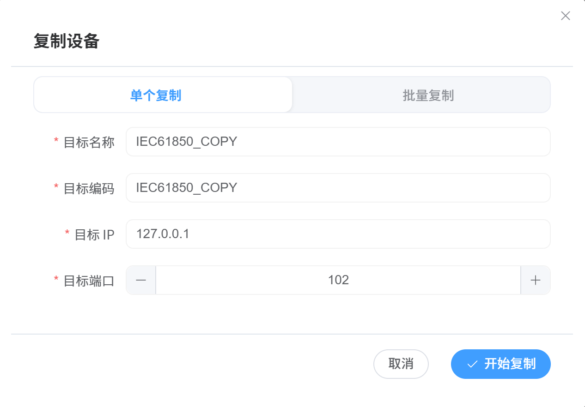
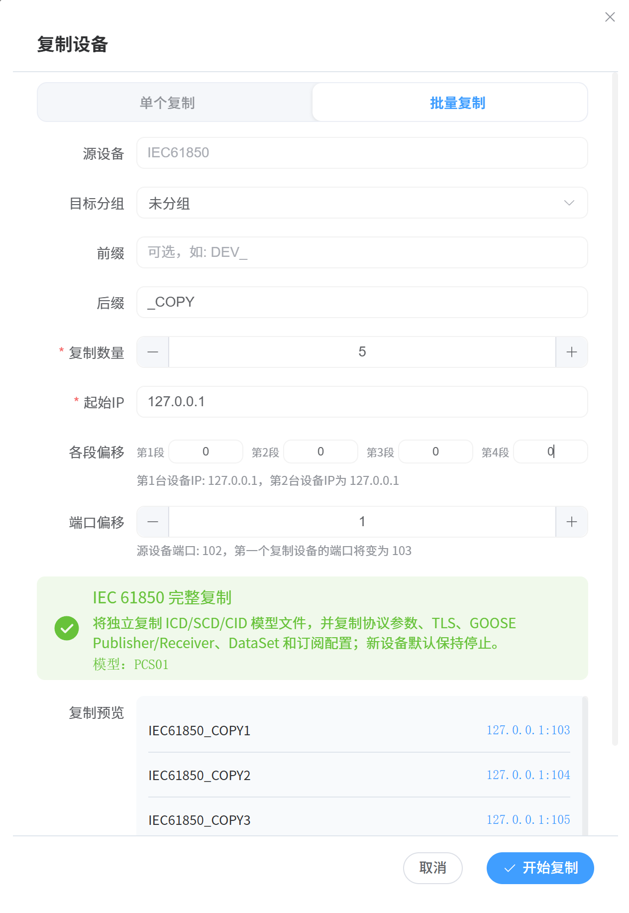
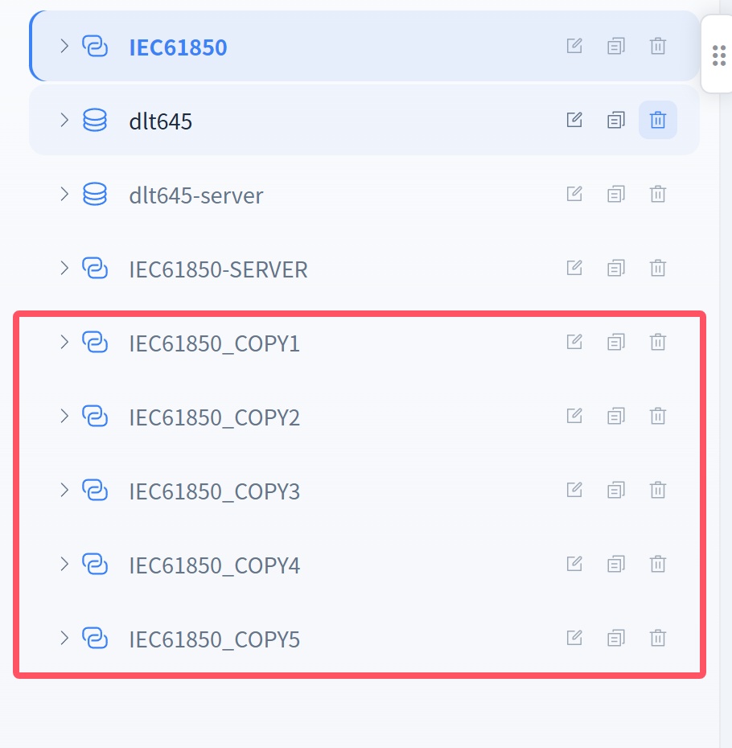

# 设备复制

## 一、概述

**设备复制**用于快速复制已有设备（含整套测点配置），避免重复配置。支持**单个复制**与**批量复制**两种模式：

| 模式 | 适用场景 | 特点 |
|------|----------|------|
| 单个复制 | 复制一台设备 | 可指定目标名称、编码、IP、端口 |
| 批量复制 | 一次复制多台设备 | 设置数量、前缀/后缀、起始 IP、各段偏移、端口偏移 |

> 复制内容：设备基本信息 + **整套测点配置**（含系数、解析码、上下限、品质等），IEC 61850 设备额外复制模型文件与 GOOSE/Reports/DataSet/订阅配置。

## 二、打开复制对话框

1. 在左侧**设备树**中选中要复制的设备；
2. 点击设备操作菜单/按钮中的"**复制设备**"，弹出"复制设备"对话框；
3. 对话框顶部提供两个页签：**单个复制**、**批量复制**。

> 复制设备对话框 - 单个复制页签（目标名称/编码/IP/端口）。

## 三、单个复制

### 操作步骤

1. 在"复制设备"对话框中选择"**单个复制**"页签；
2. 填写目标设备信息：

| 配置项 | 说明 | 示例 |
|--------|------|------|
| 目标名称 | 新设备名称 | `电池模拟器-2` |
| 目标编码 | 新设备编码（全局唯一） | `BAT_002` |
| 目标 IP | 新设备 IP 地址（IPv4） | `192.168.1.11` |
| 目标端口 | 新设备端口号 | `503` |

3. 点击"保存"，系统复制源设备配置并创建新设备；
4. 新设备出现在设备树中（可在"设备管理"中查看）。

### 注意事项

- 目标编码必须**全局唯一**，否则提示"设备编码已存在"；
- 目标 IP 若与现有服务端冲突，会提示并阻止复制；
- 单个复制默认不自动启动设备，需要手动开启。

## 四、批量复制

### 操作步骤

1. 在"复制设备"对话框中选择"**批量复制**"页签；
2. 按下表配置：

| 配置项 | 说明 | 示例 |
|--------|------|------|
| 源设备 | 当前选中的设备（只读显示） | — |
| 目标分组 | 新设备所属设备组（可选，默认跟随源设备） | 储能区 |
| 前缀 | 新设备名称/编码前缀（可选） | `DEV_` |
| 后缀 | 新设备名称/编码后缀（可选） | `_COPY` |
| 复制数量 | 本次复制的设备台数 | `3` |
| 起始 IP | 第一台设备的 IP | `10.0.0.1` |
| 各段偏移 | IP 地址 4 个段各自的偏移量 | `[0, 0, 1, 0]` |
| 端口偏移 | 端口随台数递增的偏移量（0 表示端口不变） | `1` |
| IEC 61850 完整复制 | 独立复制 ICD/SCD/CID 模型文件及 GOOSE/Reports/DataSet/订阅配置 | 勾选 |

3. 查看下方"**复制预览**"：确认第 1 台、第 2 台设备的 IP 计算结果是否符合预期；
4. 点击"保存"执行批量复制。

> 复制设备对话框 - 批量复制页签（数量/前缀后缀/起始IP/各段偏移/端口偏移/复制预览）。

### IP 偏移规则

第 n 台设备的第 k 段 IP = 起始 IP 第 k 段 + 偏移[k] × (n-1)，每段按 **256 进制进位**：

| 起始 IP | 各段偏移 | 数量 | 生成的 IP |
|---------|----------|------|-----------|
| `192.168.0.1` | `[0,0,0,1]` | 3 | `192.168.0.1` / `192.168.0.2` / `192.168.0.3` |
| `192.168.0.254` | `[0,0,0,2]` | 2 | `192.168.0.254` / `192.168.1.0`（末段溢出进位） |
| `10.0.0.1` | `[0,0,1,0]` | 3 | `10.0.0.1` / `10.0.1.1` / `10.0.2.1` |

> 💡 偏移为 `0` 的段不随台数变化；第 1 段溢出视为超出 IPv4 范围会报错。

### 批量复制行为

- 新设备编码 = `前缀 + 源编码 + 后缀 + 台号`（如 `DEV_SRC_COPY1`、`DEV_SRC_COPY2`…）；
- 编码已存在或 IP:端口与现有服务端冲突时，**自动跳过**该台并提示，其余继续复制；
- 复制完成后提示"成功复制 N 个设备"。

> 批量复制完成后的设备列表（新增多台设备）与结果提示。

## 五、注意事项

- 复制数量上限为 256；
- 批量复制支持**目标分组**，可将新设备直接放入指定设备组；
- IEC 61850 设备复制默认**深拷贝模型文件**，新设备不会指向源设备的模型文件；
- 复制后的设备默认**停止**状态，需手动开启（开启后自动应用测点模拟配置）。
