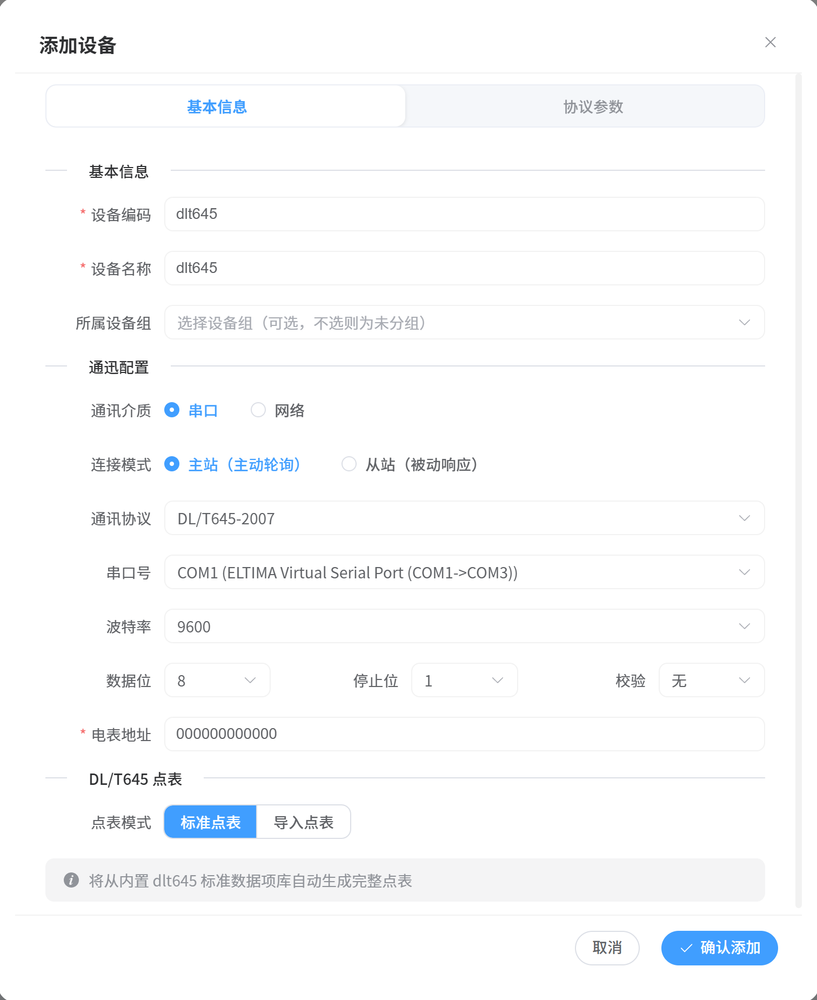

# DL/T 645-2007 操作指南

## 一、前置条件

- 已安装并启动 EMS Simulate；
- **服务端模拟**：本机即可完成全流程演示；
- **客户端模式**：需要一台真实电表（或本软件再模拟一台服务端）。

## 二、服务端模式（模拟电能表）

**目标**：模拟一台 DL/T645 电能表，响应主站抄表。

### 步骤 1：添加设备

1. 点击"**添加设备**"；
2. 填写设备名称（如 `模拟电能表`）；
3. 协议选择 **DL/T 645-2007**；
4. 连接方式选择 **串口从站**（RS-485）或 **TCP 服务端**；
5. 配置串口参数（串口号、波特率默认 2400/9600、数据位 8、校验）或 TCP 端口（默认 8899），保存。

### 步骤 2：选择点表模式

进入设备详情，DL/T645 设备提供两种模式（可切换）：

- **标准点表**：点击后自动从内置 dlt645 标准数据项库生成完整点表，覆盖电能量、需量、电压、电流、功率、功率因数等常用数据项；
- **导入点表**：上传 Excel 点表，按自定义数据项导入。

### 步骤 3：启动设备

点击"**开启设备**"，电表开始监听并响应抄表请求。

### 步骤 4：客户端读取验证

1. 添加 DL/T645 **客户端**设备（串口或 TCP 指向本机）；
2. 启动后点击"**读取**"，验证：
   - 数据标识解析是否正确（如 `00010000` → 正向有功总电能）；
   - 返回值与系数换算后的真实值（电能度数、电压值等）。

## 三、客户端模式（抄读真实电表）

1. 添加设备时连接方式选择 **客户端（主站）**，配置串口或 TCP 参数与表地址；
2. 添加需要抄读的数据项测点（数据标识与真实电表一致）；
3. 启动后点击"读取"，观察返回数据与系数换算结果；
4. 支持批量抄读常用数据项。

## 四、协议参数详解

| 参数 | 默认 | 说明 |
|------|------|------|
| 命令超时 | 3000ms | 单条抄表命令等待响应的超时时间 |
| 波特率 | 2400 / 9600 | 串口通信速率（与电表一致） |
| 表地址 | 6 字节 BCD | 电表地址（可自动识别或手动设置） |

## 五、常见问题

| 问题 | 排查建议 |
|------|----------|
| 抄表超时 | 检查串口参数（波特率/校验位）、表地址、接线 |
| 数据标识解析错误 | 确认数据标识与电表型号的数据项定义一致 |
| 返回值偏差 | 检查乘法/加法系数与数据项倍率 |
| TCP 模式连不上 | 确认端口（默认 8899）与 IP |

> 📄 报文如何解析见 [DL/T645 报文查看](./packet-view)。
