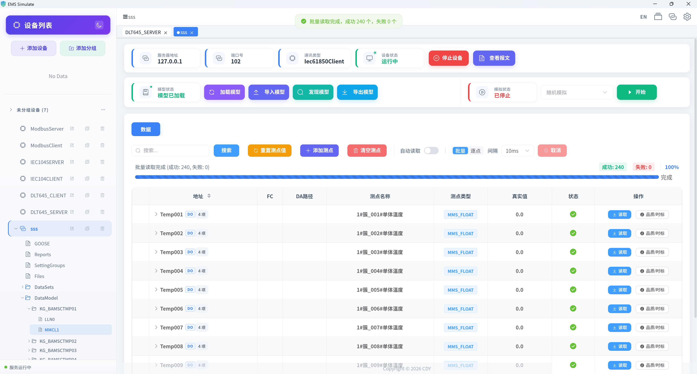
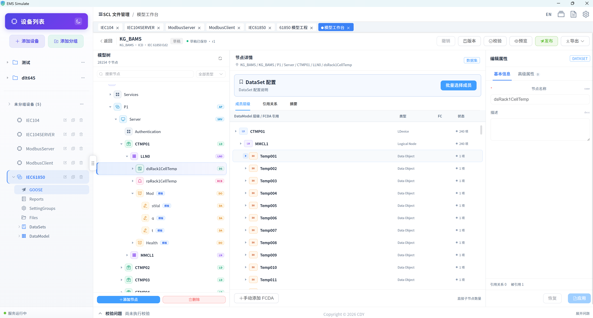

# IEC 61850 操作指南

## 一、前置条件

- 已安装并启动 EMS Simulate；
- **服务端模拟**：准备一个 ICD/SCD/CID 模型文件（可用"建模工作台"创建，或使用示例文件）；
- **客户端模式**：需要一台可访问的真实 IED（或本软件再模拟一台服务端）。

## 二、服务端模式（模拟 IED）

**目标**：导入 SCL 模型后模拟一个 IED，提供 MMS 读写、GOOSE、Reports、Files 服务。

### 步骤 1：添加设备并导入模型

1. 点击"**添加设备**"；
2. 协议选择 **IEC 61850**，连接方式选择 **服务端（Server）**；
3. 选择 ICD / SCD / CID 文件上传，系统自动解析 IED 模型并生成测点（含 GOOSE 控制块、数据集）；
4. 保存并"**开启设备**"。

### 步骤 2：查看数据模型

设备详情中以树形结构展示 **LD / LN / DO / DA** 层级与 FC 功能约束，可展开查看每个测点的 MMS 类型；支持按节点类型筛选、搜索。

### 步骤 3：MMS 读写

- 选中测点执行"读取 / 写入"，验证 MMS 报文交互；
- 支持批量读取、自动读取与变化追踪；
- IEC 61850 客户端设备（模拟对端）也可直接读写本服务端。

### 步骤 4：GOOSE 发布 / 订阅

- **发布**：配置 GOOSE 控制块（GCB）与数据集，启动后周期/变位发送组播报文；
- **订阅**：添加接收器订阅对端 GOOSE，监视数据集成员值变化；
- **抓包**：选择真实网卡实时抓取 GOOSE 报文，解析 APPID、MAC、数据集成员值。

> 🖼️ 截图占位（待补充）：GOOSE 抓包界面

### 步骤 5：Reports 报告

配置报告控制块（RCB）：

- **URCB（非缓存）** / **BRCB（缓存）**；
- 配置数据集、触发条件（数据变化 dchg、品质变化 qchg、总召唤 GI）；
- 支持报告树形数据展示与数据集的批量读取。

### 步骤 6：Files 文件服务

通过 MMS Files 浏览设备文件目录、上传与下载文件（文件服务目录可在协议参数中配置）。

## 三、客户端模式（连接真实 IED）

1. 添加设备时连接方式选择 **客户端（Client）**，填写目标 IP 与端口（MMS 默认 102）；
2. 启动后客户端**动态发现** IED 数据模型并生成测点树（可配置模型发现超时）；
3. 执行 MMS 读写、GOOSE 订阅、Reports 订阅与文件浏览。

## 四、建模工作台

基于 SCL 文件的工程化建模：

1. 新建工程（名称、编码、文件类型 ICD/CID/SCD、标准版本）；
2. 配置 IED 信息（IED 名称、访问点、厂商、设备类型）与逻辑设备（LD）；
3. 在模型树中编辑节点、添加逻辑节点、配置 DataSet 成员（支持 DO 整组/DA 精确选择）；
4. 执行校验、保存版本并发布。

## 五、协议参数详解

| 参数 | 默认 | 说明 |
|------|------|------|
| 连接超时 | 3000ms | 建立 MMS 连接的超时时间 |
| 命令超时 | 3000ms | 单条 MMS 服务等待响应的超时时间 |
| 模型发现超时 | 60s | 客户端发现数据模型的超时时间 |
| 用户认证 | 关 | 启用 ACSE 认证（服务端校验客户端密码） |
| 文件服务目录 | 空 | 向 MMS 客户端公开的文件目录 |
| MMS 报文抓包 | 关 | 使用 Npcap/libpcap 抓取 MMS 报文 |

## 六、常见问题

| 问题 | 排查建议 |
|------|----------|
| 客户端发现模型慢/超时 | 增大"模型发现超时"，确认网络可达 |
| GOOSE 收不到 | 确认网卡选择正确、组播地址与 APPID 匹配 |
| 报告不触发 | 确认数据集已配置、触发条件（dchg/qchg/GI）正确 |
| 认证失败 | 确认服务端与客户端认证密码一致 |
| SCL 校验报错 | 按校验结果修正模型后再导入 |

> 📄 报文如何解析见 [IEC 61850 报文查看](./packet-view)。
