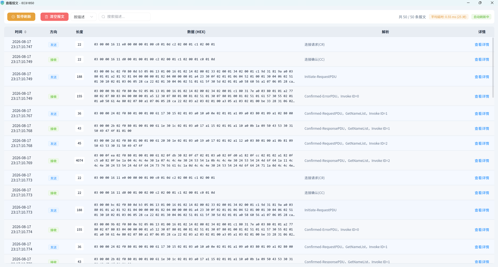
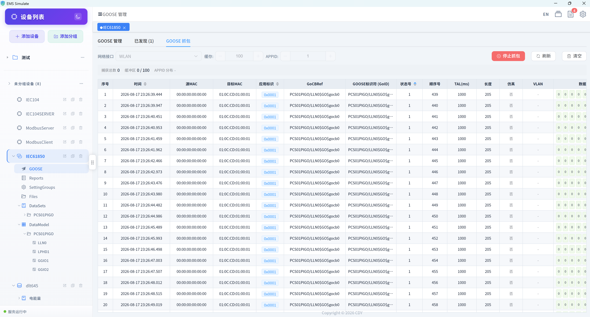
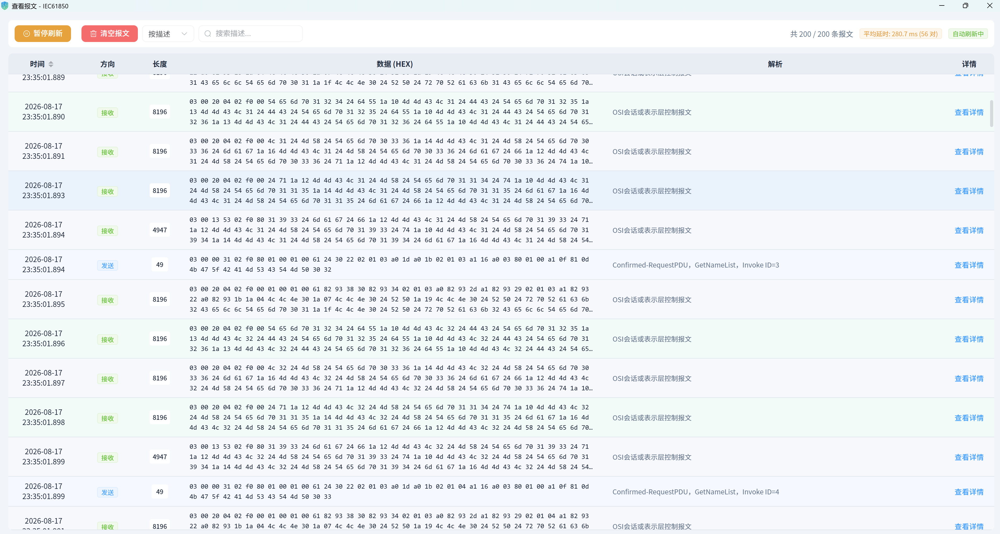

# IEC 61850 报文查看

IEC 61850 涉及 **MMS**（TCP 102 端口）与 **GOOSE**（以太网二层组播）两类报文，EMS Simulate 均可实时抓取与解析。

## 一、MMS 报文

### 进入方式

在左侧设备树中选中 IEC61850 设备，点击"**报文**"图标（需开启 MMS 报文抓包或连接中自动捕获）。

### 报文类型

| 报文 | 说明 |
|------|------|
| 连接建立 | ACSE 关联请求/响应（含认证协商） |
| Read / Write | 数据读写请求与响应 |
| GetNameList / GetNameListResponse | 模型浏览（发现数据模型） |
| Report | 报告上送（含数据集成员值） |
| File Directory / Open / Read / Write | 文件服务 |

### 解析内容

平台对 MMS 报文自动解析，展示：

- **服务类别**：Read / Write / Report / File 等；
- **对象引用**：如 `IED1LD0/MMXU1.TotW.mag.f`；
- **数据类型**：浮点、整型、布尔、品质、时标；
- **值**：读写的数据值（含品质 q 与时标 t）。



## 二、GOOSE 报文

### 进入方式

进入"**GOOSE 抓包**"功能：

1. 选择真实网卡；
2. 点击开始抓包，监听二层组播报文；
3. 实时解析并显示 GOOSE 控制块与数据集成员值。

### GOOSE 报文结构

GOOSE 使用以太网二层帧（默认组播 MAC 从 `01:0C:CD:01:00:00` 起），包含：

```
┌──────────────┬──────────┬─────────┬──────────────────────────────┐
│ 以太网头       │ APPID    │ 长度     │ APDU（GOOSE PDU，ASN.1 编码）   │
│ 目的/源 MAC   │ 2 字节   │ 2 字节  │ 控制块信息 + 数据集成员值       │
└──────────────┴──────────┴─────────┴──────────────────────────────┘
```

### GOOSE 字段

| 字段 | 说明 |
|------|------|
| APPID | 应用标识（区分数据集） |
| GOID | GOOSE 控制块标识 |
| DATSET | 数据集引用 |
| ConfRev | 配置版本号 |
| T | 报文时标 |
| StNum | 状态号（变位时 +1） |
| SqNum | 序号（周期重发递增） |
| Test | 测试标志 |
| 数据集成员 | 各成员的最新值（如开关位置、品质） |

### 抓包解析

- 实时显示每个 GOOSE 控制块的 **StNum / SqNum** 变化；
- 监视数据集成员值变化（如开关变位）；
- 支持过滤 APPID，便于多控制块场景下定位。

#### GOOSE抓包



#### GOOSE报文详情


## 三、Reports 报文

报告控制块上送的报告报文实时可见，包含：

- 报告 ID、数据集引用；
- 触发原因：数据变化（dchg）、品质变化（qchg）、总召唤（GI）、周期（periodic）；
- 成员值：变化的数据对象值（含品质与时标）；
- 缓存 / 非缓存行为差异（BRCB 断链缓存、URCB 不缓存）。



## 排查技巧

- **MMS 连接失败**：确认端口 102、IP 可达、认证密码一致；
- **GOOSE 收不到**：确认网卡、组播地址、APPID、VLAN 配置；
- **报告不触发**：核对数据集、触发条件（dchg/qchg/GI）与 RCB 使能状态；
- **值不变但 SqNum 增长**：正常周期重发；StNum 增长表示发生了变位事件。
