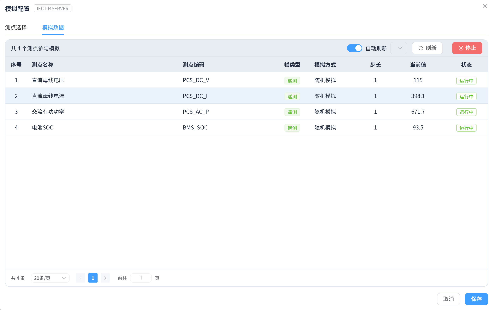
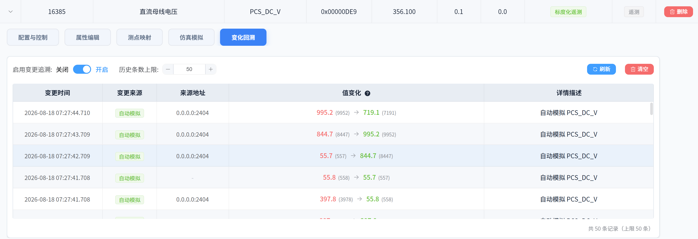

# 数据监视

## 一、概述

配置完测点后，即可在设备详情中**实时监视**测点数据的变化。EMS Simulate 提供多层级的数据监视能力：读取（单点/批量/自动）、数据模拟、测点映射、变化追踪与报文查看。

## 二、读取测点数据

### 单点读取

在测点表格中点击行的"**读取**"按钮，向设备（或对端）发起一次读取，返回最新值并更新"真实值"列。

### 批量读取

点击“**批量读取**”后，前端只提交一次后台读取任务；后端会使用协议对应的批读能力：Modbus 合并连续地址，DNP3 每轮只发送一次 Class 0 完整性轮询，IEC 61850 优先使用 DataSet/分组读取。前端后续查询的是任务状态，不会通过定时请求重复触发设备读取。

### 自动读取

点击“**自动读取**”后，读取任务由后端按设置的轮询周期持续执行，支持批量、逐点以及 IEC 61850 DataSet 模式。切换页面不会中断任务；再次进入设备页面时会从后端恢复开关和模式状态。点击关闭开关会显式取消任务，设备停止、删除或应用退出时也会自动清理。

自动读取不显示进度条，只通过开关和当前模式标签表示运行状态；进度条仅用于用户主动发起的手动批量/逐点读取。

批量/DataSet 模式设置的是相邻两轮开始时间之间的**轮询周期**；逐点模式设置的是相邻测点请求完成后的**点间隔**。如果单轮读取耗时超过轮询周期，后端不会并发补跑，而是在本轮结束后开始下一轮。页面刷新只展示后端缓存，不会额外触发设备读取。

> 测点表格中的读取/批量读取/自动读取操作与返回结果。

## 三、模拟配置

开启设备后，可通过"**模拟配置**"功能配置哪些测点参与模拟、每个测点的模拟方式（随机 / 自增 / 自减 / 正弦波 / 斜坡 / 脉冲），并在"模拟数据"页签中实时监视与启停模拟。

> ⚠️ 必须先**开启设备**，"模拟配置"按钮才可用。

> 📄 详细配置步骤见 [测点配置（模拟配置）](./point-config)。

## 四、测点映射与公式

- **测点映射**：将一个测点的值联动到另一个测点（跨设备数据镜像），源测点变化时目标测点自动更新；
- **公式计算**：映射值支持公式，如 `视在功率 = √(有功² + 无功²)`，实现基于多测点的派生数据；
- 映射关系在"测点映射"面板中配置，可查看所有映射与来源设备。

## 五、变化追踪

打开测点的"**变化历史**"，可查看该测点每次值变化的时间、旧值/新值与**变化原因**：

| 变化原因 | 说明 |
|----------|------|
| 手动 | 手动修改真实值 |
| 模拟 | 数据模拟驱动 |
| 映射 | 测点映射联动 |
| 协议写入 | 对端通过协议写入 |
| 客户端读取 | 客户端模式读取到的新值 |

> 测点变化历史列表（时间、值、变化原因）。

> 💡 变化追踪便于排查"数据从哪来、为什么变"，是联调排查的利器。

## 六、报文查看

点击设备右上角的"**报文**"图标，实时查看该设备与对端交互的原始报文（请求帧/响应帧、发送/接收方向、字段解析）。报文查看是协议级监视手段，与测点级监视互补：

- 各协议报文结构详解见[协议支持](../protocols/)；
- 报文窗口支持暂停刷新、按方向/从机筛选、报文详情与原始字节定位。

## 七、注意事项

- 自动读取与模拟同时开启时，模拟值会持续覆盖真实值，读取结果以最新一次为准；
- 自动读取属于当前设备连接会话，后端或应用重启后不会自动恢复；
- 批量读取合并连续地址需同功能码/同解析码；
- 变化历史记录数量有限（按最新 N 条展示），如需长期留档请结合数据库存储。
