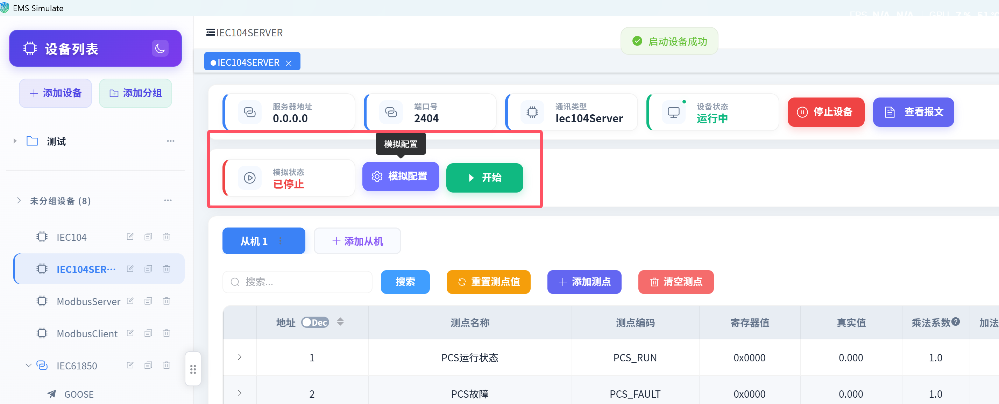
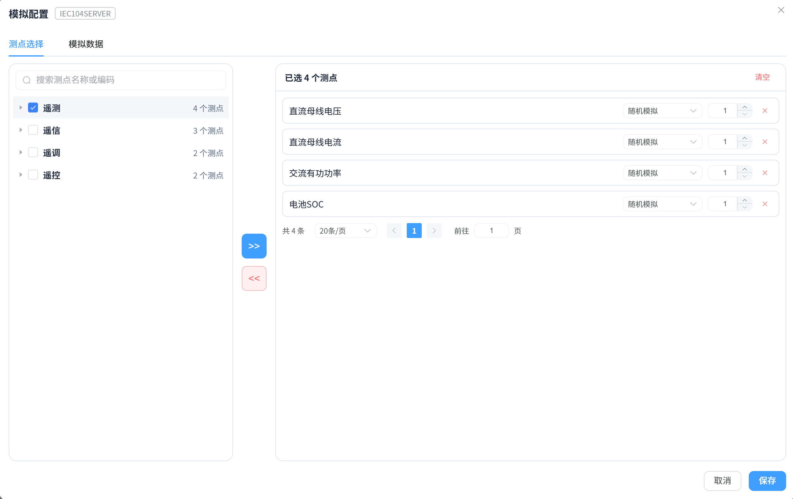
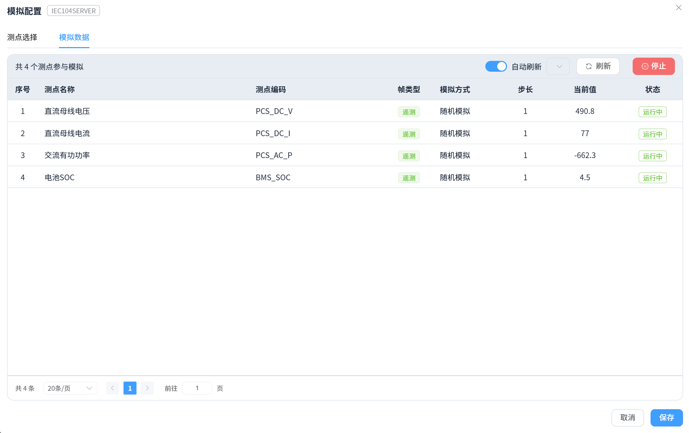

# 测点配置（模拟配置）

## 一、概述

**测点配置**（即"模拟配置"）用于配置**哪些测点参与数据模拟**，以及**每个测点采用哪种模拟方式**。它支持**局部模拟**：不再局限于全量模拟，可只对指定测点开启模拟，其余测点保持手动或映射驱动。

> 模拟方式说明：
>
> | 模拟方式 | 说明 |
> |----------|------|
> | 无（None） | 不参与模拟 |
> | 随机（Random） | 在上下限内随机跳变 |
> | 自增（AutoIncrement） | 按步长线性递增 |
> | 自减（AutoDecrement） | 按步长线性递减 |
> | 正弦波（SineWave） | 按正弦曲线波动 |
> | 斜坡（Ramp） | 按步长匀速变化 |
> | 脉冲（Pulse） | 按脉宽与间隔输出脉冲 |

## 二、前置条件：必须先开启设备 ⚠️

> **「模拟配置」按钮在设备未开启时是置灰（禁用）的，必须先开启设备才能打开模拟配置。**

### 开启条件说明

| 状态 | 模拟配置按钮 |
|------|--------------|
| 设备**未开启** | ❌ 置灰不可用 |
| 设备**已开启** | ✅ 可点击 |
| 客户端设备 | ❌ 不支持（模拟仅适用于服务端模拟设备） |
| IEC 61850 服务端未加载模型 | ❌ 需先导入/加载模型 |

### 操作步骤

1. 在设备详情顶部点击"**开启设备**"，等待设备状态变为"运行中"；
2. 点击工具栏上的"**模拟配置**"按钮（此时按钮已可点击）。

> 设备开启后，工具栏上的"模拟配置"按钮（开启前为置灰状态）。

## 三、配置模拟测点

打开"模拟配置"对话框后，在 **页签 1：测点选择** 中配置参与模拟的测点。

### 步骤 1：选择测点

1. **左侧测点树**：按分组树形展示设备全部测点；
   - 支持关键字**搜索**测点；
   - 支持**分组级联勾选**：勾选分组行 = 全选/全不选组内测点（含子分组）；
2. 点击中间"**&gt;&gt;**"按钮，将勾选的测点**全部移入**右侧"已选测点"列表；
3. 右侧列表支持逐条"**×**"移出，或"清空全部"。

> 模拟配置 - 测点选择页签（左侧测点树 + 转移按钮 + 右侧已选测点）。

### 步骤 2：设置模拟方式

在右侧"已选测点"列表中，为每个测点设置：

- **模拟方式（模拟方式下拉）**：无 / 随机 / 自增 / 自减 / 正弦波 / 斜坡 / 脉冲；
- **步长（Step）**：数值变化步长（模拟方式为"无"时步长不可用）。

> 💡 不同测点可设置不同的模拟方式，实现"局部差异化模拟"（如电压做正弦波模拟、电流做随机模拟）。

### 步骤 3：保存配置

点击对话框底部"保存"，配置保存到本地。**下次开启设备并启动模拟时，系统自动应用本次保存的测点模拟配置**（未保存过则走默认全量模拟）。

## 四、监视与启停模拟

切换到 **页签 2：模拟数据**：

- **实时值监视**：表格展示已选测点的当前值、模拟方式、步长等，支持**自动刷新**（可设间隔）与手动刷新；
- **开始 / 停止模拟**：点击"开始模拟"（或"停止模拟"）按钮，统一控制已选测点的模拟启停；
- 模拟运行期间，测点真实值按各自配置的方式持续变化。

> 模拟配置 - 模拟数据页签（实时值监视 + 自动刷新 + 开始/停止模拟）。

## 五、注意事项

- 模拟配置只对**服务端（模拟）设备**有效，客户端设备不支持；
- 模拟期间手动修改测点值、或对端通过协议写入，会与模拟值互相覆盖，以最后一次操作为准；
- 已保存的模拟配置在设备重启后仍会保留，再次开启设备模拟时自动应用；
- 模拟数据的监视与变化追踪、报文查看等能力见[数据监视](./data-monitor)。
