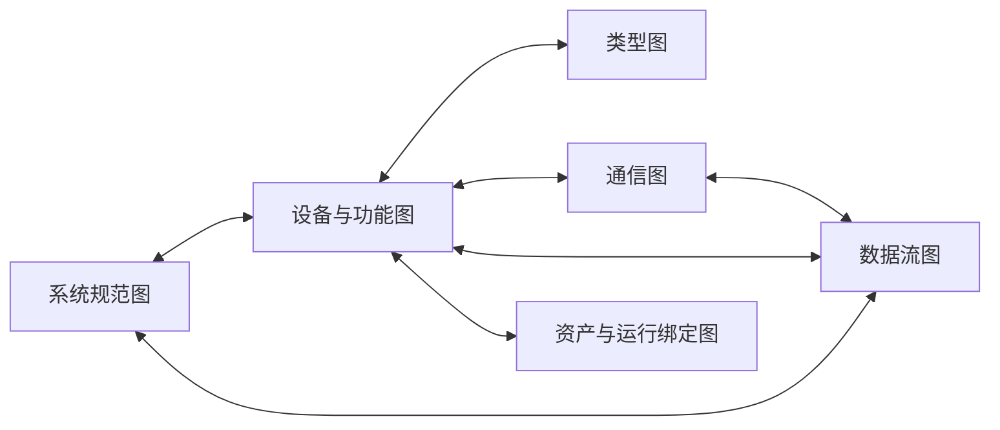
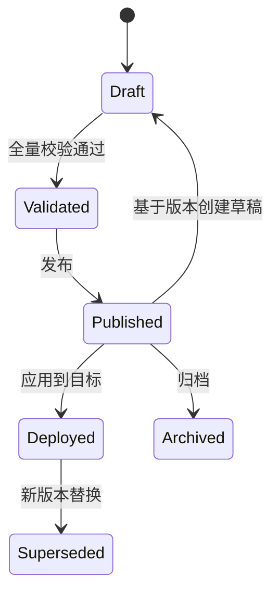

# 通用 IEC 61850 / DL/T 860 建模配置工具设计方案

> 文档状态：设计基线 v2.0
> 产品定位：领域无关的 IEC 61850 信息建模、SCL 工程配置、校验与发布平台
> 标准基线：DL/T 860 V2 系列
> 适用领域：变电站、继电保护、测控、配电、分布式能源、储能、水电、网关、仿真及企业自定义电力自动化场景
> 文档关系：本文件是当前权威设计基线，替代以单一储能或继电保护场景为中心的方案

## 1. 方案结论

本产品应定义为“通用 IEC 61850/DL/T 860 建模配置工具”，核心能力不绑定任何具体行业、设备类型或专业模板。

最终架构由三层组成：

1. 标准核心层：实现 DL/T 860 的信息模型、服务模型、SCL 结构、文件变体、名字空间、引用和工程权责。
2. 通用工程层：提供模型图、命令、版本、导入合并、校验、发布、运行绑定和可视化编辑能力。
3. 领域配置档层：以可安装、可版本化的配置档提供保护、测控、储能、水电、分布式能源或企业项目规则。

关键原则：

- 核心层只实现标准不变量，不硬编码储能、保护或任何厂商规则。
- 领域能力通过标准库、模板、规则包和 UI Schema 注入。
- 内部规范化模型图是编辑真相源，SCL 是工程交换、发布和部署产物。
- 系统规范、IED 能力、系统集成、IED 部署是不同工程模式，具有不同可编辑范围和责任边界。
- 所有引用使用稳定内部 ID，SCL 对象引用由发布名称计算并持续校验。
- 导入未知扩展时优先保真；编辑已支持内容时保持语义等价。
- 草稿、发布版本和运行模型隔离，运行时只消费不可变发布版本。

## 2. 产品目标与非目标

### 2.1 产品目标

- 支持从零、模板、标准库和 SCL 文件建立 IEC 61850 模型工程。
- 支持 SSD、ICD、IID、SCD、CID、SED 的正确导入、编辑、合并和导出。
- 支持系统拓扑、IED、逻辑设备、逻辑节点、数据对象、类型模板、通信和数据流的完整建模。
- 支持 DataSet、Report、Log、GOOSE、SV、Control、Setting Group 和 File 等服务配置。
- 支持 DL/T 860 标准名字空间和第三方扩展名字空间。
- 支持领域模板与企业规则，而不污染通用模型。
- 支持大型工程的版本、差异、审计、发布、回滚和运行绑定。
- 与现有 IEC 61850 客户端、服务端、报告、GOOSE 和仿真能力衔接。

### 2.2 非目标

- 不把产品做成仅能编辑 XML 的 SCL 文本工具。
- 不用一个固定模板覆盖全部设备和应用领域。
- 不将 GB/T 32890、储能配置档或任何厂商约定作为全局规则。
- 不替代保护定值计算、一次系统 CAD、设备固件参数和全部厂商专用工具。
- 不保证对未知私有扩展进行语义编辑；首要目标是安全保留和明确提示。
- 不允许前端绕过领域服务直接修改数据库或拼装发布 XML。

## 3. 标准基线与职责边界

### 3.1 标准层次

| 标准 | 核心采用内容 |
| --- | --- |
| DL/T 860.1 | 系列概念、目标和整体关系 |
| DL/T 860.2 | 统一术语 |
| DL/T 860.3 | 总体、性能和质量要求 |
| DL/T 860.4 | 系统和项目管理 |
| DL/T 860.5 | 功能、通信要求和装置模型 |
| DL/T 860.6 | SCL、工程过程、文件变体、工具交换和项目权责 |
| DL/T 860.71 | 建模原理、逻辑设备/逻辑节点、名字空间和扩展规则 |
| DL/T 860.72 | ACSI 服务模型 |
| DL/T 860.73 | 公用数据类 CDC |
| DL/T 860.74 | 通用逻辑节点和数据对象 |
| DL/T 860.7410 | 水电领域配置档来源 |
| DL/T 860.7420 | 分布式能源领域配置档来源 |
| DL/T 860.81 | MMS 映射和客户端/服务端通信 |
| DL/T 860.92 | 采样值映射 |

GB/T 32890 等行业或专业标准只能形成可选配置档，不能覆盖 DL/T 860 核心语义。

### 3.2 工程权责

DL/T 860.6 区分两种概念性工具职责：

- IED 配置职责：定义和维护 IED 数据模型、能力与设备专用配置，不负责修改系统级数据流和通信工程。
- 系统配置职责：实例化 IED，配置通信地址、跨 IED 数据流和系统共享信息，不越权改变 IED 能力模型。

本产品可以同时提供两类能力，但每个工程和操作必须声明当前职责。任何跨职责修改都要通过显式“能力升级”“实例替换”或“系统合并”流程完成。

### 3.3 兼容与扩展原则

- 优先使用标准 LN、DO 和 CDC。
- 第三方扩展标准 LN 时，只增加新的可选 DO，不改变标准 LN 语义和名字空间。
- 新 DO 使用 `dataNs` 声明第三方名字空间。
- 新 LN 使用 `lnNs` 声明第三方名字空间，并遵守 LN 分组和命名规则。
- 第三方不得私自扩展已有 CDC；企业 DO 仍应选择 DL/T 860.73 定义的 CDC。
- 标准名字空间、领域名字空间和企业名字空间必须分别版本化。
- 工具不能把私有对象伪装为标准对象。

## 4. 领域无关核心与配置档架构

### 4.1 核心与配置档的边界

| 能力 | 通用核心 | 领域配置档 |
| --- | --- | --- |
| SCL 元素、层级和文件变体 | 是 | 否 |
| IED/LD/LN/DO/DA 和类型系统 | 是 | 补充模板 |
| ACSI 服务和控制块 | 是 | 推荐组合和参数 |
| 标准名字空间加载 | 是 | 声明依赖 |
| 引用解析、版本、发布 | 是 | 否 |
| 标准 Schema 和通用语义校验 | 是 | 增加专业规则 |
| 设备模板 | 最小通用模板 | 主要提供者 |
| 数据集命名和内容 | 提供编辑机制 | 提供建议/强制规则 |
| IED/LD/LN 组合方式 | 不硬编码 | 按专业定义 |
| 专用表单和术语 | Schema 驱动框架 | 提供字段分组和说明 |
| 快速修复 | 通用引用类修复 | 专业语义修复 |

### 4.2 配置档示例

- `core-dlt860-v2`：通用标准目录、Schema 和规则。
- `substation-basic`：变电站拓扑和常用测控模型。
- `protection-gbt32890`：保护工程数据集、报告和虚端子规则。
- `der-dlt860-7420`：分布式能源逻辑节点。
- `bess-enterprise`：储能企业扩展和模板。
- `hydro-dlt860-7410`：水电厂模型。
- `gateway-generic`：协议网关和代理设备模板。
- `vendor-xxx`：厂商能力、Private 扩展和校验规则。

一个工程可以启用多个配置档，但必须经过依赖解析和冲突检测。

### 4.3 配置档包结构

```text
profile-package/
├─ profile.yaml
├─ namespaces/
├─ catalogs/
│  ├─ ln-classes.json
│  ├─ data-objects.json
│  └─ cdc-bindings.json
├─ templates/
├─ rules/
├─ ui-schemas/
├─ migrations/
├─ examples/
└─ tests/
```

`profile.yaml` 至少包含：

- 唯一 ID、版本、发布者和数字摘要。
- 依赖的 SCL 版本、标准名字空间和其他配置档。
- 提供的模板、规则、UI Schema 和迁移器。
- 支持的工程模式和文件变体。
- 冲突项、替代项和废弃项。
- 是否可信、是否允许执行代码。

配置档优先使用声明式数据和规则。需要执行代码的扩展只允许加载已签名、受信任的插件。

## 5. 工程模式

产品首页首先选择工程模式，而不是首先要求创建一个 IED。

### 5.1 系统规范模式

目标产物以 SSD 为主，关注：

- `Substation / VoltageLevel / Bay / ConductingEquipment`。
- `Terminal / ConnectivityNode`。
- `Function / SubFunction / EqFunction / EqSubFunction`。
- 功能 `LNode` 需求及其一次设备绑定。
- 系统边界、项目责任和接口需求。

允许在没有具体 IED 的情况下完成系统功能设计。

### 5.2 IED 能力模式

目标产物以 ICD/IID 为主，关注：

- IED、AccessPoint、Server、LDevice、LN 和 DataTypeTemplates。
- IED `Services` 和可配置能力。
- 设备支持的数据集、报告、日志、GOOSE、SV、控制和定值组能力。
- 厂商/企业扩展和默认通信能力。

系统通信和跨 IED 订阅不是本模式的主要编辑对象。

### 5.3 系统集成模式

目标产物以 SCD/SED 为主，关注：

- 导入并实例化多个 ICD/IID。
- 将系统规范 LNode 绑定到实际 IED/LN。
- 配置 Communication、网络和访问点。
- 创建 DataSet、控制块、发布/订阅和 ExtRef。
- 管理跨项目接口和工程权责。

### 5.4 IED 部署模式

目标产物以 CID 为主，关注：

- 从已发布系统版本裁剪单个目标 IED。
- 固化通信、数据流、实例值和目标设备能力范围。
- 生成设备下载包和部署清单。
- 对比现场 IID/在线发现结果与系统版本。

### 5.5 运行绑定模式

这是产品扩展模式，不等同于 SCL 文件变体：

- 将已发布对象绑定到模拟点、数据库点、Modbus、IEC 104 或其他数据源。
- 配置转换、缩放、质量、时间和控制映射。
- 编译 IEC 61850 客户端或服务端运行模型。

运行绑定不得回写改变已发布标准语义。

## 6. 六图统一模型

通用工具不能只维护一棵 IED 树，应维护六张相互引用的图。



### 6.1 系统规范图

表达一次系统、功能层级和功能需求：

- Substation、VoltageLevel、Bay。
- ConductingEquipment、PowerTransformer、TransformerWinding 等设备。
- Terminal 和 ConnectivityNode。
- Function、SubFunction、EqFunction、EqSubFunction。
- LNode 功能需求和设备绑定。

### 6.2 设备与功能图

表达通信可见的 IED 模型：

```text
IED
└─ AccessPoint
   └─ Server
      └─ LDevice
         ├─ LN0
         └─ LN
            └─ DOI / SDI / DAI
```

模型必须支持代理、网关、多 AccessPoint、多 Server 和逻辑设备层级，不假设一种固定物理部署方式。

### 6.3 类型图

表达 `DataTypeTemplates`：

- LNodeType。
- DOType。
- DAType。
- EnumType。
- DO/SDO/DA/BDA/EnumVal 关系。

类型图是有向依赖图，必须检测悬空引用、循环、CDC 错配、重复 ID 和结构冲突。

### 6.4 通信图

表达：

- SubNetwork、ConnectedAP、Address。
- MMS/OSI/TCP-IP 地址。
- GSE 和 SMV 通信参数。
- VLAN、APPID、MAC、时间参数和冗余网络。
- IED `Services` 与实际通信配置的能力一致性。

### 6.5 数据流图

表达：

- DataSet 和成员。
- ReportControl、LogControl、GSEControl、SampledValueControl。
- 发布者、订阅者和 ExtRef。
- 源对象、服务类型、控制块和目标输入。
- 项目间接口及其拥有者。

### 6.6 资产与运行绑定图

表达非标准但产品必需的工程关系：

- 业务资产与 SCL 节点映射。
- 协议点、数据库点、计算点与 DA/DO 映射。
- 缩放、变换、质量、时间和控制适配。
- 发布模型与运行通道绑定。

该图通过产品私有领域模型持久化，不污染标准 SCL；必要时通过受控 `Private` 元素交换。

## 7. 统一身份与引用

### 7.1 稳定身份

每个工程对象使用稳定 UUID。名称、路径和 SCL ObjectReference 是对象属性，不是数据库主键。

好处：

- 重命名不产生内部悬空引用。
- 可精确计算删除和移动影响。
- 支持跨版本差异和三方合并。
- 支持同名模板、类型和项目实例隔离。

### 7.2 语义键

导入、合并或跨工程匹配时使用分层语义键：

- 系统拓扑：Substation/VoltageLevel/Bay/Equipment 路径。
- IED 模型：IED/AP/Server/LD/LN/DO/DA 路径。
- 类型：名字空间 + 类型类别 + 类型 ID + 结构摘要。
- 数据流：发布 IED + LD/LN + 控制块 + DataSet。

语义键用于匹配，不替代内部 UUID。

### 7.3 引用类型

至少结构化保存：

- LNode 到 IED/LN 的绑定。
- LN 到 LNodeType。
- DO/DA 到 DOType/DAType/EnumType。
- 控制块到 DataSet。
- FCDA 到目标 DO/DA。
- Communication 到 IED/AP/控制块。
- ExtRef 到源对象和源控制块。
- 运行点到发布对象。
- 模板实例到模板版本。

任何删除、移动、重命名、类型替换和配置档升级都必须经过引用影响分析。

## 8. SCL 工程模型

### 8.1 支持的文件变体

| 文件 | 工程含义 | 必要能力 |
| --- | --- | --- |
| SSD | 系统规范描述 | 系统拓扑、功能和 LNode 需求 |
| ICD | IED 能力描述 | 设备能力、类型模板和默认能力 |
| IID | 实例化 IED 描述 | 项目实例更新及设备侧回传 |
| SCD | 系统配置描述 | 全系统 IED、通信、数据流和拓扑 |
| CID | 已配置 IED 描述 | 面向单个 IED 的部署配置 |
| SED | 系统交换描述 | 项目边界和跨项目数据流 |

导出器必须按文件变体的内容和约束生成，不能只修改扩展名。

### 8.2 完整 SCL 结构

```text
SCL
├─ Header
│  └─ History / Hitem
├─ Substation
│  ├─ VoltageLevel / Bay
│  ├─ ConductingEquipment / PowerTransformer
│  ├─ Terminal / ConnectivityNode
│  ├─ Function / SubFunction
│  └─ LNode
├─ Communication
│  └─ SubNetwork / ConnectedAP / Address / GSE / SMV
├─ IED
│  ├─ Services
│  └─ AccessPoint
│     ├─ Server
│     │  └─ LDevice / LN0 / LN / DOI / SDI / DAI
│     └─ ServerAt
└─ DataTypeTemplates
   ├─ LNodeType
   ├─ DOType
   ├─ DAType
   └─ EnumType
```

节点父子关系和属性必须由目标 SCL Schema 驱动，不能仅依靠一张宽松的手写字典。

### 8.3 保真模型

内部模型分为：

- 已理解语义：转为强类型领域对象，可编辑、校验和重构。
- 已知但暂未提供 UI 的标准元素：结构化保存，允许专家属性编辑。
- 未知 Private/扩展：以安全的保真片段保存，记录所属父节点、名字空间和顺序。

未知扩展不得阻塞只读导入，但可能阻塞涉及该区域的有损修改和发布。

### 8.4 文件头与历史

Header 应支持：

- id、version、revision、toolID、nameStructure。
- History/Hitem 的 who、what、why、when、version、revision。
- 原始文件、导入工具和发布产物之间的谱系。
- 工程版本与 SCL 版本的明确映射。

## 9. 标准库和名字空间注册表

### 9.1 标准包

标准目录不能散落在业务代码常量中。每个标准包包含：

- namespaceID、version、revision。
- LN 类、M/O/C 数据对象和说明。
- DO 到 CDC 的绑定。
- CDC 属性、FC、触发、基本类型和值域。
- 枚举、缩写、命名规则和废弃信息。
- 对应 SCL Schema 和兼容矩阵。

### 9.2 名字空间属性

工具应正确支持：

- `ldNs`：逻辑设备采用的域应用名字空间。
- `lnNs`：单个 LN 偏离 LD 名字空间时使用。
- `dataNs`：扩展数据对象的名字空间。
- `cdcNs`：CDC 名字空间；第三方不可借此扩展标准 CDC。

界面必须展示对象来源和版本，能从实例跳转到标准定义。

### 9.3 类型生成与复用

- 从标准模板创建时生成或复用兼容类型。
- 类型复用基于名字空间、语义和结构摘要。
- 导入时默认保留原类型 ID。
- 同 ID 异构必须阻断或重命名，不能静默覆盖。
- 类型变更自动定位全部实例和数据流影响。

## 10. 通用服务配置

### 10.1 DataSet

- 支持持久和动态数据集能力描述。
- 成员使用结构化目标引用，不手工拼接 FCDA 字符串。
- 校验目标、FC、顺序、重复、成员数量和设备能力。
- 数据集成员或顺序变化自动影响相关 `confRev`。
- 核心不规定业务数据集名称；配置档可提供命名和内容模板。

### 10.2 Report 和 Log

完整支持：

- BRCB、URCB、LogControl。
- datSet、rptID、confRev、bufTime、intgPd。
- TrgOps、OptFields、RptEnabled、Owner/Reservation 能力。
- 日志引用、触发和查询能力。
- 设备 Services 声明、客户端数量和缓冲能力校验。

### 10.3 Control

支持所有标准控制模型及其状态机：

- status-only。
- direct-with-normal-security。
- sbo-with-normal-security。
- direct-with-enhanced-security。
- sbo-with-enhanced-security。

校验 CDC 是否可控、`ctlModel`、SBO 配置、操作超时、原发者、检查条件、命令终止和设备服务能力。领域配置档可以推荐控制模型，但核心不替业务做安全决策。

### 10.4 GOOSE

支持：

- GSEControl、DataSet、Communication/GSE。
- APPID、组播 MAC、VLAN-ID、优先级、MinTime、MaxTime。
- 发布/订阅和 ExtRef 数据流。
- confRev、数据集契约和订阅完整性。
- 冗余网络、失联和测试/仿真标志的工程检查。

### 10.5 Sampled Value

支持：

- SampledValueControl、Communication/SMV。
- 采样率、同步、组播地址、VLAN 和数据集。
- 发布/订阅、设备能力和目标版本差异。

是否显示和启用由工程模式和配置档决定，但核心模型必须能够无损处理。

### 10.6 Setting Group、File 和 Time

- 支持 SettingControl 和 SG/SE 数据的组关系。
- 支持文件服务能力和文件目录工程配置。
- 支持时间同步能力、精度和时钟相关工程信息。
- 配置档决定具体使用方式和发布门禁。

## 11. 导入、合并和往返

### 11.1 导入流水线

1. 文件安全、大小、编码和 XML 防护检查。
2. 检测文件变体、SCL 版本和名字空间。
3. XML Schema 校验。
4. 构建临时六图模型和引用索引。
5. 加载匹配标准包和配置档。
6. 分类标准、企业扩展、未知 Private 和不兼容内容。
7. 展示导入摘要、差异、风险和预计对象数。
8. 用户选择新建、合并、实例化、替换 IED 或只读检查。
9. 单事务提交并保存导入基线版本。

### 11.2 合并策略

- 三方合并基线：当前草稿、导入文件、上次共同版本。
- 区分能力模型、实例值、系统通信、数据流和系统规范的所有权。
- 类型同名时比较名字空间和结构摘要。
- IED 替换时保持系统拥有的数据流，并校验新能力是否仍满足引用。
- 对象删除或重命名必须显示全部引用和运行影响。
- 冲突逐项解决并形成可审计 ChangeSet。

### 11.3 往返目标

- 已支持标准内容语义等价。
- 未编辑未知扩展尽可能原样保留。
- 元素顺序稳定且符合 Schema。
- 导出文件重新导入后六图语义和引用等价。
- 无法保真的内容在发布前明确列出并要求确认。

## 12. 用户体验和信息架构

### 12.1 工程中心

显示：

- 工程模式和目标文件变体。
- SCL/名字空间/配置档版本。
- IED、LD、LN、DO、数据集和数据流规模。
- 草稿、校验、发布、部署和归档状态。
- 最近修改、发布和运行绑定。

### 12.2 创建向导

1. 选择工程模式。
2. 选择 SCL 版本和标准包。
3. 选择领域/企业配置档。
4. 选择空白、模板、导入或复制。
5. 配置初始系统/IED/通信边界。
6. 预览生成对象、规则和风险。

IED 不是所有工程的必填种子；SSD 工程可以从系统拓扑开始。

### 12.3 统一工作台

提供可切换视图：

- 系统拓扑视图。
- IED/SCL 树视图。
- 类型依赖视图。
- 通信网络视图。
- 数据流视图。
- 资产/运行绑定视图。

布局：

- 左侧：当前视图树、搜索、过滤和配置档。
- 中间：表格、画布、关系图或专用编辑器。
- 右侧：属性、标准说明、名字空间、来源和引用。
- 底部：问题、变更、影响、任务和运行结果。

### 12.4 专用编辑器

- Substation/一次拓扑编辑器。
- IED/LD/LN 模型编辑器。
- DataTypeTemplates 依赖编辑器。
- DataSet 和 FCDA 成员编辑器。
- Report/Log/Control 编辑器。
- GOOSE/SV 发布订阅编辑器。
- Communication 网络与地址编辑器。
- ExtRef 和跨项目接口编辑器。
- 标准扩展数据字典编辑器。
- 版本差异和合并冲突编辑器。

### 12.5 普通模式与专家模式

- 普通模式以功能、模板和业务说明为主，隐藏不必要的 Schema 细节。
- 专家模式显示原始 SCL 名、FC、CDC、类型和名字空间。
- 两种模式编辑同一个领域模型，不维护两套数据。

## 13. 校验体系

### 13.1 校验层次

| 层次 | 内容 | 默认发布门禁 |
| --- | --- | --- |
| L1 XML/SCL Schema | 元素、层级、属性、值域、文件变体 | 错误阻断 |
| L2 通用引用 | 类型、FCDA、控制块、通信、ExtRef | 错误阻断 |
| L3 DL/T 860 语义 | LN M/O/C、CDC、FC、控制、名字空间 | 错误阻断或警告 |
| L4 工程权责 | IED 能力、系统配置和项目边界 | 越权错误阻断 |
| L5 配置档 | 保护、储能、水电、厂商或企业规则 | 由配置档定义 |
| L6 通信与容量 | 地址冲突、报告实例、GOOSE/SV 参数 | 错误/警告 |
| L7 部署兼容 | 目标设备、运行绑定和版本差异 | 部署阻断 |

### 13.2 通用阻断规则

- 文件不符合目标 SCL Schema 或文件变体。
- 每个 LD 缺少或重复 LLN0。
- LN、DO、DA 或类型引用不存在。
- 标准 LN 缺少必选数据，或标准 DO 使用错误 CDC。
- 第三方扩展改变标准语义或使用非法名字空间。
- 控制块引用不存在的数据集。
- FCDA 目标或 FC 不匹配。
- Communication 引用不存在的 IED/AP/控制块。
- ExtRef 无法解析或服务类型不一致。
- GOOSE/SV 地址、APPID 或控制块契约冲突。
- 发布产物回读后语义不等价。

### 13.3 规则模型

每个规则包含：

- 稳定规则码和规则版本。
- 来源标准/配置档和条款说明。
- 适用工程模式、文件变体、名字空间和节点类型。
- 严重度、是否允许豁免。
- 依赖字段和引用范围，用于增量校验。
- 人类可读说明和修复建议。
- 可选安全 Quick Fix。

配置档可增加规则、提高严重度或缩小允许范围，但不得关闭核心 Schema 和引用完整性规则。

### 13.4 增量和全量校验

- 字段修改后执行局部 Schema 和命名校验。
- 类型修改沿依赖图校验所有实例。
- 数据集修改联动控制块、confRev 和订阅方。
- IED 能力变化联动系统数据流和部署兼容性。
- 发布执行全量七层校验，并固定规则包版本。

## 14. 核心领域模型

### 14.1 主要聚合

| 聚合/实体 | 职责 |
| --- | --- |
| ModelProject | 工程模式、SCL 版本、标准包、配置档和状态 |
| ModelGraph | 六图节点和边的统一容器 |
| ModelNode | 稳定 ID、kind、名称、强类型属性、顺序和来源 |
| ModelReference | 来源、目标、引用类型、解析状态和作用域 |
| StandardPackage | Schema、名字空间、目录和兼容矩阵 |
| ProfilePackage | 模板、规则、UI Schema、依赖和迁移 |
| Draft | 可编辑状态、revision、命令历史和自动保存 |
| ChangeSet | 原子语义变更、影响和审计信息 |
| ValidationRun/Finding | 校验上下文、规则结果和豁免 |
| ModelVersion | 不可变快照和发布元数据 |
| Artifact | SCL、报告、清单、哈希和生成器信息 |
| RuntimeBinding | 发布对象与通道/点/转换关系 |

### 14.2 节点分类

建议将节点 kind 分组：

- `SYSTEM_*`：Substation、VoltageLevel、Bay、Equipment、Terminal、Function、LNode。
- `IED_*`：IED、AccessPoint、Server、LDevice、LN0、LN、DOI、DAI。
- `TYPE_*`：LNodeType、DOType、DAType、EnumType 及子定义。
- `COMM_*`：SubNetwork、ConnectedAP、Address、GSE、SMV。
- `FLOW_*`：DataSet、FCDA、控制块、Inputs、ExtRef。
- `BINDING_*`：Asset、RuntimePoint、Transform、ChannelBinding。
- `EXTENSION_*`：Private、企业扩展定义和保真节点。

### 14.3 属性 Schema

现有 `attributes_json` 可以保留，但必须由版本化 Schema 管理：

- 每个 kind 有字段类型、默认值、枚举、只读和显示条件。
- 常用索引字段结构化投影。
- Schema 升级有迁移器。
- 任意 JSON 不能绕过领域验证直接入库。
- 未知扩展与已知强类型属性隔离。

## 15. 命令、撤销与并发

### 15.1 语义命令

```text
CreateProject
ImportScl
AddSubstationElement
InstantiateIedCapability
AddLogicalNodeFromCatalog
ExtendLogicalNode
CreateDataSet
ConfigureReport
ConfigureGooseFlow
BindLNodeToIed
RenameSclObject
ReplaceIedCapability
MergeProjectInterface
PublishVersion
ApplyVersionToRuntime
```

禁止把底层“修改某行 JSON”作为公共 API。

### 15.2 命令要求

- 包含操作者、工程 revision、原因和幂等键。
- 返回 ChangeSet、受影响对象和增量问题。
- 批量命令单事务提交。
- 可逆命令保存逆操作或前后快照。
- 发布、部署、删除版本等不可逆操作需要独立权限和确认。

### 15.3 并发

- 首期使用工程级 revision 和节点级乐观锁。
- 冲突返回字段级差异，不简单覆盖。
- 长编辑表单支持临时租约或软锁提示。
- 后续多用户协作使用 ChangeSet 合并，而不是共享可变 XML。

## 16. 后端架构

```text
API / WebSocket / Task Events
├─ Application
│  ├─ Project Command Service
│  ├─ Query / Search Service
│  ├─ Import / Merge Orchestrator
│  ├─ Validation Orchestrator
│  ├─ Publish / Artifact Service
│  └─ Runtime Binding Service
├─ Domain
│  ├─ Six-Graph Model
│  ├─ Reference Resolver
│  ├─ Standard/Profile Registry
│  ├─ Command / ChangeSet
│  └─ Version / Compatibility
├─ Infrastructure
│  ├─ Repository / Unit of Work
│  ├─ SCL Parser / Serializer
│  ├─ XML Schema Validator
│  ├─ Search / Cache / Task Queue
│  └─ Artifact Store
└─ Runtime Adapters
   ├─ IEC 61850 Client / Server
   ├─ Report / Control / GOOSE / SV
   └─ Simulator / Protocol Bridges
```

### 16.1 SCL 解析器

- 安全流式解析。
- 文件变体识别。
- Schema 版本和名字空间识别。
- 保留源位置，用于问题定位。
- 同步构建节点、引用和保真扩展。
- 不在解析阶段执行业务修复。

### 16.2 SCL 序列化器

- 按文件变体和 Schema 生成。
- 确定性排序和稳定格式。
- 流式写出大文件。
- 注入 Header/History 和发布信息。
- 生成后独立回读并验证语义等价。

### 16.3 标准与配置档注册表

- 标准包和配置档不可变加载。
- 依赖、冲突和兼容矩阵解析。
- 按工程固定版本，不随系统升级静默变化。
- 配置档升级通过显式迁移预览执行。

## 17. API 与任务设计

建议新增 `/api/modeling/v2`：

```text
GET    /standards
GET    /standards/{id}/catalog
GET    /profiles
POST   /profiles/validate

POST   /projects
GET    /projects/{id}
GET    /projects/{id}/views/{view}/tree
GET    /projects/{id}/nodes/{nodeId}
POST   /projects/{id}/commands
POST   /projects/{id}/commands/batch

POST   /projects/{id}/imports
GET    /projects/{id}/imports/{taskId}
POST   /projects/{id}/merge-preview
POST   /projects/{id}/merge

GET    /projects/{id}/references
GET    /projects/{id}/dataflows
POST   /projects/{id}/validations
GET    /projects/{id}/validations/{runId}

GET    /projects/{id}/versions
GET    /projects/{id}/versions/{versionId}/diff
POST   /projects/{id}/publish
GET    /projects/{id}/artifacts
POST   /projects/{id}/artifacts/{artifactId}/deploy
```

导入、合并、全量校验、发布和大规模差异使用后台任务，通过 SSE/WebSocket 返回阶段、百分比、问题计数和取消状态。

## 18. 版本、发布和部署

### 18.1 状态机



### 18.2 发布产物

- 不可变六图快照。
- 目标 SCL 文件。
- Schema、标准包和配置档清单。
- 全量校验报告及豁免。
- 与上一版本的语义差异。
- SHA-256、生成器版本和创建时间。
- 操作者、审核者和变更原因。
- 设备兼容和运行影响摘要。

### 18.3 兼容性分类

| 变更 | 默认分类 |
| --- | --- |
| 修改 desc 或 UI 元数据 | 通常兼容 |
| 新增可选监视对象 | 通常向后兼容 |
| DataSet 成员或顺序变化 | 数据契约变化 |
| confRev 不同步 | 错误 |
| 对象重命名、移动或删除 | 引用不兼容 |
| CDC、FC 或控制模型变化 | 语义不兼容 |
| GOOSE/SV 数据集变化 | 实时接口不兼容 |
| 通信地址变化 | 部署变化 |
| 配置档主版本变化 | 需迁移评估 |

## 19. 安全、可靠性与审计

- XML 禁用外部实体和网络实体，防止 XXE。
- 限制文件大小、节点数、嵌套深度和解压大小。
- Private 片段按白名单序列化，不执行其中内容。
- 第三方配置档默认声明式；代码插件需要签名和信任。
- 编辑、发布、部署和控制模型变更分权。
- 全部命令、豁免、发布和部署可审计。
- 自动保存草稿，发布必须显式触发。
- 运行部署前创建回滚点并执行预检查。
- 日志不包含凭据、私钥和敏感认证信息。

## 20. 性能与规模

首期目标：

| 指标 | 目标 |
| --- | --- |
| 单工程 IED | 1,000 |
| 单工程模型节点 | 500,000 |
| 单工程引用 | 2,000,000 |
| 10 万节点首屏 | 5 s 内，按需加载 |
| 常规命令 | 300 ms 内 |
| 局部校验 | 200 ms 内 |
| 10 万节点全量校验 | 60 s 内，可取消 |
| 10 万节点 SCL 生成 | 30 s 内，流式输出 |

措施：

- 树和表格虚拟滚动。
- 节点、语义键和引用索引。
- 内容摘要驱动增量校验。
- 流式 XML 解析/生成。
- 标准目录只读缓存。
- 后台任务和分阶段进度。
- API 不返回整棵巨型树。

## 21. 测试与互操作

### 21.1 测试矩阵

- 每个 SCL 文件变体的 Schema 正反向用例。
- 六图节点和引用完整性测试。
- 标准 LN/DO/CDC/M/O/C 目录测试。
- DataSet、Report、Log、Control、GOOSE、SV、Setting Group 测试。
- 名字空间、标准 LN 扩展和新 LN 测试。
- 导入、合并、冲突、未知 Private 和往返测试。
- 命令撤销、并发和版本差异测试。
- 大模型性能和内存测试。
- 第三方工具和至少两种设备栈互操作测试。

### 21.2 黄金样例库

- 最小 SSD。
- 最小 ICD 和项目 IID。
- 多 IED SCD。
- 单 IED CID。
- 跨项目 SED。
- 含 Report/Log/Control 的样例。
- 含 GOOSE/SV 和 ExtRef 的样例。
- 含标准 LN 扩展、新企业 LN 和 Private 的样例。
- 保护、测控、分布式能源、水电和网关配置档样例。
- 悬空引用、CDC 错配、非法父子关系、地址冲突等负向样例。

### 21.3 发布验收

- 通过目标 Schema 和全部核心阻断规则。
- 导出后可被独立解析器重新解析。
- 往返后六图语义和引用等价。
- 配置档规则结果稳定可复现。
- MMS 浏览、报告和控制按服务能力工作。
- GOOSE/SV 场景完成发布订阅和异常测试。
- 版本可比较、可回滚、可审计。

## 22. 与现有工程的衔接和差距

现有工程具备：

- 模型工程、通用节点、引用和版本表。
- 工程、节点、校验、版本和发布 API。
- 基础 SCL Parser、文件管理和验证。
- IED/AP/Server/LD/LN/DOI/DataSet/Report/GSE/ExtRef/类型模板的部分序列化。
- IEC 61850 客户端、服务端、模型发现、报告、控制、GOOSE 和 ICD 导出能力。
- 前端项目列表、创建向导和建模工作台雏形。

主要差距：

1. 当前模型几乎只有 IED 树，缺少完整 Substation/系统规范图。
2. 创建 API 强制 IED 种子，不适合 SSD 和系统规范工程。
3. 通用 CHILD_RULES 不是目标 SCL Schema，存在非法结构风险。
4. 缺少 Services、History、LogControl、SampledValueControl、SettingControl 等完整元素。
5. ReportControl 只有基础属性，缺少 TrgOps、OptFields、RptEnabled 等子结构。
6. SCL 文件变体目前主要依赖扩展名，缺少不同内容约束和裁剪器。
7. 标准版本映射过于简化，缺少标准包、名字空间和兼容矩阵。
8. 校验以格式和引用为主，缺少标准 M/O/C、CDC、工程权责和配置档层。
9. `attributes_json` 缺少版本化 Schema、迁移和结构化索引。
10. 缺少标准/配置档注册表、资产视图、数据流图和通信图。
11. API 以 CRUD 为主，缺少语义命令、任务、合并和发布产物模型。
12. 导入编辑的 Private 保真和导出回读等价尚未形成闭环。

### 22.1 现有表的演进

- 保留 `Iec61850ModelProject`，增加工程模式、SCL 版本、标准包和配置档绑定。
- 保留 `Iec61850ModelNode`，增加图类型、Schema 版本、来源、语义摘要和常用投影。
- 保留 `Iec61850ModelReference`，扩充引用类型、作用域和解析状态。
- 保留 `Iec61850ModelVersion`，增加标准/配置档清单、产物和校验摘要。
- 新增 StandardPackage、ProfilePackage、ValidationRun/Finding、Artifact、RuntimeBinding、ChangeSet。

## 23. 实施路线

### Phase 0：契约与标准基线

- 确定目标 SCL 版本和文件变体。
- 建立机器可读标准包和规则码。
- 定义六图节点、引用和语义命令契约。
- 建立黄金样例和独立 Schema 校验。

退出条件：最小 SSD、ICD、SCD、CID 可由同一领域模型表达。

### Phase 1：六图核心与存储

- 扩充节点类型和引用图。
- 引入属性 Schema 和迁移。
- 支持系统规范图、IED 图、类型图和基础通信图。
- 重构工程创建为模式优先。

退出条件：支持系统规范和 IED 能力两个独立工程模式。

### Phase 2：SCL 导入、序列化和往返

- 完整文件变体识别和 Schema 校验。
- 流式导入、保真扩展和源位置。
- 文件变体序列化器和 Header/History。
- 导出回读等价校验。

退出条件：黄金样例可无阻断导入、编辑、导出和回读。

### Phase 3：服务与数据流

- 完整 DataSet/Report/Log/Control。
- GOOSE/SV/ExtRef 和 Communication 对应关系。
- Setting Group、File、Time 能力。
- 专用编辑器和数据流视图。

退出条件：跨 IED 报告、GOOSE/SV 和控制配置可完整交付。

### Phase 4：配置档和扩展治理

- 配置档清单、依赖、冲突和固定版本。
- 标准 LN 扩展、新 LN、企业数据字典。
- 保护、储能/DER 和一个企业厂商配置档作为验证样例。
- 配置档升级和迁移预览。

退出条件：新增领域不修改核心代码即可安装和使用。

### Phase 5：合并、发布和运行绑定

- ICD/IID 实例化和 IED 替换。
- SCD/SED 三方合并与工程权责。
- 发布产物、差异、审批、部署和回滚。
- 与现有运行时编译和绑定。

退出条件：从规范/能力到系统配置、CID 和运行模型形成闭环。

### Phase 6：规模化与互操作

- 大模型性能优化。
- 多用户 ChangeSet 协作。
- 第三方工具和设备栈互操作。
- 生产权限、安全和审计验收。

## 24. 推荐首个纵向切片

首个切片不选某个行业，而选择一个覆盖通用骨架的“小型多 IED 系统工程”：

1. 新建系统规范工程，创建 Substation/VoltageLevel/Bay 和两个 LNode 需求。
2. 导入两个不同厂商的 ICD。
3. 实例化 IED 并将 LNode 需求绑定到实际 LN。
4. 配置一个 MMS Report 数据流。
5. 配置一个 GOOSE 发布/订阅和 ExtRef。
6. 完成 Communication 地址配置。
7. 执行全量校验，发布 SCD。
8. 为其中一个 IED 裁剪 CID。
9. 将发布版本绑定到仿真运行时，验证浏览、报告和 GOOSE。

该切片同时验证系统规范、IED 能力、系统集成、服务、通信、发布和运行边界，且不依赖任何特定行业模板。

## 25. 产品验收标准

1. 核心领域无关：删除所有领域配置档后，仍可完成标准 SSD/ICD/SCD/CID 工程。
2. 配置档可插拔：新增专业模板和规则不修改核心领域代码。
3. 标准完整：六图、文件变体、名字空间和服务模型均有正确表达。
4. 工程权责清晰：IED 能力和系统数据流不会被越权静默修改。
5. SCL 有效：产物通过目标 Schema 和核心语义校验。
6. 引用安全：重命名、移动、删除和替换均有影响分析。
7. 往返保真：支持内容语义等价，未知扩展有明确保真策略。
8. 服务可用：Report、Control、GOOSE/SV 能形成可验证数据流。
9. 发布可靠：版本不可变、差异可读、产物可审计、部署可回滚。
10. 性能达标：满足第 20 章的首期规模目标。

## 26. 关键决策记录

| 决策 | 结论 | 原因 |
| --- | --- | --- |
| 产品是否绑定储能 | 否 | 储能是领域配置档，不是通用核心 |
| 产品是否绑定继电保护 | 否 | GB/T 32890 只适用于保护专业配置档 |
| 编辑真相源 | 内部六图模型 | 支持引用、版本、合并和多文件变体 |
| SCL 的角色 | 标准交换、发布和部署产物 | 避免在线 XML 编辑破坏语义 |
| 工程入口 | 模式优先 | SSD 工程不应被迫从 IED 开始 |
| 领域扩展 | 配置档包 | 保持核心稳定，允许多专业并存 |
| 标准扩展 | 名字空间治理 | 保持互操作性和来源可追溯 |
| 私有 CDC | 不支持 | 第三方不得扩展标准 CDC |
| 未知 Private | 安全保真优先 | 降低厂商文件导入导出损失 |
| 运行时来源 | 不可变发布版本 | 草稿不影响运行，便于回滚审计 |

## 27. 标准依据

本方案依据仓库 `word/dlt860v2` 中以下标准文件形成：

- `DLT 860.1变电站通信网络和系统 第1_部分 概述.pdf`
- `DLT 860.2变电站内通信网络和系统 第2部分：术语.pdf`
- `DLT 860.3变电站通信网络和系统 第3_部分_总体要求.pdf`
- `DLT 860.4变电站通信网络和系统 第4_部分_系统和项目管理.pdf`
- `5变电站通信网络和系统 第5 部分：功能通信要求和装置模型.pdf`
- `6：与智能电子设备有关的变电站内通信配置描述语言.pdf`，重点参考工程过程、文件变体、数据流和项目权责。
- `7-1：基本通信结构—原理和模型.pdf`，重点参考信息模型、逻辑设备/逻辑节点、名字空间和类扩展。
- `7-2：基本信息和通信结构– 抽象通信服务接口（ACSI.pdf`
- `7-3：基本通信结构公用数据类.pdf`
- `7-4：基本通信结构兼容逻辑节点类和数据类.pdf`
- `7-410：基本通信结构水力发电厂监视与控制用通信.pdf`
- `7-420：基本通信结构—分布式能源.pdf`
- `8-1：特定通信服务映射(SCSM)- 映射到 MMS（ISO 9506-1 和 ISO 9506-2）.pdf`
- `9-2：特定通信服务映射(SCSM)― 基于 ISOIEC 8802-3 的采样值.pdf`

`32890-2016-gbt-cd-300.pdf` 仅用于保护领域配置档的设计参考，不进入通用核心强制规则。
