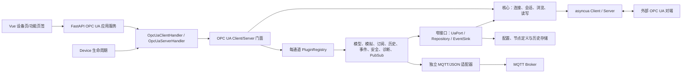
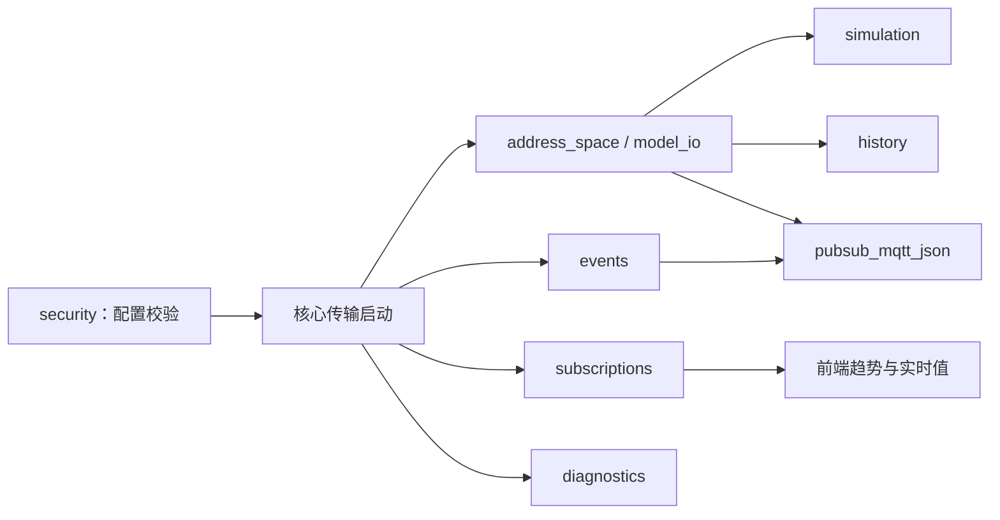
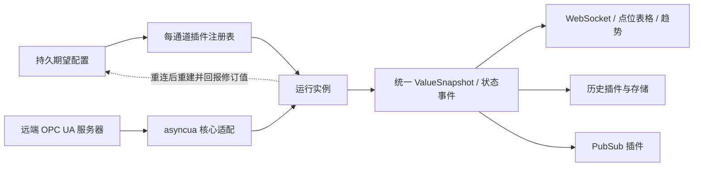
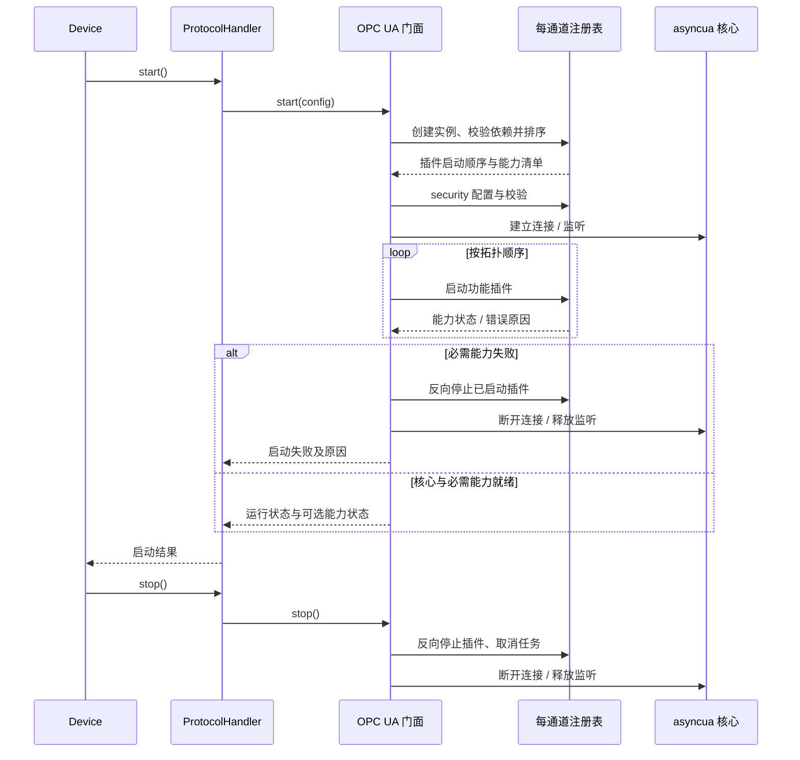

# OPC UA 客户端与服务端开发计划（opcua-asyncio）

> 状态：实施中。已接入 M1 基础闭环及部分 M2–M4 能力，详见[基础实施记录](progress-2026-10-01.md)和[模拟、订阅、安全与历史实施记录](progress-2026-10-01-live-features.md)；本文是实现顺序、数据契约和验收依据，不表示全部设计稿功能已经可用。
> 日期：2026-09-30。需求依据：[OPC UA 设计稿](../../../.pen/opcua.pen)、[设计稿调整说明](../../../.pen/opcua-refactor-spec.md)。

## 1. 目标与边界

在现有 EMS Simulate 的设备/通道体系中增加 OPC UA TCP 客户端和服务端。协议栈使用 **opcua-asyncio**，其 PyPI 包名和导入名均为 `asyncua`。前端按设计稿的 20 张画板交付：左侧仅保留设备与分组，右侧在设备标签下切换功能页签；客户端点位浏览与服务端点位管理沿用现有表格结构，保留服务端监测接入客户端会话的弹框。

交付范围包含服务端地址空间与模拟、客户端浏览/读写/订阅、连接和安全配置、会话与服务诊断、趋势与历史、事件与告警，以及 MQTT/JSON PubSub。每一项必须由真实协议状态或持久化数据驱动；不得用画板示例数据、前端计数器或假报文填充运行页面。

支持 `opc.tcp://`。设计稿未要求的 OPC UA XML/WebSocket、冗余服务器切换、UDP/UADP PubSub 先不纳入本计划。第三方服务器不支持的历史聚合、条件确认等能力须在界面明确显示为“不支持”，不能悄悄改成本地估算结果。

## 2. 现状与库选型

当前仓库尚无 OPC UA 枚举、运行代码、配置或测试。现有数字协议 ID 为 0–6，建议 **OPC UA 使用 7**，仅允许连接类型 1（TCP 客户端）和 2（TCP 服务端），默认端口 4840。`Device.start()/stop()` 已是异步入口，可承载 `asyncua.Client` 与 `asyncua.Server`；通道构建、协议参数和页面仍需接入。`BasePoint` 构造器虽然能保留部分字符串地址，但现有值初始化、元数据编辑和 API 仍有整数/浮点假设，无法完整表达 UA 的各类 NodeId、数组、结构体和 `DataValue`，因此不能直接把 OPC UA 节点塞入现有四类测点表。

候选依赖为 `asyncua==2.0.1`：截至本文日期，PyPI 和上游 release 均列出此版本；项目要求 Python ≥3.11，库要求 Python ≥3.10。实施 M0 时需在项目的 Windows/Linux、Python 3.11 构建环境完成兼容性试验后固定版本并更新 `uv.lock`，不得只修改 `pyproject.toml`。库提供异步客户端/服务端、读写、订阅、事件和历史相关接口；2.0.1 新增客户端自动重连参数，但**会话恢复及订阅重建仍要由本项目验证和管理**。[库仓库](https://github.com/FreeOpcUa/opcua-asyncio)、[PyPI](https://pypi.org/project/asyncua/)、[v2.0.1 发布说明](https://github.com/FreeOpcUa/opcua-asyncio/releases/tag/v2.0.1)、[客户端 API](https://opcua-asyncio.readthedocs.io/en/latest/api/asyncua.client.html)。

重要能力边界：截至本文日期，上游公开源码的 PubSub 传输实现仅覆盖 UDP/UADP；M0 还须在拟锁定的 2.0.1 版本复核。设计稿指定的 **MQTT + JSON** 不应写成 `asyncua` 开箱即用。该部分需在 `asyncua` 节点/类型模型外增加独立的 MQTT 传输和 OPC UA PubSub JSON 编码适配器，并通过第三方订阅端验证。[上游 PubSub 连接源码](https://github.com/FreeOpcUa/opcua-asyncio/blob/master/asyncua/pubsub/connection.py)、[OPC UA Part 14 MQTT/JSON 映射](https://reference.opcfoundation.org/specs/OPC-10000-14/7)。上游 README 对服务端告警模型也未作现成功能承诺，条件与确认单列技术门槛。

## 3. 总体结构

参考 IEC 61850 客户端的[插件协议](../../../src/proto/iec61850/plugins/base.py)、[注册表](../../../src/proto/iec61850/plugins/__init__.py)和[门面装配](../../../src/proto/iec61850/iec61850_client.py)，以及[服务端门面组合](../../../src/proto/iec61850/iec61850_server.py)。OPC UA 保留“门面 + 核心连接 + 功能插件”的思路，针对 `asyncua` 使用原生异步生命周期。下图中的插件是**仓库内部功能模块**，不是 Codex/应用商店插件；它们按通道实例化，不修改全局插件注册表。



### 3.1 插件职责与依赖方向

`ProtocolHandler` 只实现 EMS 的统一协议接口，门面只装配核心与插件并对外暴露能力；FastAPI 路由通过应用服务/门面调用，不导入插件实现类。`asyncua` 对象只留在核心适配层，插件使用项目定义的 `NodeRef`、`ValueSnapshot`、`CapabilityStatus` 等类型及窄接口，避免库类型扩散到 API、数据库和 Vue。

| 组件 | 角色与阶段 | 依赖/交付 |
| --- | --- | --- |
| 核心传输（非插件） | 客户端/服务端，M1 | `asyncua` 生命周期、会话、基础 Browse/Read/Write；基础读写不依赖可选插件。 |
| `address_space`、`model_io` | 服务端为主，M1–M2 | 稳定节点、类型/引用与 NodeSet XML；客户端 `model_io` 只管理本地发现快照。 |
| `simulation`、`security` | 服务端/双角色，M2 | 变量规则；端点、证书、身份和权限。生产运行必须启用并通过安全配置校验。 |
| `subscriptions` | 客户端，M3 | 监控项、重连重建、值事件；趋势页消费它的事件，不在协议层重复建趋势插件。 |
| `history`、`events`、`diagnostics` | 双角色，M4 | HistoryRead/存储、事件/条件、会话与服务调用摘要；各自可独立验证。 |
| `pubsub_mqtt_json` | 服务端，M5 | 通过节点/事件来源接口取数，独立编码并发布 MQTT/JSON；不直接依赖 `asyncua` 的 UDP/UADP PubSub 传输。 |

注册表只保存**工厂和能力元数据**，按设备角色与配置选择插件，并在单个通道作用域创建实例。插件契约至少包含 `name`、`roles`、`requires`、`failure_policy`、异步 `initialize(context)` / `start()` / `stop()`、`status()`。`failure_policy` 按部署配置判定必需或可选；正式部署的安全校验为必需，不能通过禁用 `security` 降级运行。依赖用能力名声明，由注册表拓扑排序；禁止插件直接导入另一插件、FastAPI 路由或 `Device`。`context` 只提供所需 Port、配置只读视图、任务管理器和事件出口，不提供可任意访问的宿主对象。

计划目录如下。`base.py` 和 `registry.py` 借鉴 IEC 61850 的协议与工厂注册方式；各功能插件只实现本领域行为。内置插件显式登记，冻结打包时无需扫描目录或依赖运行时反射。

```text
src/proto/opcua/
├── client.py, server.py       # 对外门面
├── core/                      # asyncua 适配、领域类型、Port 契约
└── plugins/
    ├── base.py, registry.py   # 异步契约、依赖校验、实例生命周期
    ├── address_space.py, model_io.py, simulation.py, security.py
    ├── subscriptions.py, history.py, events.py, diagnostics.py
    └── pubsub_mqtt_json.py
```



图中箭头表示**启动前提**，不是插件之间的 Python 导入。服务端不创建 `subscriptions` 插件，客户端不创建 `simulation` 或发布器。安全能力可在核心传输启动前配置端点，诊断能力只能观察公开或经 M0 验证的挂钩；按需加载不能绕过这些前置条件。

### 3.2 接入现有架构

| 层 | 计划改动 | 约束 |
| --- | --- | --- |
| 依赖/发布 | `pyproject.toml`、`uv.lock`、`ems_simulate_backend.spec` | 锁定版本并对冻结产物做真实监听/连接试验。 |
| 协议选择 | `src/enums/modbus_def.py`、`src/data/service/channel_service.py`、`src/web/api/channel/router.py`、`front/src/constants/protocol.ts`、`front/src/types/channel.ts` | 数字协议 ID 7；运行时枚举 `OpcUaClient`/`OpcUaServer`；复用通道的 TCP IP/端口校验。 |
| 参数与设备 | `src/device/protocol/runtime_config.py`、`src/device/core/device.py`、`src/device/factory/general_device_builder.py`、`src/device_controller.py`、`src/web/api/channel/helpers.py`、`src/web/api/channel/device_manage.py` | 服务端绑定地址与对外公布的 Endpoint URL 分离；同步构建只准备配置，网络启动由异步 `start()` 完成；创建/重载均检查启动返回值。 |
| 协议模块 | 新建 `src/device/protocol/opcua_handler.py`，以及 `src/proto/opcua/{client,server}.py`、`core/`、`plugins/` | Handler→门面→核心/注册表单向依赖；`asyncua` 仅由核心适配层持有，不在 HTTP 路由或功能插件中直接持有 Client/Server，也不使用 `asyncua.sync` 包装器。 |
| API | 新建 `src/web/api/opcua/`，在 `src/web/app.py` 注册；对接 `src/web/api/device/router.py` 的连接监测和 `src/web/api/point/tree.py` 的点树入口 | 设备 ID/通道 ID 做归属校验；沿用 `BaseResponse` 和业务错误码；路由只访问应用服务与能力接口，读写/启动/证书审批记录审计信息。 |
| 页面 | `front/src/views/Device.vue`、`front/src/components/device/Slave.vue`、`front/src/components/device/DeviceProtocolParams.vue`、设备表单、`front/src/api/`、`front/src/constants/`、中英文文案 | 复用现有设备标签与原版点位表格；M0 固化 UA 专属表格数据适配或绕行旧四遥 API 的路径；页签根据能力状态显示可用/不可用原因；左侧不重复展开 OPC UA 功能分类。 |

### 3.3 数据与运行时的分界

- `channel` 继续存放设备归属、协议 ID、连接模式、IP/端口；现有 `ChannelProtocolParams` 的 JSON 参数可保存非秘密的运行参数。另建 OPC UA 专属配置实体保存 Endpoint URL/路径、Application URI、命名空间 URI、安全策略、会话/重连参数和证书引用。**单一来源规则**：服务端以 `channel.ip/port` 为监听地址/端口，专属配置只增加端点路径与对外公布主机名；客户端以完整 `endpoint_url` 为连接来源，并在同一事务中把解析后的 host/port 同步到 `channel.ip/port` 供列表、复制和既有 API 使用。回显、启动、重载、端口冲突与通道复制按此规则处理，不允许两份端点配置独立修改。UA 安全模式不能沿用普通 TLS 的 `tls_enabled` 语义。
- 服务端持久化对象、变量、类型和引用定义；字段至少含 `channel_id`、稳定 `NodeId`、`namespace_uri`、`browse_name`、`node_class`、父/引用、`data_type`、`value_rank`、数组维度、访问级别、初始值、版本。命名空间索引是运行时编号，数据库以 URI 作为稳定标识；重启后相同模型不得生成不同 NodeId。
- 原有四类测点表与 `BasePoint` 继续服务既有协议。OPC UA 使用专属节点仓储和表格适配器：`PointEditDataRequest.point_value` 目前固定为浮点数，`PointOperator.edit_metadata` 会把地址转整数，批量新增也按数字地址递增，这些路径不能直接复用来编辑字符串 NodeId、布尔/字符串/数组值。点表 Excel 导入是 M1 基础能力，使用[储能示例模板](../../../data/point_csv/point_sample_opcua.xlsx)的“遥测、遥信、遥控、遥调”四个 Sheet；客户端远端节点不允许通过“删除测点”误删远端节点，该操作只移除本地收藏/监控项。
- 客户端在线发现节点作为独立缓存/快照，注明来源 Endpoint、发现时间和失效状态；远端浏览结果不直接写入服务端定义表。只有用户明确添加的监控项/收藏点才持久化。
- 订阅、监控项、模拟规则、PubSub 配置分别持久化**期望配置**；UA SessionId、SubscriptionId、修订间隔、实时值、连接状态只属运行时，重连后重新取得并反馈。删除设备时清理其后台任务和关联配置。
- 变量值统一以 `DataValue` 语义传输：类型化值、`StatusCode`、源时间戳和服务端时间戳均保留，API 对数组/复杂值使用有界、明确的 JSON 编码；时标统一 UTC 存储、界面按本地时区显示。
- 服务端历史使用可持久化存储（先验证 `asyncua` 的 `HistorySQLite` 是否满足分页、保留期和事件字段；不满足则实现 `HistoryStorageInterface`）；前端“历史数据”读取远端 UA `HistoryRead`，处理 continuation point、条数上限和不支持状态。[历史存储 API](https://opcua-asyncio.readthedocs.io/en/latest/api/asyncua.server.html)、[HistoryRead 规范](https://reference.opcfoundation.org/specs/OPC-10000-4/5)。



持久期望配置与运行实例分离，插件重启后从配置重建，前端只消费能力快照和状态事件。历史、趋势与 PubSub 共享同一类型化值来源，避免各自重复轮询或各自解释质量码。上图以客户端采集为例；服务端值更新也通过相同的值出口进入历史和 PubSub。

### 3.4 插件生命周期与安全原则

1. 一个通道拥有一个 Client/Server、插件注册表、后台任务集合和受控取消入口。注册表在启动前检查角色、缺失依赖和依赖环，并按拓扑顺序启动；停止时反向关闭。必需插件启动失败时反向清理已启动插件、连接与端口，通道保持故障状态；可选插件失败只将对应能力标为不可用并记录原因，不能把该能力伪装成成功。`start()` 完整成功才标记运行；`stop()` 有超时、等待取消且重复调用幂等。配置重载先验证新配置，再有序停旧启新；失败保留可诊断状态。每个通道的插件实例和任务互不共享。
   现有 `ProtocolHandler.add_points()` 是同步入口，而 `asyncua` 增删节点为异步操作：服务端启动前可缓存定义并在 `start()` 建立地址空间；运行中增删必须经所属事件循环调度并等待结果，或在 M1 明确要求重载设备。不得从同步 API 丢弃未等待的协程。
2. 客户端断线后按配置退避重连；重新发现 Endpoint/校验证书、建立 Session、重建订阅和监控项，并把每项的服务器修订值与失败原因返回前端。不能假设库自动重连等于订阅自动恢复。
3. 用户名密码、私钥和 MQTT 凭据不能出现在普通协议参数 JSON、API 回显、请求/响应日志或前端持久缓存。服务端密码保存加盐哈希；客户端密钥与密码使用受保护的凭据存储/文件权限；证书信任以指纹、Application URI、有效期、链与主机名校验，未知证书须显式审批。`asyncua.Server` 的默认策略/证书行为不可直接当生产配置；M0 验证 `set_security_policy()`、`set_certificate_validator()`、`set_identity_tokens()` 及内置用户行为，M2 显式配置并测试。M1 仅在隔离 loopback 环境用临时 `NoSecurity` 验证基础协议；M2 完成后才对实际部署默认启用 `Basic256Sha256` + `SignAndEncrypt`。无安全模式在正式界面仍为显式选项并提示风险。[2.0.1 服务端源码](https://github.com/FreeOpcUa/opcua-asyncio/blob/v2.0.1/asyncua/server/server.py)。
4. “请求/响应日志”记录 UA 服务类型、会话、状态码、耗时和经脱敏/截断的结构化摘要，不把加密报文伪装为可读明文，也不依赖不稳定的私有属性而没有兼容性测试。诊断记录有数量、大小和保留期限。连接历史与当前会话复用项目已有连接监测登记簿，但以真实 UA 会话生命周期事件驱动。



## 4. 画板到功能与里程碑的映射

| 画板 | 页面/功能 | 验收重点 | 里程碑 |
| --- | --- | --- | --- |
| 01 | 客户端点位浏览 | 层级浏览、搜索、分页、按 NodeId 读写；显示类型、质量码、权限和源时间戳；保留原表格及“加载/导入/发现/导出模型”“批量/逐点自动读取、轮询周期”入口；Excel 导入只建立本地监控/收藏配置。 | M1–M3 |
| 02 | 服务端点位管理 | Excel 点表批量导入和预检、增删改对象/变量、稳定 NodeId、值与规则显示；保留原表格及 NodeSet XML 导入/导出、模拟配置/停止、重置/清空测点入口。 | M1–M2 |
| 03 | 客户端连接配置 | Endpoint 发现、安全策略/模式与身份选择、证书信任、超时和重连配置；可选“连接后自动浏览 Objects”。 | M2–M3 |
| 04 | 订阅管理 | 订阅/监控项增删改、暂停恢复，显示发布/采样间隔的请求值与服务器修订值、保活计数和生命周期、队列/死区/模式及逐项错误；重连恢复。 | M3 |
| 05 | 服务端服务配置 | 监听地址、对外 Endpoint、Application URI、命名空间、安全端点和用户；需重启项提示会话断开。 | M2 |
| 06 | 模拟规则 | 固定、随机、正弦、步进；上下限、周期、时间偏移、更新间隔、预览和客户端写入冲突策略。 | M2 |
| 07–09 | 服务端的客户端监测弹框 | 服务端接入客户端的当前会话、最近 100 条历史及详情，显示地址、时长、安全信息与可观察到的收发统计；无可信统计来源时显示“不可用”，复用现有 `ConnectionMonitorDialog`。 | M4 |
| 10 | 服务端运行状态 | 启停、运行时长、节点/变量/会话数、端点及模拟状态，数值来自运行时快照。 | M1–M4 |
| 11 | 对象与变量 | 对象树、属性/引用/值、变量类型/数据类型/数组大小、正弦参数、波形与当前值。 | M2–M3 |
| 12 | 类型、命名空间、地址空间 | 类型树、URI/索引及节点数量；新增/修改只作用于允许编辑的自定义空间。 | M2 |
| 13 | 证书与用户 | 应用证书、信任审批/撤销、用户身份和角色权限；操作有审计记录。 | M2 |
| 14 | 会话与连接日志 | 活跃会话、建立/断开/拒绝原因、历史筛选与统计。 | M4 |
| 15 | 请求/响应日志 | 服务、状态码、时间筛选；耗时、脱敏详情、导出；仅展示真实捕获到的调用。 | M4 |
| 16–17 | PubSub 发布器与数据集 | MQTT/JSON、PublisherId、WriterGroup、变量/事件 DataSetWriter、KeyFrameCount、消息掩码、数据/元数据队列、字段及事件筛选。 | M5 |
| 18 | 客户端实时趋势 | 从订阅监控项选曲线，时间窗、暂停/清空、断线标记和 CSV 导出。 | M3 |
| 19 | 客户端历史数据 | 指定时间区间的远端原始值/可用聚合，图表/表格、质量码和 CSV；处理 continuation point。 | M4 |
| 20 | 客户端事件与告警 | 事件订阅、严重度/来源/类型筛选、详情、历史；仅在对端支持标准确认方法时启用确认。 | M4 |

画板 02、05、06、11–17 中的服务端内容落在“对象/类型/命名空间/地址空间/端点/证书/用户/会话/连接日志/请求响应/PubSub”统一页签下，按需要再分子视图；不在设备树重复加功能节点。客户端按“点位浏览/订阅/实时趋势/历史/事件/连接配置/证书/日志”切换。服务端原有“客户端监测”弹框入口保留在设备页。

客户端“加载模型”读取本地缓存快照，“发现模型”在线 Browse 并更新快照，“导入/导出模型”只操作本地版本化快照，不对远端服务器增删节点；快照格式与服务端 NodeSet XML 导入/导出分开定义。客户端“证书与信任”页展示本应用证书和对端证书的指纹、有效期、信任状态，提供待审批/撤销操作（M2）；“通信日志”页展示真实连接、Browse、Read、Write、Subscribe 的结果和耗时，不显示口令或私钥（M4）。自动读取是受控批量/逐点轮询，显示实际周期与每点状态；它与 UA 订阅是两种独立模式，不得对同一监控项叠加产生重复曲线（M3）。

## 5. 分阶段实施与完成门槛

| 阶段 | 交付内容 | 阶段退出条件 |
| --- | --- | --- |
| **M0：技术验证与契约** | 锁定 `asyncua` 版本；完成 Windows/Linux 进程内 loopback；验证读写、订阅、事件、历史、安全策略/证书校验/身份令牌、默认用户、绑定与通告分离（`set_endpoint` + `socket_address`）、重连和打包；确定节点/配置表结构、旧点树/表格 API 适配路径、API 契约和迁移方案；固化插件契约、Port、能力状态及必需/可选规则。 | 技术验证记录可复现；未验证的库接口列入风险清单；数据迁移与回滚方案审阅通过；插件依赖和故障语义经样例验证。 |
| **M1：协议骨架与基础读写** | 协议 ID、通道/设备接入、Client/Server Handler、门面、核心适配、每通道注册表、启停与资源释放；`address_space` 与基础 `model_io` 插件；Excel 点表预检/批量导入、客户端浏览/读写、基本状态、设备表单与原版点位表格。 | 隔离 loopback 环境中用 `NoSecurity` 验证同应用客户端/服务端互连及第三方客户端浏览、读写授权变量；储能模板 27 点预检与导入成功，重复编码、错误 NodeId 和关联缺失能定位到行；停止后端口释放，重载不遗留任务；生产网络启用以 M2 安全验收为前提。 |
| **M2：建模、模拟与安全** | 完成 `model_io`、`simulation`、`security` 插件；对象/变量/类型/命名空间 CRUD、模型导入/导出格式、四类模拟规则、Endpoint 发现、证书/信任、用户和角色、服务端配置与提示。 | 重启后 NodeId/命名空间稳定；正弦波边界/周期正确；无权限写入被拒绝，未知证书不自动信任；配置回显无秘密。 |
| **M3：订阅与实时体验** | `subscriptions` 插件提供订阅和监控项全生命周期、重连恢复、值/质量/时标推送；页面消费值事件形成对象实时值和趋势，并处理流式更新与背压。 | 断线恢复后每个监控项状态可见；重复重连不产生重复回调；趋势显示真实采样并正确标注缺口。 |
| **M4：历史、事件与诊断** | `history`、`events`、`diagnostics` 插件提供持久历史、远端 HistoryRead、事件订阅/存储、条件确认能力、会话/连接监测、服务调用日志和 CSV 导出。 | 历史重启后仍可读、分页与保留期有效；不支持的远端功能有明确错误；会话/日志与真实通信一致且脱敏。 |
| **M5：MQTT/JSON PubSub** | `pubsub_mqtt_json` 插件包含独立 MQTT 适配器、OPC UA JSON 消息/元数据编码、发布器/数据集管理、变量/事件 Writer、队列名和消息掩码。 | 与真实 broker 和独立第三方订阅端互通；元数据版本、KeyFrameCount、重连与消息顺序通过测试；普通 UA Subscription 不代替此验收。 |
| **M6：联调与发布** | 20 张画板逐页走查、插件禁用/故障/隔离测试、互操作矩阵、性能/长期运行、冻结产物及安装包试验、运维与用户文档。 | Python/前端 CI 全绿；Windows/Linux 安装包实际运行；安全组合和升级/回滚走通；无演示数据残留。 |

M0 是实施前置，不得直接跳到 M5。M1–M3 可先形成可用的客户端/服务端闭环，M4 和 M5 完成后才称为覆盖全部画板。M5 的 MQTT/JSON 与 M4 的标准条件告警属于额外实现工作，应单独估算，不把它们包含进“接入库”工时。


## 6. 具体技术契约

### 6.1 配置与模型

- `protocol_type=7`；`conn_type=1/2`。客户端专属配置保存完整 Endpoint URL（含路径）为权威连接地址，解析后事务同步 `channel.ip/port`；服务端以 `channel.ip/port` 作为权威 `bind_host/bind_port`，专属配置保存 `advertised_host`、`endpoint_path`、`application_uri`，避免对外通告 `0.0.0.0`。创建、编辑、复制和重载必须走同一解析与校验函数。
- Excel 点表导入以[储能示例模板](../../../data/point_csv/point_sample_opcua.xlsx)为 M1 契约起点：与现有点表一样仅有 `遥测`、`遥信`、`遥控`、`遥调` 四个 Sheet，第 1 行是表头。点表中的“测点编码、NodeId、采样间隔(ms)、属性编码”分别对应阿里云边缘数采的 `PointCode`、`VariableName`、`SamplingInterval`、`AttributeCode`；还保留乘/加系数、量程以及遥控/遥调反馈点。Endpoint、身份、安全策略、证书等设备参数只在添加/编辑设备时配置，不放入 Excel。该模板借鉴阿里云字段语义，并非其控制台原生上传文件。[阿里云 OPC UA 点位接入说明](https://help.aliyun.com/zh/iiot/user-guide/i-am-a-data-acquisition-operator)。
- 导入先解析并预览，不修改运行实例；目标设备由导入操作指定，逐行校验编码唯一、`命名空间URI` 与 `NodeId` 的对应关系、UA 类型与初始值、量程、采样间隔及遥控/遥调反馈点。预检返回 Sheet、Excel 行号、字段和错误；用户确认后在一个事务内写入专属仓储，再有序重建运行模型。冲突策略必须显式选择新增/覆盖，失败回滚整批。服务端导入创建本地对象/变量定义；客户端导入只建立本地发现快照、收藏或监控项，不对远端地址空间写入。Excel 不保存密码或私钥。
- 基本 UA 类型先覆盖 Boolean、整数、Float/Double、String、DateTime、ByteString、枚举及一维数组；结构体/多维数组仅在 M0 验证可序列化、可编辑后开放。每种数据类型的输入校验和 JSON 编码必须与 UI 字段一一对应。
- M1 的可写闭环先以 Boolean 和数值标量验证；其他上述基础类型在 M2 节点模型与编辑器完成后开放。远端写入必须以服务器成功响应为准再更新本地缓存，失败保留旧值并显示原始 UA 状态码。
- 内部节点定义采用明确版本号的项目 schema。画板中的“导入模型/导出模型”以 OPC UA NodeSet XML 为外部格式，M0 验证 `asyncua.Server.import_xml()`/`export_xml_by_ns()` 对目标节点类型与引用的保真度，M2 完成导入冲突检查、失败回滚及第三方工具互操作；不能把现有 IEC 61850 ICD/SCL 操作复用于 UA。[服务端 XML API](https://opcua-asyncio.readthedocs.io/en/latest/api/asyncua.server.html)。
- 模拟规则只绑定 Variable 节点。计算以单调时钟定相位，正弦值按 `min + (max-min) × (1 + sin(2π(t+offset)/period))/2`；`period>0`、`min≤max`。客户端写入时策略为“暂停并保留”“下一周期覆盖”或“拒绝写入”，UI/服务端使用相同配置。

### 6.2 API 草案（M0 固化）

沿用现有 `/api/...`、`BaseResponse` 和业务错误处理；以下路径为计划契约，允许在 M0 按项目路由习惯统一命名，但功能不得遗漏：

| 能力 | 接口草案 | 必须返回/校验的内容 |
| --- | --- | --- |
| 状态/端点 | `POST /api/opcua/status`、`/endpoints/discover` | `channel_id`、真实状态、Endpoint 描述、安全模式/策略、证书摘要与错误。 |
| 插件能力 | `POST /api/opcua/capabilities` | 按通道返回能力名、角色、启用状态、运行状态与不可用原因；调用具体操作前检查能力，未启用或失败时返回明确业务错误。 |
| 地址空间 | `POST /api/opcua/nodes/browse`、`/read`、`/write`、`/upsert`、`/delete` | NodeId、Namespace URI、类型、访问级别、`DataValue`；浏览有深度/条数上限和 continuation。 |
| Excel 点表 | `POST /api/opcua/points/import/preview`、`/import/apply`、`/export` | 上传文件与目标通道；预检逐行错误、变更摘要和冲突列表；确认后原子导入并回报成功数量与模型版本。 |
| 订阅/流 | `POST /api/opcua/subscriptions/...`、`WS /api/opcua/stream/{channel_id}` | 期望配置、实际修订值、逐项状态；流消息带序号、时标、质量、重连状态。 |
| 历史/事件 | `POST /api/opcua/history/read`、`/events/query`、`/events/ack` | 时间区间/条数上限、continuation、质量码、远端能力检查；确认携带 EventId/ConditionId。 |
| 安全/诊断 | `POST /api/opcua/certificates/...`、`/users/...`、`/sessions`、`/calls` | 只返回证书公开信息、脱敏身份和结构化调用摘要；审批/导出记录审计。 |
| PubSub | `POST /api/opcua/pubsub/...` | 发布器、WriterGroup、DataSetWriter、字段/事件源、有效队列名、运行状态和逐项验证结果。 |

所有入口先确认通道为 OPC UA、角色匹配且对应能力可用；路由不查找或持有具体插件实例。写入值按远端 `DataType` 转换并保留 UA 错误状态，不把 `BadUserAccessDenied`、`BadNodeIdUnknown` 等统一抹成“操作失败”。服务端有权限/访问级别校验，客户端写入也要在 UI 呈现远端拒绝。长耗时发现、批量读取和导出须支持取消与分页。

### 6.3 PubSub 专项验收

以 OPC UA Part 14 的 JSON/MQTT 映射为准，而非简单把节点值序列化成任意 JSON。实现 PublisherId、WriterGroup、DataSetWriterId、变量/事件 PublishedDataSet、MetaDataVersion、KeyFrameCount、JSON 内容掩码和默认/自定义 `QueueName`/`MetaDataQueueName`；定义 MQTT QoS、重连、缓冲上限、断线丢弃策略、元数据重发和 TLS/凭据配置。DataSet 字段变化触发元数据版本更新，先发元数据再发布对应数据。真实 broker 与独立订阅端必须能按元数据解析值和事件。[Part 14 参数定义](https://reference.opcfoundation.org/specs/OPC-10000-14/6)、[Part 14 MQTT/JSON 映射](https://reference.opcfoundation.org/specs/OPC-10000-14/7)。

## 7. 测试矩阵与发布门槛

| 层级 | 必测场景 |
| --- | --- |
| 单元 | NodeId/Namespace URI 稳定性、类型/数组转换、质量与 UTC 时标、正弦/随机/步进边界、配置迁移、Endpoint 与权限校验、消息脱敏；插件缺失依赖、依赖环、角色筛选、启用配置、拓扑排序及反向停止。 |
| 进程内真实协议 | 动态端口的 `asyncua.Server`↔`Client` loopback；浏览/读写/订阅/事件/HistoryRead；多客户端、重连、重复启停、取消、证书和身份策略组合；必需插件失败后端口与任务释放、可选插件失败时核心保持运行、不同通道无状态串扰。 |
| API/前端 | 设备建改删复制/重载、参数和证书回显、角色页签、原表格操作、监控弹框、空/错/断线状态、分页与 CSV 内容；储能 Excel 模板导入/导出、预览与逐行错误、重复导入/覆盖、整批回滚、客户端导入不改远端；能力不可用原因与业务错误一致，禁用插件对应操作不可执行。 |
| 互操作/发布 | UAExpert 或同类第三方客户端及独立服务端，MQTT broker/独立订阅端；Windows/Linux 冻结产物能显式装配所有内置插件并真实监听和连接；长时运行、资源/端口/任务泄漏。 |

测试目录建议 `tests/protocols/opcua/`、`tests/services/`、`tests/web/api/` 与现有前端测试目录；`tests/manual` 不计入自动门槛。CI 按现有工作流运行 `uv sync --frozen --extra dev`、`uv run --no-sync ruff check .`、`uv run --no-sync pytest -q`；前端至少运行 `npm test`、`npm run type-check`、`npm run build:fast`。发布还要验证 `ems_simulate_backend.spec` 打包后的证书、命名空间资源与 `asyncua` 导入，不以源码环境通过代替安装包通过。

## 8. 风险与待确认决策

| 风险/决策 | 处理方式与判定时间 |
| --- | --- |
| `asyncua` 版本和应用既有依赖、冻结打包不兼容 | M0 做双平台安装/启动验证，固定版本并记录必要 hidden imports；失败先解决兼容性再实施功能。 |
| 插件依赖环、跨通道共享实例或冻结后插件未注册 | M0 固化声明式依赖和单通道注册表；M1 检测依赖环与角色冲突并显式注册内置插件；M6 验证冻结产物的完整能力清单及故障隔离。 |
| UA 高级类型、历史聚合、条件确认并非每个对端都支持 | M0 做能力矩阵；API 返回具体不支持状态；M4 对本地服务端实现所需条件模型，对远端按能力启用。 |
| `asyncua` 现有 PubSub 与设计指定传输不一致 | M0 明确独立适配器边界；M5 做 Part 14 MQTT/JSON 互操作，单独纳入排期。 |
| 会话/请求详细日志可能需库内挂钩且可能泄密 | M0 验证稳定观测点；M4 只记录可证实、可脱敏的结构化摘要；日志无法捕获的字段显示“不可用”。 |
| 新 UA 节点模型与旧四类测点数据结构不同 | M0 确定独立表与表格适配器；不改变现有协议的点位存储和编辑语义。 |
| 安全配置跨 Windows/Linux 存储差异 | M0 确定凭据与私钥存放方案、迁移和备份策略；M2 用真实证书和用户做权限回归。 |

计划实施时每阶段附上 API 契约、迁移脚本、测试结果和设计稿对应页面走查记录；发现与画板行为冲突时先更新本计划，再更改代码。
