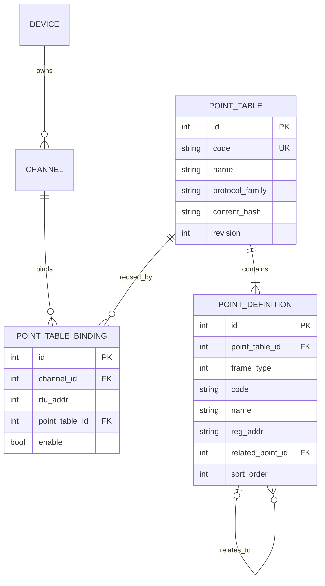

# 数据库 v4：可复用点表与 Alembic 迁移设计

## 1. 文档信息

- 状态：待评审
- 目标版本：数据库 Schema v4
- 适用数据库：SQLite、MySQL
- 影响范围：数据库模型、测点 DAO、Excel 导入、设备复制、从机管理、启动流程、部署升级
- 本文只描述设计，不包含本轮代码实现

## 2. 方案结论

v4 将当前“每个通道、每个从机各存一份完整测点”的结构改为“点表定义与设备绑定分离”：

1. `point_table` 表示一份可复用的点表。
2. `point_definition` 保存点表中的静态测点定义，统一承载遥测、遥信、遥控、遥调四类点。
3. `point_table_binding` 把一个通道下的一个从机地址绑定到一份点表。
4. 多个设备或从机使用相同点表时，只增加绑定记录，不复制测点定义。
5. 测点实时值、品质、模拟状态继续由各设备运行时对象独立持有，不放入共享点表，避免设备间串值。
6. 现有数据库通过 Alembic 从 v3 升级到 v4；迁移按点表内容自动识别完全相同的点表并去重。
7. 现有按设备编辑测点的接口采用“写时分离”兼容策略：共享点表被单设备修改时，先克隆点表并只重绑当前设备，再执行修改；点表管理接口才允许显式修改共享定义。

核心关系如下：



## 3. 当前问题与数据基线

### 3.1 当前结构

当前测点分别存储在以下四张表：

- `point_yc`
- `point_yx`
- `point_yk`
- `point_yt`

每条记录直接包含：

- `channel_id`
- `rtu_addr`
- 测点编码、名称、寄存器地址
- 解析参数、量程参数
- IEC 104 / IEC 61850 元数据

因此，同型号设备即使使用完全相同的点表，也必须复制全部测点记录。设备复制接口目前也是读取源通道全部点后逐条插入新通道。

### 3.2 当前结构的问题

- 静态定义重复，设备数量与测点数量相乘后数据库膨胀明显。
- 修改公共点表需要逐设备更新，容易遗漏或产生版本不一致。
- 四类点分表导致 DAO 中存在大量重复 CRUD 分支。
- 数据库升级依赖 `create_all()` 和启动时手写 `ALTER TABLE`，没有可靠的版本链、升级记录和回滚入口。
- `related_yx_id`、`related_yc_id` 跨分表引用，统一查询和迁移较复杂。
- 数据库无法表达“设备 1～10 使用同一版本点表”这一业务事实。

### 3.3 当前样例库的复用收益

截至本文编写时，`data/ems.db` 中共有：

| 项目 | 数量 |
| --- | ---: |
| 设备 | 6 |
| 通道 | 6 |
| 遥测记录 | 28 |
| 遥信记录 | 6 |
| 遥控记录 | 4 |
| 遥调记录 | 4 |
| 测点记录合计 | 42 |

按 `(channel_id, rtu_addr)` 聚合并对静态定义生成规范化签名后：

- PCS1 与 PCS2 的点表完全一致，每份 11 个点。
- DLT645 服务端与客户端的点表完全一致，每份 10 个点。

迁移到 v4 后，上述 42 条重复静态记录可收敛为：

- 2 份 `point_table`
- 21 条 `point_definition`
- 4 条 `point_table_binding`

该结果仅是当前样例库数据；正式迁移以每个部署实际内容为准，不按设备名称或设备类型猜测是否相同。

## 4. 设计目标与非目标

### 4.1 必须实现

- 相同点表可被多个设备、通道或从机复用。
- 设备运行时状态相互隔离，不因共享定义而共享实时值。
- v3 已有点数据无损迁移到 v4。
- 迁移自动合并内容完全一致的点表，不合并“看起来相似但存在字段差异”的点表。
- 现有按 `channel_id`、`rtu_addr` 和 `point_code` 查询测点的业务行为保持兼容。
- 设备复制不再复制所有点定义，只复用原点表绑定。
- SQLite 与 MySQL 使用同一套 Alembic 版本链。
- 新建数据库与已有数据库都能通过 `alembic upgrade head` 到达一致结构。
- 所有外键、唯一约束、级联删除和索引有明确语义。

### 4.2 本期不做

- 不把实时测点值持久化到数据库。
- 不引入设备级的逐点覆盖表；个别设备需要不同点定义时，通过克隆点表实现。
- 不在本期重构 `point_mapping` 的业务模型；它继续按设备和点编码工作。
- 不把 IEC 61850 ICD 动态模型强行迁入通用点表。当前 IEC 61850 v3 流程已不再向四张点表写点，继续保持该边界。
- 不允许一个 `(channel_id, rtu_addr)` 同时组合多份点表。组合点表会产生跨表编码冲突和覆盖优先级问题，留待独立设计。

## 5. 领域边界

### 5.1 哪些数据可以共享

以下内容属于点表静态定义，可以共享：

- 点类型、编码、名称、排序
- 寄存器或对象地址
- 功能码、解析码、位偏移、反转标记
- 乘加系数、上下限
- 遥控命令类型
- IEC 104 类型、COT、品质默认值等静态协议元数据
- IEC 61850 FC 元数据（仅保留现有兼容字段）
- 遥控到遥信、遥调到遥测的定义关系

### 5.2 哪些数据必须按设备隔离

以下内容不得进入共享点定义：

- 实时值、原始值、上一次值
- 当前品质、通信状态、更新时间
- 模拟器当前状态、随机数状态、变化历史
- 客户端连接状态、重试计数
- 设备运行实例中的缓存和锁

这些数据继续由现有 `BasePoint` 及设备运行时字典按设备实例创建和维护。同一 `point_definition` 被加载到十个设备时，应生成十组互不引用的运行时 Point 对象。

### 5.3 绑定粒度

绑定键采用 `(channel_id, rtu_addr)`，而不是只使用 `device_id`：

- 当前测点查询和 Modbus 从机管理都以通道与从机地址为边界。
- 一个设备可以有多个通道。
- 一个通道可以有多个从机地址，每个从机可能使用不同点表。
- IEC 104、DL/T 645 等现有流程仍可把其业务地址映射到兼容的 `rtu_addr` 绑定字段。

## 6. v4 数据库表设计

### 6.1 `point_table`：点表主表

| 字段 | 类型 | 约束 | 说明 |
| --- | --- | --- | --- |
| `id` | INTEGER | PK，自增 | 点表 ID |
| `code` | VARCHAR(64) | NOT NULL，UNIQUE | 稳定业务编码，不使用名称作关联键 |
| `name` | VARCHAR(128) | NOT NULL | 点表名称 |
| `description` | VARCHAR(512) | NULL | 描述 |
| `protocol_family` | VARCHAR(32) | NOT NULL | `modbus`、`iec104`、`dlt645`、`generic` 等协议族 |
| `content_hash` | VARCHAR(64) | NOT NULL，INDEX | 规范化内容 SHA-256，用于快速查找相同点表 |
| `revision` | INTEGER | NOT NULL，默认 1 | 乐观锁与点表版本号 |
| `enable` | BOOLEAN | NOT NULL，默认 true | 是否可用于新绑定 |
| `created_at` | DATETIME | NOT NULL | 创建时间 |
| `updated_at` | DATETIME | NOT NULL | 更新时间 |

设计说明：

- 使用协议族而不是客户端/服务端具体枚举，使同协议族且定义完全一致的客户端、服务端可以复用点表。
- `content_hash` 只作为候选索引，不单独设置唯一约束。命中哈希后仍必须逐字段比较，避免哈希碰撞，也允许历史上临时存在重复点表。
- 每次共享定义发生有效修改，重新计算 `content_hash` 并递增 `revision`。
- 点表被绑定后仍可修改，但必须走显式共享修改接口并展示影响范围。

建议约束和索引：

```sql
UNIQUE (code)
INDEX ix_point_table_family_hash (protocol_family, content_hash)
```

### 6.2 `point_definition`：统一测点定义表

| 字段 | 类型 | 默认值 | 适用类型/说明 |
| --- | --- | --- | --- |
| `id` | INTEGER PK | 自增 | 定义 ID |
| `point_table_id` | INTEGER FK | - | 所属点表，删除点表时级联删除 |
| `frame_type` | SMALLINT | - | 0=遥测，1=遥信，2=遥控，3=遥调 |
| `code` | VARCHAR(64) | - | 点编码 |
| `name` | VARCHAR(128) | - | 点名称 |
| `reg_addr` | VARCHAR(128) | - | 寄存器或协议对象地址 |
| `func_code` | INTEGER | NULL | 功能码 |
| `decode_code` | VARCHAR(10) | NULL | 解析码 |
| `bit` | INTEGER | NULL | 遥信/遥控位偏移 |
| `reverse` | BOOLEAN | false | 遥信反转 |
| `mul_coe` | FLOAT | 1.0 | 遥测/遥调乘系数 |
| `add_coe` | FLOAT | 0.0 | 遥测/遥调加系数 |
| `max_limit` | FLOAT | NULL | 遥测/遥调上限 |
| `min_limit` | FLOAT | NULL | 遥测/遥调下限 |
| `command_type` | SMALLINT | 0 | 遥控命令类型 |
| `related_point_id` | INTEGER FK | NULL | 同一点表内被关联点，删除目标时置空 |
| `iec_common_address` | INTEGER | NULL | 保留现有 IEC 104 字段 |
| `iec_cot` | INTEGER | 3 | IEC 104 COT 默认值 |
| `iec_quality` | INTEGER | 0 | IEC 104 品质默认值 |
| `iec_type_id` | VARCHAR(16) | NULL | IEC 104 ASDU 类型 |
| `fc` | VARCHAR(8) | NULL | IEC 61850 FC 兼容字段 |
| `sort_order` | INTEGER | 0 | 稳定显示和导出顺序 |
| `enable` | BOOLEAN | true | 是否加载此定义 |
| `created_at` | DATETIME | 当前时间 | 创建时间 |
| `updated_at` | DATETIME | 当前时间 | 更新时间 |

建议约束和索引：

```sql
UNIQUE (point_table_id, code)
INDEX ix_point_definition_table_type_order
    (point_table_id, frame_type, sort_order)
FOREIGN KEY (related_point_id)
    REFERENCES point_definition(id) ON DELETE SET NULL
```

关键决定：点编码在一份点表内跨四种类型唯一。当前 DAO 按编码依次扫描四张表，如果相同编码出现在不同类型中会产生歧义；v4 直接在数据库层消除这种歧义。

`frame_type` 与类型专属字段应在服务层校验：

- 遥测、遥调要求 `max_limit >= min_limit`。
- 遥信、遥控才允许设置 `bit`。
- 遥控的 `related_point_id` 只能指向同一点表的遥信点。
- 遥调的 `related_point_id` 只能指向同一点表的遥测点。
- 其他类型不得设置 `related_point_id`。

SQLite 与 MySQL 对复杂 `CHECK` 约束的兼容和变更能力不同，因此上述跨行、跨类型规则以应用校验为主，数据库保留基础范围约束。

### 6.3 `point_table_binding`：通道/从机绑定表

| 字段 | 类型 | 约束 | 说明 |
| --- | --- | --- | --- |
| `id` | INTEGER | PK，自增 | 绑定 ID |
| `channel_id` | INTEGER | FK，NOT NULL | 绑定通道，删除通道时级联删除 |
| `rtu_addr` | INTEGER | NOT NULL，默认 1 | 从机/站地址 |
| `point_table_id` | INTEGER | FK，NOT NULL | 复用的点表 |
| `enable` | BOOLEAN | NOT NULL，默认 true | 是否加载该绑定 |
| `created_at` | DATETIME | NOT NULL | 创建时间 |
| `updated_at` | DATETIME | NOT NULL | 更新时间 |

建议约束和索引：

```sql
UNIQUE (channel_id, rtu_addr)
INDEX ix_point_table_binding_table (point_table_id)
FOREIGN KEY (channel_id) REFERENCES channel(id) ON DELETE CASCADE
FOREIGN KEY (point_table_id) REFERENCES point_table(id) ON DELETE RESTRICT
```

删除语义：

- 删除设备或通道：删除绑定，不删除仍可能被其他设备使用的点表。
- 删除从机：删除对应 `(channel_id, rtu_addr)` 绑定。
- 删除点表：只允许点表没有任何绑定时执行。
- 孤立点表不自动物理删除，可在点表管理页明确清理，避免误删可复用资产。

## 7. 读取模型与现有接口兼容

### 7.1 逻辑展开

v4 物理查询：

```sql
SELECT
    d.*,
    b.channel_id,
    b.rtu_addr,
    b.id AS binding_id,
    t.id AS point_table_id,
    t.revision AS point_table_revision
FROM point_table_binding b
JOIN point_table t ON t.id = b.point_table_id
JOIN point_definition d ON d.point_table_id = t.id
WHERE b.channel_id = :channel_id
  AND b.enable = true
  AND d.enable = true;
```

DAO 对外继续组装当前兼容字典：

- `channel_id` 来自绑定。
- `rtu_addr` 来自绑定。
- `frame_type` 来自定义。
- 遥控、遥调的 `related_yx_id` / `related_yc_id` 在兼容层临时映射到 `related_point_id`；新代码统一使用 `related_point_id`。
- 新增 `point_table_id`、`binding_id` 和 `point_table_revision`，现有调用方可忽略。

### 7.2 `get_all_*` 的语义

`get_all_yc()` 等接口必须按绑定逻辑展开。同一份定义绑定到十个设备时，运行时仍需要得到十组带不同 `channel_id` / `rtu_addr` 的逻辑测点，不能只返回一条物理定义。

### 7.3 计数语义

- 点表管理中的“定义数量”：统计 `point_definition` 物理行数。
- 设备详情中的“测点数量”：统计绑定展开后的逻辑点数。
- 系统诊断应同时显示定义数、绑定数和逻辑实例数，避免迁移后用户误认为数据丢失。

## 8. 修改语义与写时分离

共享点表引入后，必须明确“修改当前设备”与“修改共享点表”的区别。

### 8.1 现有设备上下文接口

现有新增、编辑、删除、清空、重新导入接口均位于设备/通道上下文。为了保持升级前行为，这些接口默认执行写时分离：

1. 查询当前 `(channel_id, rtu_addr)` 的绑定。
2. 如果该点表只被当前绑定使用，直接修改。
3. 如果该点表有多个绑定，事务内克隆 `point_table` 和全部 `point_definition`。
4. 只把当前绑定切换到克隆点表。
5. 对克隆点表执行新增、编辑、删除或重新导入。

这样，旧前端在 PCS1 中修改一个点不会无提示地改变 PCS2。

### 8.2 新增点表管理接口

点表复用需要单独的显式接口，建议增加：

| 方法 | 路径 | 作用 |
| --- | --- | --- |
| `GET` | `/api/point-tables` | 查询点表、定义数和绑定数 |
| `POST` | `/api/point-tables` | 创建空点表或从文件导入 |
| `GET` | `/api/point-tables/{id}` | 查询点表和定义 |
| `PUT` | `/api/point-tables/{id}` | 显式修改共享点表元数据 |
| `POST` | `/api/point-tables/{id}/clone` | 克隆点表 |
| `DELETE` | `/api/point-tables/{id}` | 删除未绑定点表 |
| `POST` | `/api/point-table-bindings` | 给通道/从机绑定已有点表 |
| `PUT` | `/api/point-table-bindings/{id}` | 更换绑定点表 |
| `DELETE` | `/api/point-table-bindings/{id}` | 解除绑定 |
| `GET` | `/api/point-tables/{id}/usages` | 查询受影响设备列表 |

共享修改请求必须携带客户端已读取的 `revision`。服务端使用乐观锁：版本不一致返回 `POINT_TABLE_REVISION_CONFLICT`，防止两个用户覆盖彼此修改。

### 8.3 文件导入

导入流程改为：

1. 在内存中解析、校验并规范化完整点表。
2. 计算 `protocol_family + content_hash`。
3. 查找哈希候选并逐字段确认是否完全一致。
4. 若一致，直接绑定已有点表。
5. 若不一致，创建新点表及定义后绑定。
6. 整个替换在单事务内完成，解析失败不影响旧绑定。

设备上下文中的“重新导入”如果会改变共享点表，仍先写时分离。点表管理页中的导入则属于显式共享变更。

### 8.4 设备复制

当前设备复制会逐条复制测点。v4 改为复制绑定：

- 新通道的从机地址与源通道一致时，新增指向同一 `point_table_id` 的绑定。
- 不复制 `point_definition`。
- 后续若只修改复制出的设备，写时分离会自动产生独立点表。

## 9. 内容哈希与相同点表判定

### 9.1 规范化输入

哈希内容只包含影响协议和展示行为的静态定义，不包含：

- 数据库 ID
- `channel_id`、`rtu_addr`
- 点表名称、描述
- 创建/更新时间
- 当前 revision

每个点包含全部 v4 定义字段；`related_point_id` 转换为被关联点的 `code` 后再参与哈希。点按 `(frame_type, code)` 稳定排序，JSON 使用固定键顺序和 UTF-8 编码。

### 9.2 默认值归一化

迁移前先把语义相同的值归一化，例如：

- 缺失的 `mul_coe` 与显式 `1.0` 等价。
- 缺失的 `add_coe` 与显式 `0.0` 等价。
- 缺失的 `iec_quality` 与显式 `0` 等价。
- 地址统一使用当前 `_format_reg_addr()` 的规则，但 IEC 61850 对象路径不得做十六进制转换。
- 布尔值统一为 `true` / `false`。
- 浮点数采用稳定十进制序列化，禁止直接依赖数据库驱动的字符串表示。

不同协议族即使字段内容恰好相同也不自动合并。

### 9.3 判定原则

只自动复用“完整静态定义逐字段相同”的点表。以下情况一律保留为不同点表：

- 点数量不同。
- 任一点编码、名称、地址或解析参数不同。
- 点顺序要求不同。
- 关联关系不同。
- 启用状态不同。
- 协议族不同。

## 10. Alembic 接入设计

### 10.1 项目结构

建议新增：

```text
alembic.ini
migrations/
├── env.py
├── script.py.mako
└── versions/
    ├── 0001_v3_baseline.py
    └── 0002_database_v4_reusable_point_tables.py
src/data/migration/
├── runner.py
├── bootstrap.py
└── point_table_v4.py
```

`pyproject.toml` 增加固定版本的 `alembic` 运行依赖。具体版本在实现时根据当前 SQLAlchemy 2.0.45 和 Python 3.11 的测试结果锁定，并同步更新 `uv.lock`。

### 10.2 v3 基线策略

项目此前没有 `alembic_version` 表，因此需要同时处理空库和已有库：

- 空数据库：执行 `0001_v3_baseline` 创建 v3 完整结构，再执行 v4 迁移。
- 已有 v3 数据库：启动迁移前检查关键表、列、索引是否符合受支持的 v3 结构；符合后执行 `alembic stamp 0001_v3_baseline`，再升级 v4。
- 结构未知或处于半迁移状态：拒绝自动 stamp，输出差异和人工处理指引。

禁止只根据“存在 `device` 表”就无条件 stamp，以免把旧版本或损坏数据库误标为 v3。

### 10.3 启动流程

当前 `DbController` 的以下职责应移交给 Alembic：

- `Base.metadata.create_all()` 作为生产数据库升级手段。
- `_migrate_goose_schema()`。
- `_migrate_channel_security_schema()`。
- 多段忽略异常的手写 `ALTER TABLE`。

最终启动顺序：

```text
读取数据库配置
  -> 建立 Engine
  -> 检查/初始化 Alembic 基线
  -> alembic upgrade head
  -> 校验当前 revision == head
  -> 创建 Session Factory
  -> 启动业务服务
```

应用打包版本默认自动升级本地 SQLite，以保持桌面端开箱可用。MySQL 生产部署建议在应用启动前由运维显式执行迁移；如果启用应用自动迁移，需要数据库迁移锁，确保多实例不会并发升级。

### 10.4 自动生成约束

`migrations/env.py` 使用 `Base.metadata` 作为 `target_metadata`，但 v4 数据迁移必须手写并审查，不能依赖 `--autogenerate` 自动推断以下行为：

- 四张旧点表合并为统一定义表。
- 完全相同点表去重。
- 旧关联 ID 转换为统一自引用。
- 通道/从机绑定生成。

自动生成只用于发现模型和数据库结构差异，生成结果必须人工检查后提交。

## 11. v3 到 v4 数据迁移

### 11.1 升级前保护

SQLite：

- 关闭现有 Engine 的全部连接。
- 使用 SQLite Backup API 生成带时间戳的完整备份，而不是在连接未释放时直接复制文件。
- 执行 `PRAGMA integrity_check`。
- 确认磁盘剩余空间至少为数据库文件大小的 2 倍加固定安全余量。

MySQL：

- 迁移工具执行前提示并检查运维备份确认参数。
- 对迁移使用数据库级互斥锁。
- 大数据量部署分批读取旧测点，避免一次加载全部记录。

### 11.2 升级算法

1. 创建 `point_table`、`point_definition`、`point_table_binding`。
2. 读取四张旧点表，按 `(channel_id, rtu_addr)` 分组。
3. 把每组四类点转换为统一的规范化定义集合。
4. 将 `related_yx_id`、`related_yc_id` 解析为同组目标点编码；悬空引用记录为迁移错误，不静默丢弃。
5. 根据通道协议计算 `protocol_family`。
6. 生成内容哈希，并与已迁移候选逐字段比较。
7. 首次出现的点表创建 `point_table` 和 `point_definition`。
8. 后续完全一致的组复用已有 `point_table_id`。
9. 为每组创建一条 `point_table_binding`。
10. 执行迁移后校验。
11. 校验全部通过后删除四张旧点表及其旧索引。
12. Alembic 更新 revision 到 v4。

整个数据转换在可行范围内使用事务。SQLite 的 DDL 特性不能保证所有版本下完整回滚，因此升级前备份是强制步骤，不以事务替代备份。

### 11.3 迁移校验

迁移必须同时满足：

- 每个旧 `(channel_id, rtu_addr)` 恰好对应一条新绑定。
- 每组旧点数等于新绑定展开后的点数。
- 每个旧点的静态字段与新逻辑点逐字段一致。
- 所有遥控/遥调关联关系语义一致。
- 不存在无效 `channel_id`、重复绑定或同表重复点编码。
- `content_hash` 重新计算结果与表中值一致。
- 全库旧逻辑点总数等于新绑定展开后的逻辑点总数。

当前样例库的明确预期：

```text
迁移前逻辑点数：42
迁移后定义数：21
迁移后绑定数：4
迁移后展开逻辑点数：42
复用点表数：2
```

### 11.4 降级策略

`downgrade` 从 v4 回 v3 时：

1. 重建 `point_yc`、`point_yx`、`point_yk`、`point_yt`。
2. 按每条绑定展开共享定义，恢复 `channel_id` 和 `rtu_addr`。
3. 先插入遥测/遥信，再插入遥控/遥调并重建旧关联 ID。
4. 校验展开点数后删除 v4 三张表。

降级保证业务字段和关系语义恢复，但不保证恢复迁移前完全相同的自增主键值。需要字节级恢复时应使用升级前备份。

## 12. ORM 与代码重构边界

### 12.1 新模型

新增：

- `src/data/model/point_table.py`
- `src/data/model/point_definition.py`
- `src/data/model/point_table_binding.py`

`Channel` 关系改为 `point_table_bindings`，移除四个 `points_y*` 关系。

### 12.2 旧模型退出

以下模型在 v4 迁移完成后不再注册到 `Base.metadata`：

- `PointYc`
- `PointYx`
- `PointYk`
- `PointYt`

旧模块可在一个过渡版本中只保留 TypedDict 或兼容导入提示，但不得继续映射已删除的旧表。

### 12.3 DAO 分层

建议拆分：

```text
PointTableDao          点表及定义的持久化 CRUD
PointTableBindingDao   绑定、换绑、使用范围查询
PointDao               面向现有业务的逻辑展开兼容层
PointTableService      校验、哈希、去重、克隆、乐观锁
```

避免继续在一个 `point_dao.py` 中堆叠四类点的重复分支。

### 12.4 需要同步改造的入口

- `src/data/dao/point_dao.py`
- `src/data/dao/channel_dao.py`
- `src/tools/excel_point_importer.py`
- `src/web/api/channel/import_points.py`
- `src/web/api/channel/device_manage.py`
- `src/device/core/slave_manager.py`
- 四类点 Service 的读取逻辑
- 数据库启动与配置模块
- 数据清理、旧诊断和手工迁移脚本
- 测点相关单元测试和集成测试夹具

## 13. 并发与事务

- 新建或换绑点表必须在同一事务中完成。
- 写时分离的“克隆定义、克隆关系、切换绑定、执行修改”必须是单事务。
- 共享点表更新使用 `revision` 乐观锁。
- 删除点表前在事务中再次检查绑定数，依赖外键 `RESTRICT` 处理并发竞态。
- 内容哈希命中后逐字段比较；并发导入仍可能暂时创建两份相同点表，允许后续合并，不以全局锁牺牲正常导入吞吐。
- MySQL 迁移和应用级点表合并使用数据库锁；SQLite 依赖单进程写事务。

## 14. 性能与容量

典型场景中，N 个同型号设备、每台 M 个点：

| 结构 | 静态点定义行数 | 绑定行数 |
| --- | ---: | ---: |
| v3 | `N × M` | 0 |
| v4 | `M` | `N` |

例如 10 台设备、每台 2,000 点：

- v3：20,000 条完整点记录。
- v4：2,000 条定义 + 10 条绑定。

读取单设备点表仍需返回 M 个逻辑点，查询复杂度不变，增加两次索引 Join。通过绑定唯一索引和 `(point_table_id, frame_type, sort_order)` 索引可控制开销。

不要在 DAO 中为每个定义单独查询关联点或点表信息；必须一次 Join 或使用批量加载，避免 N+1 查询。

## 15. 安全与失败处理

- 迁移不得捕获异常后继续启动业务服务。
- 任一数据校验失败都应保持旧库可恢复，并输出具体通道、从机、点编码和字段差异。
- 不使用设备名称判断复用关系，名称可修改且不唯一。
- 不自动合并近似点表。
- 迁移日志不得输出数据库密码或完整连接串。
- MySQL Alembic 配置通过现有配置对象注入 URL，不把密码写入 `alembic.ini`。
- SQLite 备份文件位置和保留策略应可配置，升级成功后也不立即删除最近备份。

## 16. 测试方案

### 16.1 模型与约束测试

- 同一点表不能出现重复点编码。
- 一个通道/从机只能绑定一份点表。
- 被绑定点表不能删除。
- 删除通道级联删除绑定但保留点表。
- 删除关联目标后 `related_point_id` 置空。
- 遥控/遥调关联类型错误被服务层拒绝。

### 16.2 DAO 兼容测试

- 四类 `get_list` 返回原有字段和正确 `channel_id`、`rtu_addr`。
- 同一点表绑定十个设备后，`get_all_*` 返回十组逻辑实例。
- 新增、编辑、删除、限值修改与按点编码查询行为保持兼容。
- `count_points_by_channel` 统计逻辑点数。
- 删除从机只删除绑定，不影响其他设备。

### 16.3 共享与写时分离测试

- 设备复制只增加绑定，不增加定义。
- 两设备共享点表时，从旧设备接口修改一个点会克隆并换绑，只影响当前设备。
- 显式共享修改会影响所有绑定设备，并递增 revision。
- 旧 revision 更新返回冲突。
- 重新导入相同文件复用已有点表。
- 导入仅一个字段不同的文件创建新点表。

### 16.4 迁移测试

使用临时 SQLite 和 MySQL 测试库覆盖：

- 空库升级到 head。
- 标准 v3 库升级。
- 包含完全重复点表的 v3 库升级并去重。
- 包含近似但不相同点表的 v3 库不合并。
- 多从机通道迁移。
- 遥控/遥调关联关系迁移。
- 孤立外键、重复编码、未知协议等坏数据拒绝迁移。
- v3 -> v4 -> v3 -> v4 往返迁移保持业务字段一致。
- 中途异常后可从备份恢复并重新执行。

### 16.5 运行时隔离测试

- 两个设备加载同一点表后得到不同 Point 对象。
- 修改设备 1 实时值不改变设备 2。
- 模拟规则、变化历史、通信品质互不影响。
- 设备停止、重载或重新同步不影响其他共享设备。

## 17. 实施阶段

### 阶段一：Alembic 基础设施

- 引入依赖和目录。
- 建立 v3 基线、空库和已有库 bootstrap。
- 将现有手写结构迁移纳入版本链。
- 建立 SQLite 自动备份和迁移锁。

### 阶段二：v4 模型与迁移

- 实现三张新表和 ORM。
- 实现规范化、哈希和 v3 数据转换。
- 完成升级、校验、降级测试。

### 阶段三：兼容 DAO 与现有业务迁移

- PointDao 改为绑定展开。
- 改造导入、设备复制、删除通道、从机管理。
- 保持现有前端和 API 可工作。
- 移除旧四表模型和手工迁移脚本依赖。

### 阶段四：点表管理能力

- 增加点表 CRUD、克隆、绑定、使用范围接口。
- 前端增加点表管理与设备绑定入口。
- 对共享修改明确展示受影响设备。

### 阶段五：验证与发布

- 使用当前 `data/ems.db` 的副本进行演练。
- 使用大数据量 SQLite/MySQL 数据集压测。
- 编写升级、回滚和备份说明。
- 发布前冻结 v4 migration revision，禁止修改已发布 revision，只允许新增 revision。

## 18. 验收标准

- 数据库当前 revision 为 v4 head，启动过程不再依赖 `create_all()` 补表或忽略异常的 `ALTER TABLE`。
- 当前样例库迁移后达到 21 条定义、4 条绑定、展开 42 个逻辑点。
- 创建 10 个相同设备时，点定义只保存一份，设备仅新增绑定。
- 十个设备运行时值、品质和模拟状态相互隔离。
- 设备复制、点表导入、点增删改查、从机删除、通道删除均通过回归测试。
- SQLite 与 MySQL 均能从空库建立 v4，也能从受支持的 v3 数据库升级。
- v4 降级能够恢复 v3 的业务字段和逻辑点数量。
- 迁移失败时应用拒绝启动，用户可使用自动生成的 SQLite 备份恢复。

## 19. 待评审决策

实施前需要确认以下产品行为，本文给出推荐默认值：

1. **单设备编辑共享点表时的默认行为**：推荐写时分离，保持旧行为；显式点表管理才做全局修改。
2. **相同导入文件是否自动复用**：推荐自动复用，但必须逐字段确认，不只比较文件名或哈希。
3. **孤立点表是否自动清理**：推荐不自动清理，只在管理页显式删除。
4. **MySQL 是否允许应用启动时自动迁移**：推荐生产环境关闭，部署阶段显式运行；桌面 SQLite 默认自动迁移。
5. **一个通道/从机能否组合多份点表**：推荐 v4 限制为一份，后续有明确组合需求再设计优先级与冲突规则。
