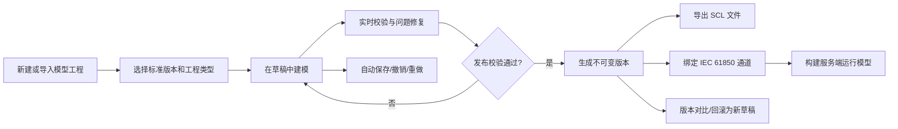
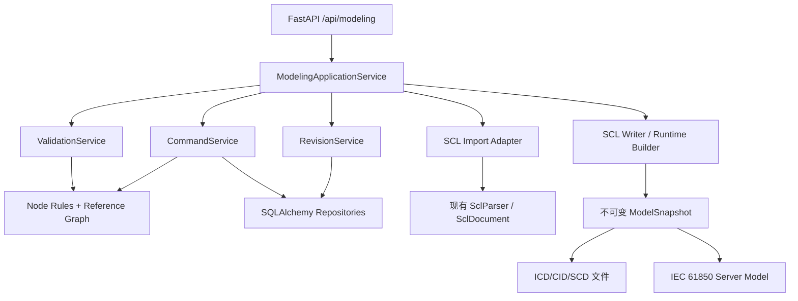

# IEC 61850 可视化建模功能整体方案

> 本文为早期方案草稿。当前通用建模配置工具的权威设计基线请参见 `plan/iec61850-general-modeling-tool-design.md`。

## 1. 方案结论

在现有“SCL 文件管理”之外新增“模型工程”，不要直接把上传的 XML 文件当作在线编辑数据源。

模型工程以稳定 UUID 组织节点，以结构化模型作为编辑真相源，以不可变版本作为发布和运行依据。用户在草稿中增删改、校验、撤销和预览，通过校验后发布一个版本，再绑定到 IEC 61850 通道并生成 ICD/CID/SCD 文件。

推荐的产品结构：

```text
IEC 61850
├── 模型工程       新建、复制、导入、编辑、校验、发布、版本管理
├── SCL 文件       保留现有上传、预览、对比、导入能力
├── 模板库         IED、LD、LN、CDC、数据集和控制块模板
└── 标准与规则     版本、命名规则、企业规则包和校验配置
```

核心原则：

1. 编辑草稿与运行模型隔离，现场运行中的模型不会被未完成修改影响。
2. 所有引用使用内部节点 ID，显示路径只在界面和导出时计算；重命名不会产生悬空引用。
3. 增删改是语义命令，不是前端直接拼 XML。
4. 每个操作可撤销、可重做、可审计；删除前显示影响范围。
5. 普通模式突出工程含义，专家模式才显示完整 SCL 属性和类型模板。
6. 校验贯穿编辑过程，保存草稿不被错误阻断，发布必须通过阻断级校验。

## 2. 与现有工程的衔接

现有工程已经具备以下可复用基础：

- Vue 3、Element Plus、TypeScript 前端框架。
- FastAPI、Pydantic、SQLAlchemy 后端框架。
- `SclParser` 和 `SclDocument`，已覆盖 Header、Communication、IED、AP、LDevice、LN、DOI、DataSet、RCB、GoCB、ExtRef 和 DataTypeTemplates。
- SCL 文件上传、解析、校验、浏览、差异比较、测点/GOOSE/Report 导入。
- IEC 61850 在线模型、模型缓存、ICD 导出和服务器模型构建能力。

需要补齐的能力：

- 编辑工程、稳定节点 ID、持久化草稿和版本快照。
- SCL 全量写出器和导入后的可控回写能力。
- 节点增删改、移动、复制、批量编辑和引用完整性服务。
- 标准规则、字段规则和跨节点语义校验。
- 撤销/重做、自动保存、发布、回滚、差异和审计。
- 面向现场人员的建模工作台，而不是只读文件树。

现有 `/api/scl/*` 接口继续服务于“文件管理”；新增 `/api/modeling/*`，避免兼容逻辑污染已有功能。

## 3. 功能范围

### 3.1 第一阶段必须支持

- 新建空白工程、从模板创建、从 ICD/CID/SCD 导入工程。
- IED、AccessPoint、Server、LDevice、LN0/LN、DOI/DAI 节点增删改、复制和排序。
- DataSet/FCDA、ReportControl、GSEControl、Communication/GSE 地址编辑。
- DataTypeTemplates 浏览，以及从标准模板自动生成或复用类型。
- 节点属性编辑、搜索、过滤、定位引用、批量修改描述和初始值。
- 实时局部校验、全工程校验、问题定位和快速修复。
- 自动保存、撤销/重做、版本发布、版本比较、回滚。
- 导出 ICD；在工程类型允许时导出 CID/SCD。
- 发布版本绑定 IEC 61850 通道，生成运行模型。

### 3.2 后续增强

- 变电站一次设备拓扑和 SLD 图形化建模。
- 多人协作、审批流、权限和远程模型仓库。
- Excel 批量模板、厂商模板市场和规则包管理。
- Edition/Namespace 升降级助手。
- SCL 文件的完整无损往返，包括厂商私有扩展的可视化编辑。

## 4. 用户流程



推荐把“保存”和“发布”明确区分：

- 保存：允许存在错误，保存当前草稿。
- 校验：只检查，不改变运行配置。
- 发布：必须通过阻断级校验，生成不可变版本。
- 应用到通道：显式选择已发布版本，并提示是否需要重启 IEC 61850 服务。

## 5. 前端信息架构

### 5.0 从 0 建模向导

“从 0 建模”必须是一级入口，与“导入 SCL”并列，不能要求用户先准备 ICD 文件。

入口：模型工程列表右上角“新建模型”，点击后先选择：

- 从空白开始：只创建工程骨架，适合专家。
- 使用标准 LN 模板：按功能逐步选择 LN，适合大多数现场工程师，作为默认推荐项。
- 使用设备模板：保护测控、PCS、BMS、箱变、电表等，适合快速交付。
- 复制已有工程：用于同系列设备。

向导采用 5 步流程，右侧始终展示即将创建的模型树预览。

#### 第 1 步：工程信息

- 工程名称、工程编码、说明。
- 目标文件类型：ICD、CID、SCD；默认 ICD。
- 标准版本/namespace：根据系统已安装规则包选择。
- 建模模式：普通模式或专家模式；默认普通模式。
- 名称结构和企业规则包；高级选项默认折叠。

#### 第 2 步：IED 基本信息

- IED 名称、描述、制造商、型号/配置版本。
- AccessPoint 名称，默认 `AP1`。
- 服务角色：服务端模型、客户端工程描述或二者兼有。
- 名称输入时即时显示最终 MMS 引用示例，避免工程完成后才发现命名不合规。

#### 第 3 步：初始逻辑设备

- 至少创建一个 LDevice，默认建议 `LD0`。
- 可添加多个 LDevice，并填写实例、描述和用途。
- 每个 LDevice 默认创建一个 LLN0；创建内容在预览中明确展示，不做不可见的隐式生成。
- 可选添加 LPHD 和常用系统节点，界面说明其用途。

#### 第 4 步：功能模板

- 按“测量、控制、保护、监视、通用”分类选择 LN 模板。
- 每个模板卡片显示 LNClass、将创建的 DO 数、用途和标准来源版本。
- 支持实例数量，例如一次创建 `MMXU1～MMXU4`。
- 支持完全跳过，进入工作台后逐个添加空白 LN。
- 选择模板后右侧树实时预览 LN、固定 DO 和类型模板的新增内容。

#### 第 5 步：确认创建

- 展示 IED/LD/LN/DO/DA 数量、预计 DataTypeTemplates 数量和初始问题。
- 展示所有自动创建项和默认值，允许返回任一步修改。
- “创建并进入建模”作为主按钮；整个向导作为一个原子命令执行，失败不留下半成品。

向导完成后进入工作台，并自动选中第一个待完善节点。顶部显示下一步建议：

```text
模型骨架已创建
建议下一步：① 完善 LN 数据对象  ② 创建 DataSet  ③ 配置 Report/GOOSE  ④ 校验发布
```

在工作台中，空白工程也必须允许逐级建立完整结构：

```text
ROOT
├── 添加 Header / Communication / IED / DataTypeTemplates
IED
├── 添加 AccessPoint
AccessPoint
├── 添加 Server
Server
├── 添加 LDevice
LDevice
├── 添加 LN0 / LN
LN
├── 添加 DOI / DataSet / ReportControl / GSEControl / Inputs
DOI
├── 添加 DAI / SDI
DataTypeTemplates
├── 添加 LNodeType / DOType / DAType / EnumType
```

“空白 LN”与“模板 LN”都支持：模板 LN 自动补齐并保持引用完整；空白 LN 允许专家手工选择或新建 LNodeType。普通模式下，用户添加 DO 时由系统在后台生成或复用兼容类型模板，但创建预览必须明确列出这些关联变化。

### 5.1 模型工程列表

列表字段：工程名称、工程类型、IED 数量、标准版本、草稿状态、发布版本、校验状态、更新时间和绑定通道。

主要操作：

- 新建工程：空白、标准模板、复制现有工程。
- 导入 SCL：先解析预览，再选择“创建工程”或“合并到草稿”。
- 打开、复制、归档、导出、版本历史。
- 默认显示最近工程，并支持按 IED 名、工程名、设备和状态搜索。

### 5.2 建模工作台

```text
┌──────────────────────────────────────────────────────────────────────────────┐
│ 返回  PCS 保护测控模型 / 草稿 · 自动保存于 10:32   撤销 重做 校验 发布 导出 │
├───────────────┬──────────────────────────────────────┬───────────────────────┤
│ 模型结构      │ 当前节点内容                         │ 属性编辑              │
│ [搜索节点...] │ PCS01 / LD0 / MMXU1                  │ 基本信息 | 高级属性   │
│               │                                      │                       │
│ ▾ IED PCS01   │ 子节点表格 / 引用关系 / 可视化摘要   │ 名称 *  [MMXU1     ] │
│   ▾ AP AP1    │                                      │ 类型    [MMXU       ] │
│     ▾ LD0     │ 名称   类型  CDC  FC  描述  状态     │ 实例 *  [1         ] │
│       LLN0    │ TotW   DO    MV       总有功  正常   │ 描述    [总测量节点] │
│       MMXU1   │ PhV    DO    WYE      相电压  正常   │                       │
│       XCBR1   │ A      DO    WYE      电流    警告   │ [恢复]       [应用] │
│               │                                      │                       │
│ + 添加节点    │ + 添加数据对象  批量添加  从模板添加 │ 引用 3  被引用 1      │
├───────────────┴──────────────────────────────────────┴───────────────────────┤
│ 问题 3  · 错误 1 / 警告 2     路径 / 规则 / 描述 / 快速修复                │
└──────────────────────────────────────────────────────────────────────────────┘
```

布局建议：

- 顶部 56px：面包屑、草稿状态、自动保存状态、撤销/重做、校验、发布、导出。
- 左侧 300～360px：虚拟化树、类型过滤、问题过滤、收藏节点和添加入口。
- 中间自适应：当前节点的子项表格、关系、摘要或专用编辑器。
- 右侧 360～420px：Schema 驱动属性表单，可折叠。
- 底部 220～300px 可收起：问题、引用、变更记录。
- 小屏幕下右侧改为抽屉，树宽度可拖动并记忆。

### 5.3 节点操作

每种节点只显示允许的操作。操作入口同时提供：

- 节点行尾的 `+` 和更多菜单。
- 右键菜单。
- 顶部“添加”按钮。
- 快捷键：`Ctrl+S` 保存、`Ctrl+Z/Y` 撤销/重做、`F2` 重命名、`Delete` 删除、`Ctrl+D` 复制。

添加节点采用两级体验：

1. 快速添加：填写名称/实例和描述，系统补齐默认值、固定 DO 和类型模板。
2. 高级添加：选择标准模板、功能约束、CDC、数据类型和触发属性。

删除节点时不直接弹一句“是否删除”，而是显示：

```text
将删除 MMXU1 及其 18 个子节点
同时影响：2 个 DataSet 成员、1 个 ReportControl

处理引用：
(•) 阻止删除并先处理引用
( ) 同时移除无效的 FCDA 成员
( ) 保留为待修复问题
```

默认选择“阻止删除”，最大限度降低现场误操作。

### 5.4 属性编辑器

属性表单不硬编码在单个超大 Vue 文件中。前端根据后端返回的节点类型 Schema 渲染：

- 字段中文名、SCL 原名、类型、必填、默认值、可选项和帮助文本。
- 显示条件、只读条件、联动规则和格式化方式。
- 普通/高级字段分组。
- 本地格式校验与后端语义校验结果。

例如 APPID 同时显示十进制和十六进制，MAC 使用分段输入并自动规范化，FC 使用枚举选择，引用字段使用“选择节点”而非手填路径。

表单默认采用“修改后点击应用”；切换节点前有未应用修改时给出保留、放弃或返回编辑的选择。批量操作使用一次事务提交。

### 5.5 美观与可用性

- 使用现有主题变量，新增一组 IEC 61850 语义色，不使用 emoji 作为正式图标。
- IED 蓝、LD 靛青、LN 紫、DO 青、DA 灰、DataSet 绿、控制块橙、错误红。
- 颜色只作辅助，节点类型始终有文字和图标，满足色弱场景。
- 高信息密度但保持 32～36px 行高；关键按钮使用文字，低频操作放入更多菜单。
- 所有危险操作可撤销；不可撤销的发布/覆盖/删除版本使用二次确认并展示影响。
- 现场模式默认不展示类型模板内部细节，减少 LNType/DOType/DAType 对非专家用户的干扰。
- 记住列宽、面板宽度、展开节点、最近过滤器和用户偏好。
- 中文术语为主，同时显示 SCL 原名，例如“逻辑节点（LN）”“功能约束（FC）”。

## 6. 前端技术设计

建议目录：

```text
front/src/
├── views/modeling/
│   ├── ModelProjectListView.vue
│   └── ModelWorkspaceView.vue
├── components/modeling/
│   ├── ModelToolbar.vue
│   ├── ModelTree.vue
│   ├── NodeContent.vue
│   ├── NodePropertyPanel.vue
│   ├── NodeCreateDialog.vue
│   ├── ReferencePicker.vue
│   ├── DeleteImpactDialog.vue
│   ├── ValidationPanel.vue
│   ├── VersionHistoryDrawer.vue
│   └── editors/
│       ├── DataSetEditor.vue
│       ├── ReportControlEditor.vue
│       ├── GooseControlEditor.vue
│       └── CommunicationEditor.vue
├── composables/modeling/
│   ├── useModelWorkspace.ts
│   ├── useModelCommands.ts
│   └── useAutoSave.ts
├── stores/modelingStore.ts
├── api/modelingApi.ts
└── types/modeling.ts
```

状态划分：

- `projectMeta`：工程、标准版本、草稿版本和发布状态。
- `nodeCache`：按 ID 缓存已加载节点；树按需加载 children。
- `selection`：当前节点、多选节点和展开节点。
- `draftForm`：右侧尚未应用的表单，不直接污染节点缓存。
- `commandState`：撤销/重做栈由后端作为权威，前端只显示能力状态。
- `validationState`：问题摘要和当前节点问题。
- `dirtyState`：待自动保存命令、保存中、保存失败和最后保存时间。

性能策略：

- 树使用虚拟滚动和懒加载，首次只加载根、IED、AP、LD 层。
- 子项表格分页或虚拟化；搜索由后端建立名称/路径索引。
- 编辑命令本地乐观更新，失败时按服务端返回回滚。
- 配置数据不做高频轮询；建模页只处理草稿状态。
- 自动保存采用 800～1500ms 防抖并批量提交命令，不在每次键盘输入时请求。

## 7. 核心领域模型

### 7.1 工程与版本

```text
ModelProject
├── Draft（唯一可编辑）
│   ├── ModelNode 1..n
│   ├── ModelReference 0..n
│   └── CommandLog 0..n
└── ModelRevision 0..n（不可变）
    ├── Snapshot
    ├── ValidationReport
    └── ExportArtifacts
```

工程状态：

- `DRAFT`：存在未发布修改。
- `VALID`：当前草稿全量校验通过。
- `PUBLISHED`：至少有一个发布版本。
- `ARCHIVED`：只读归档。

版本状态不与运行状态混合。通道仅记录当前绑定的 `published_revision_id`。

### 7.2 通用节点表

SCL 元素种类多且随标准版本扩展，建议采用“通用树节点 + 类型化属性 + 独立引用表”，不要为每一种 SCL 元素建立一张业务表。

`model_node`：

| 字段 | 说明 |
|---|---|
| `id` | UUID，编辑全过程稳定 |
| `project_id` | 所属工程 |
| `parent_id` | 父节点，根节点为空 |
| `kind` | IED、LDEVICE、LN、DOI、DATASET、FCDA 等 |
| `name` | 高频名称字段，便于索引和搜索 |
| `sort_order` | 同级顺序 |
| `attributes_json` | 该类型的结构化属性 |
| `source_key` | 导入时的源 XML 定位信息，可空 |
| `revision` | 节点乐观锁版本 |
| `created_at/updated_at` | 审计时间 |

`model_reference`：

| 字段 | 说明 |
|---|---|
| `id` | UUID |
| `project_id` | 所属工程 |
| `source_node_id` | 引用发起节点 |
| `target_node_id` | 工程内目标节点，可空 |
| `relation_type` | LN_TYPE、DO_TYPE、DATASET_MEMBER、CONTROL_DATASET、EXT_REF 等 |
| `external_ref` | 无法解析为内部节点时保留的外部引用 |
| `attributes_json` | FC、索引、厂商附加信息等 |

这样重命名 LN 或 DO 时无需批量修改字符串路径；导出器根据节点 ID 重新计算规范引用。

### 7.3 节点类型

第一阶段完整支持：

- 文档：ROOT、HEADER。
- 通信：COMMUNICATION、SUBNETWORK、CONNECTED_AP、ADDRESS、GSE_ADDRESS、SMV_ADDRESS。
- IED：IED、ACCESS_POINT、SERVER、LDEVICE、LN0、LN、DOI、SDI、DAI。
- 数据集与服务：DATASET、FCDA、REPORT_CONTROL、GSE_CONTROL、SAMPLED_VALUE_CONTROL、INPUTS、EXT_REF。
- 类型模板：DATA_TYPE_TEMPLATES、LNODE_TYPE、DO_DEF、DO_TYPE、DA_DEF、SDO_DEF、DA_TYPE、BDA_DEF、ENUM_TYPE、ENUM_VALUE。

节点能力矩阵由后端提供，例如：

```json
{
  "kind": "LDEVICE",
  "allowed_children": ["LN0", "LN"],
  "min_children": { "LN0": 1 },
  "max_children": { "LN0": 1 },
  "deletable": true,
  "movable": true,
  "copyable": true
}
```

## 8. 后端架构



建议目录：

```text
src/modeling/
├── domain/
│   ├── enums.py
│   ├── node.py
│   ├── reference.py
│   ├── commands.py
│   ├── schemas.py
│   └── rules.py
├── application/
│   ├── project_service.py
│   ├── command_service.py
│   ├── validation_service.py
│   ├── revision_service.py
│   └── binding_service.py
├── infrastructure/
│   ├── repositories/
│   ├── scl_import_adapter.py
│   ├── scl_writer.py
│   ├── snapshot_codec.py
│   └── search_index.py
└── api/
    ├── router.py
    └── schemas.py
```

### 8.1 命令机制

前端提交语义命令：

- `CreateNode`
- `UpdateNodeAttributes`
- `RenameNode`
- `DeleteNode`
- `MoveNode`
- `CloneSubtree`
- `AddReference` / `RemoveReference`
- `ApplyTemplate`
- `BatchCommand`

后端在一个数据库事务内完成：权限/状态检查、结构规则检查、引用影响检查、写入、局部校验和命令日志。命令保存逆操作或前后补丁，从而支持可靠的撤销/重做。

不建议让前端通过多个 CRUD 请求完成一次业务操作。例如“添加 MMXU1”可能同时创建 LN、固定 DO、类型引用和模板节点，应作为一个原子命令。

### 8.2 SCL 导入与写出

导入流程：

1. 上传到临时区并做文件大小、扩展名、XML 安全解析和 namespace 识别。
2. 使用现有 `SclParser` 构建 `SclDocument`。
3. 转换为带 UUID 的节点图和引用图。
4. 返回导入预览：IED 数、节点数、控制块数、错误、警告、未知扩展。
5. 用户确认后一次事务创建工程或合并草稿。

写出流程：

1. 读取指定不可变版本快照。
2. 按节点顺序构建 SCL 输出模型。
3. 根据内部 ID 解析类型、FCDA、DataSet、GoCB、RCB 和通信引用。
4. 选择 namespace/edition 和工程文件类型。
5. 写临时文件，执行 XSD/内置/企业规则校验。
6. 校验通过后原子替换目标文件并记录 SHA-256。

现有 `IcdExporter` 主要面向在线 `IedModel`，新功能需要单独的 `SclWriter`，不能用简化在线模型替代完整工程模型。

对厂商私有扩展采用两级策略：

- 识别的扩展转为结构化节点/属性。
- 未识别的 XML 片段以 `extension_payload` 保留，界面标记为只读“厂商扩展”。

发布前若存在无法安全回写的扩展，必须给出明确警告，不宣称无损导出。

## 9. API 设计

### 9.1 工程

```text
GET    /api/modeling/projects
POST   /api/modeling/projects
GET    /api/modeling/projects/{project_id}
PATCH  /api/modeling/projects/{project_id}
DELETE /api/modeling/projects/{project_id}
POST   /api/modeling/projects/{project_id}:clone
POST   /api/modeling/projects:import-preview
POST   /api/modeling/projects:import
```

### 9.2 节点和命令

```text
GET  /api/modeling/projects/{project_id}/tree?parent_id=&depth=2
GET  /api/modeling/projects/{project_id}/nodes/{node_id}
GET  /api/modeling/projects/{project_id}/nodes/{node_id}/references
GET  /api/modeling/projects/{project_id}/nodes:search?q=&kind=&issue_level=
POST /api/modeling/projects/{project_id}/commands
POST /api/modeling/projects/{project_id}/commands:batch
POST /api/modeling/projects/{project_id}:undo
POST /api/modeling/projects/{project_id}:redo
GET  /api/modeling/node-kinds/{kind}/schema
```

命令请求示例：

```json
{
  "command_id": "客户端生成的 UUID，用于幂等",
  "base_revision": 42,
  "type": "CREATE_NODE",
  "payload": {
    "parent_id": "uuid-of-ld0",
    "kind": "LN",
    "attributes": {
      "lnClass": "MMXU",
      "inst": "1",
      "prefix": "",
      "desc": "三相测量"
    },
    "template_id": "standard-ed2-mmxu"
  }
}
```

响应返回受影响节点、树补丁、当前工程 revision、局部问题变化和 undo/redo 能力。`base_revision` 用于避免多个窗口相互覆盖。

### 9.3 校验、版本、导出和绑定

```text
POST /api/modeling/projects/{project_id}:validate
GET  /api/modeling/projects/{project_id}/issues
POST /api/modeling/projects/{project_id}:publish
GET  /api/modeling/projects/{project_id}/revisions
GET  /api/modeling/projects/{project_id}/revisions/{revision_id}
POST /api/modeling/projects/{project_id}/revisions/{revision_id}:restore-as-draft
GET  /api/modeling/projects/{project_id}/diff?from=&to=
POST /api/modeling/projects/{project_id}/revisions/{revision_id}:export
POST /api/channels/{channel_id}/model-binding
GET  /api/channels/{channel_id}/model-binding
```

所有错误返回稳定错误码，例如：

- `MODEL_NODE_NAME_CONFLICT`
- `MODEL_CHILD_KIND_NOT_ALLOWED`
- `MODEL_REFERENCE_IN_USE`
- `MODEL_REVISION_CONFLICT`
- `MODEL_VALIDATION_BLOCKED`
- `MODEL_PUBLISHED_REVISION_IMMUTABLE`
- `MODEL_EXPORT_UNSUPPORTED_EXTENSION`

## 10. 校验体系

校验分四层：

1. 字段校验：必填、长度、格式、枚举、数值范围。
2. 结构校验：父子关系、LLN0 唯一、必需节点、顺序和基数。
3. 引用校验：类型引用、FCDA、DataSet、RCB/GoCB、Communication 地址和 ExtRef。
4. 工程校验：命名唯一性、文件类型限制、标准版本、运行能力和企业规则。

问题等级：

- `ERROR`：阻止发布，例如悬空 DataSet 引用、重复 LN 名称。
- `WARNING`：允许发布但需确认，例如厂商扩展无法结构化编辑。
- `INFO`：优化建议，例如缺少描述、默认值仍未调整。

校验执行策略：

- 编辑字段时：前端即时格式校验。
- 应用一次修改后：后端校验当前节点和受影响引用。
- 手动校验/发布时：全工程校验。
- 导出后：对最终 XML 再做一次文件级校验。

问题项必须包含 `rule_code`、`node_id`、字段、路径、说明、修复建议和可选 `quick_fix`，点击问题直接定位并展开节点。

## 11. 数据库与版本设计

建议新增：

- `model_project`
- `model_node`
- `model_reference`
- `model_command_log`
- `model_revision`
- `model_validation_issue`
- `model_channel_binding`
- `model_template`（后续也可先用内置 JSON）

`model_project` 保存 `draft_revision` 作为工程级乐观锁。每次批量命令成功加一。

`model_revision` 保存：

- 版本号、发布说明、创建人/时间。
- 标准版本、工程类型、根快照 SHA-256。
- 压缩后的规范化 JSON 快照或独立快照文件路径。
- 校验摘要和导出产物元数据。

发布版本不可原地修改。回滚的语义是“把旧版本恢复成一个新草稿”，保留完整历史。

命令日志建议保留最近 200～500 步可撤销记录；发布后清空草稿撤销栈，但不删除审计记录。

## 12. 模板体系

模板是“好用”的关键，不应要求工程人员从空 LN 开始逐个创建 DO/DA。

模板层次：

- 标准 LN 模板：LLN0、LPHD、MMXU、XCBR、CSWI、GGIO 等。
- 设备功能模板：保护测控、PCS、BMS、箱变、电表等。
- 企业模板：命名规则、描述、常用 DataSet、Report/GOOSE 配置。
- 用户模板：从选中子树保存，复用到其他工程。

模板应用前显示创建清单和命名冲突；应用后作为单个命令可一次撤销。

标准模板应带版本信息，已发布工程不因模板库升级自动改变。

## 13. 与运行时的边界

建模模型、测点映射和运行值是三个不同概念：

- 建模模型描述 IEC 61850 结构、类型、服务和初始值。
- 测点映射描述 DA 与现有 YC/YX/YK/YT 点表之间的绑定。
- 运行值属于模拟器运行状态，不写回已发布模型版本。

发布版本绑定通道时执行：

1. 生成/验证 ICD 或内部快照。
2. 构建 `IedModel`、PointRegistry、DataSet、RCB 和 GoCB。
3. 预览新增、删除、改名和映射失效项。
4. 用户确认后更新 `channel.icd_path`、hash 和绑定版本。
5. 通道正在运行时提示“保存并稍后应用”或“停止后应用”，不静默重启。

## 14. 安全、可靠性和恢复

- XML 禁用外部实体和网络实体，限制文件大小、节点数、深度和文本长度。
- 所有路径由存储服务生成，禁止用户文件名直接拼接磁盘路径。
- 导入、批量命令、发布和绑定均使用数据库事务。
- 自动保存失败时保留浏览器内待提交命令，并在顶部持续显示失败状态。
- 应用崩溃后从最后已提交命令恢复；不依赖前端内存作为唯一真相源。
- 发布、覆盖导入、删除工程和模型绑定记录审计信息。
- 大文件解析和全量校验进入后台任务，前端显示进度并允许取消。

## 15. 测试方案

### 15.1 后端

- 节点类型父子矩阵、命名、唯一性和默认值单元测试。
- 引用图重命名、移动、复制、删除影响和悬空引用测试。
- 每种命令的事务回滚、幂等、乐观锁、撤销/重做测试。
- ICD/CID/SCD 导入、快照、写出、重新导入后的语义一致性测试。
- 不同 namespace/edition、无 namespace、厂商扩展和非法 XML 测试。
- 大模型性能：10 万节点下树加载、搜索、批量命令和全量校验。
- 发布版本不可变、通道绑定、运行中应用保护测试。

### 15.2 前端

- 节点添加、编辑、删除、复制、移动和批量操作组件测试。
- 未应用表单切换保护、自动保存失败恢复、撤销/重做测试。
- 树懒加载、搜索定位、问题定位、引用选择器测试。
- APPID/MAC/FC/引用等专用字段编辑器测试。
- 1920×1080、1366×768 和高 DPI 桌面布局回归。
- 键盘操作、焦点顺序、色弱和长中文/英文文本测试。

### 15.3 验收场景

1. 从 MMXU 模板创建 LN，系统自动生成固定 DO 和类型引用。
2. 重命名 LN 后，关联 DataSet 和控制块仍然有效。
3. 删除被 DataSet 引用的 DO 时，系统列出影响并默认阻止。
4. 连续 20 次编辑可以逐步撤销和重做，刷新页面后草稿仍存在。
5. 有错误的草稿可以保存但不能发布；问题可一键定位。
6. 发布后再编辑会进入新草稿，已绑定通道仍使用旧版本。
7. 导入一个现有 ICD，修改、导出并重新导入，受支持内容语义一致。
8. 现场人员只用普通模式即可完成 IED、LD、LN、DataSet、Report 和 GOOSE 基本配置。

## 16. 分阶段实施

### Phase 0：契约与原型，2～3 天

- 冻结节点类型、属性 Schema、引用类型、错误码和 API 契约。
- 做建模工作台高保真页面原型并让现场工程人员走查。
- 准备 5～10 个真实 ICD/SCD 样本和性能基准样本。

### Phase 1：领域与存储，4～6 天

- 数据库迁移、工程/节点/引用 Repository。
- 命令服务、乐观锁、批量事务、撤销/重做。
- 基础结构和引用校验。

### Phase 2：导入、写出和版本，5～8 天

- 现有 `SclParser` 到节点图的适配器。
- 完整 `SclWriter`、版本快照、发布、对比和恢复。
- 导入—导出—再导入的语义回归测试。

### Phase 3：建模工作台，6～9 天

- 工程列表、虚拟树、节点内容、Schema 属性面板。
- 增删改、复制、移动、批量编辑、搜索和引用选择器。
- 自动保存、问题面板、快捷键和偏好记忆。

### Phase 4：专用编辑器和模板，5～7 天

- DataSet/FCDA、ReportControl、GSEControl、Communication 编辑器。
- 常用 LN/设备模板、模板冲突预览和快速修复。

### Phase 5：运行绑定与验收，4～6 天

- 发布版本绑定通道、差异预览和安全应用。
- 大模型性能、Windows/Linux 打包、真实工程样本验收。

第一版完整交付预计 26～39 个工程日。若先做可用 MVP，建议切到 Phase 0～3，并在 Phase 3 仅支持 IED/AP/LD/LN/DOI/DAI，约 17～26 个工程日。

## 17. 建议的第一个纵向切片

先交付一个能够独立验收的最小闭环：

1. 从现有 ICD 导入为模型工程。
2. 在工作台中添加/编辑/删除/复制 IED、LD、LN、DOI、DAI。
3. 支持搜索、影响分析、自动保存、撤销/重做和问题定位。
4. 发布不可变版本并导出 ICD。
5. 重新导入导出的 ICD，校验语义一致。

这个切片先验证最关键的模型、交互、版本和写出架构，再增加 DataSet、Report、GOOSE 和 Communication 专用编辑器，返工风险最低。

## 18. 决策项

实施前需要产品侧最终确认，但不影响先做技术原型：

- 第一版以 ICD 为主，还是必须同时完整支持 SCD/CID。
- 目标标准版本和需要兼容的 namespace 集合。
- 是否要求厂商私有扩展无损往返。
- 模型工程是否需要多人协作，还是当前桌面端单用户即可。
- 第一批必备 LN/设备模板清单。
- 发布版本应用到运行通道时，是否允许自动停止并重启服务。

## 19. 标准依据

- IEC 61850-6：SCL 文件用于描述 IED 配置、通信系统配置、系统结构及其关系。
- IEC 61850-7-4：定义兼容的逻辑节点类和数据对象类及其关系。
- IEC 61850-7-500：提供在应用功能中使用逻辑节点和数据对象的建模指导。

实现时应使用项目合法取得的 IEC 标准、XSD 和机器可处理模型作为最终规则依据；内置模板和校验规则必须标明来源版本，不能只依赖代码中的经验规则。
